# awx -- topological routing of a BGA-to-BGA bus (#622)

awx routes a fanned-out bus between two BGAs -- an SoC and its DDR3, say --
as one problem: where each net escapes each array, where each lane crosses
the others, and where each changes layer. It holds two routers:

| | how it works | status |
|---|---|---|
| **The whole route**<br>`whole_route.py`, `whole_*.py` | Chooses every net's ends, then plans every lane's **whole path before anything is routed** -- crossings, layer changes, geometry on the router's grid -- checks the plan against the router's own rules, and routes every lane in its band at once. | **The current router.** Every rung of both benches routes connected and DRC-clean on a Mac and on Linux, never with more vias than the human and always with less copper. |
| The braid chain and the evolution<br>`chain_k.sh`, `braid.py`, `evolve.py` | A CP-SAT plan of both ends, a corridor braid routed stage by stage, then a population of routed boards improved by probes the real router judges. | The earlier approach. Its records stand, and the whole route reuses its fanout, router, benches and audits. |

Two rules both keep:

- **It is general.** No net, face, board or part name anywhere in the code;
  every rule is geometric.
- **It is an autorouter.** The human's boards are tests, never seeds.

(We have no idea what `awx` stands for. The name predates every note that
mentions it.)

**Contents**

1. [The whole route](#the-whole-route) -- [results](#results), [running it](#running-it), [how it works](#how-it-works), [the same answer on each machine](#each-machine-the-same-answer); its two solvers explained: [CP-SAT and HiGHS in the whole route](https://drandyhaas.github.io/KiCadRoutingTools/solvers/)
2. [The braid chain and the evolution](#the-braid-chain-and-the-evolution)
3. [Shared pieces](#shared-pieces) -- grading, `rules.py`, measuring honestly, the tools, what this adds to `py_router`
4. [TODO](#todo) -- first, [the bus step in the routing chain](#first-the-bus-step-in-the-routing-chain)

<details>
<summary><b>Words this README uses</b></summary>

| | |
|---|---|
| **bench** | a board prepared for the problem: the two arrays, the bus nets, everything else as obstacles. `fb_t2q_fresh` / `fb_t2q_pairs` are an H3 BGA `U1` to a DDR3 `DU1`; the zynq **article** is `zynq_ad9364` from the stress corpus, built by `make_bench.py` |
| **K, rung, ladder** | "K51" is a checkpoint on the coherent ladder (`coherent_nets.py`: whole rivers, tightest first). The net and lane counts can differ from K: K51 is 48 nets on `fb_t2q_fresh`, and 51 nets on `fb_t2q_pairs` -- 45 singles and 3 pairs, so 48 lanes |
| **tooth / berth** | a net's escape at the source array / at the destination array: the end of the fanout's stub, where the lane starts / ends |
| **lane, single, pair, legs** | a net's routed copper between its tooth and berth; a single-ended net; a differential pair, one lane of two legs (P and N) |
| **dive, layer change** | a via along a lane; a pair's dive is two barrels |
| **bar** | the least centre-to-centre distance two neighbouring lanes may have (0.232 mm here) |
| **island** | a piece of static copper -- a part's pads -- that a lane must pass on one side |
| **the human** | the original board's hand-routed copper on the same nets: a benchmark to approach, not a pose to match |
| **v** | vias, in the tables |
| **open, DRC** | nets not connected; DRC violations at the routed 0.1 mm floor |

</details>

---

## The whole route

The braid plans a corridor's lanes stage by stage -- launch order, pages,
exits, rings -- and learns only at the last call what the plan could not
fit. The whole route decides every lane's whole path first, checks it
against the router's own rules, and only then routes it.

### Results

**On our own ends.** The fanout chooses every net's tooth and berth with the
whole route's own ends model (`whole_ends.py`, `PLAN_JUDGE=ends`), and the
whole route plans and routes on them: no braid planner, no human ends
(`whole_route.py`). Every board below routes every lane in its band at once,
every net connected, DRC-clean, on a Mac and on Linux (Modal; see *Each
machine, the same answer*). Each cell
counts every via and millimetre of the run's nets on the board; the human's
are counted the same way.

H3 to DDR3 (`fb_t2q_pairs`):

| | K15 | K28 | K35 | K41 | K51 |
|---|---|---|---|---|---|
| **the whole route, Mac** | **10 v, 199 mm** | **30 v, 589 mm** | **58 v, 779 mm** | **70 v, 1040 mm** | **80 v, 1220 mm** |
| the whole route, Linux | 10 v, 199 mm | 30 v, 589 mm | 58 v, 779 mm | 70 v, 981 mm | 78 v, 1260 mm |
| human | 22 v, 232 mm | 48 v, 678 mm | 60 v, 889 mm | 70 v, 1081 mm | 88 v, 1337 mm |

Zynq to DDR3 (the zynq article as built on 2026-09-19, 44 lanes; today's
build selects 47, see *Building the zynq article*; the human's copper here
carries its length-matching meanders):

| | K18 | K26 | K32 | K38 | K42 | K44 |
|---|---|---|---|---|---|---|
| **the whole route, Mac and Linux** | **12 v, 466 mm** | **30 v, 732 mm** | **46 v, 940 mm** | **54 v, 1121 mm** | **62 v, 1263 mm** | **58 v, 1347 mm** |
| human | 45 v, 662 mm | 57 v, 923 mm | 74 v, 1166 mm | 86 v, 1373 mm | 97 v, 1534 mm | 103 v, 1617 mm |

**On the human's ends** (K51, the human's teeth and berths clipped from its
board; 48 lanes, three of them pairs): 88 vias against the human's 88, in
1263 mm of copper against 1337 -- the Mac in 651 s, Linux in 857 s
(1261 mm). See [the worked example](#a-worked-example-k51-on-the-humans-ends).

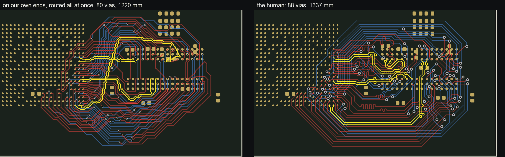

*K51 on our own ends (the Mac's board): left, our fanout's ends and the
whole route on them, 80 vias; right, the human's board, 88. The pairs are
yellow.*

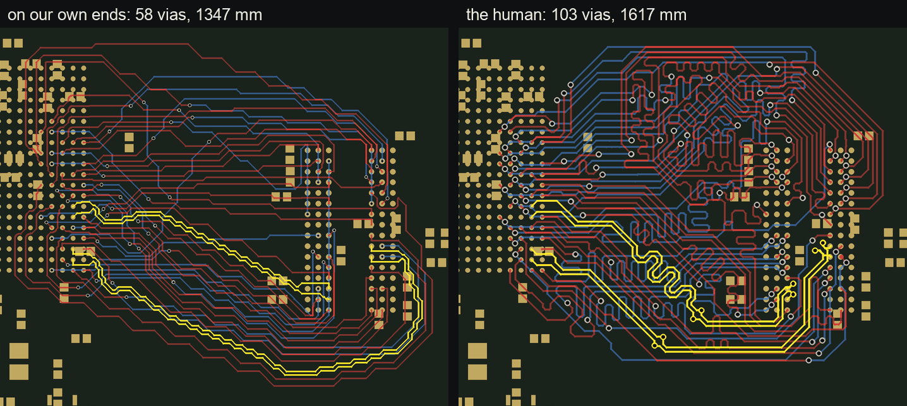

*The zynq article at K44, 42 lanes (both DQS pairs yellow), in our frame
(the human's board turned the same quarter turn): left, the whole route on
our own ends, 58 vias, 1347 mm; right, the human, 103 vias and 1617 mm, much
of it length-matching meanders.*

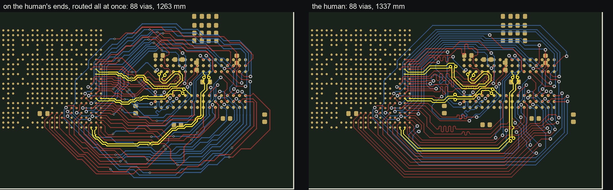

*K51 on the human's fanout, the same frame: left, the whole-route plan routed
all at once (88 vias, 1263 mm); right, the human (88, 1337 mm). The three
pairs are yellow. The human's meanders match lengths.*

Reading the tables:

- **Mac and Linux** give the same vias and copper at every zynq rung and up
  to K35. At K41 and K51 each keeps its own plan among the solve's equal
  optima ([below](#every-machine-and-the-same-answer-on-each)). At K51 both
  prove 42 layer changes: the Mac's with the pair SDQS0 diving twice (four
  barrels on the board), Linux's with the single SDQ4 (two vias).
- **A second fanout round** (five of the six zynq rungs) is the
  [feedback](#feedback-whole_feedbackpy)'s: the first round's ends crowded,
  and the next fanout moved them.
- **Where the time goes.** K51's first solve proves in 25 s; its fanout is
  829 s of the 1295, most of it the ends model's exact routes. The heaviest
  process of any rung is zynq K42's, 842 MB.

<details>
<summary><b>Fanout rounds, wall time, CPU and memory per rung</b></summary>

| H3 | K15 | K28 | K35 | K41 | K51 |
|---|---|---|---|---|---|
| fanout rounds | 1 | 1 | 1 | 1 | 1 |
| Mac: wall / CPU | 39 / 36 s | 169 / 156 s | 341 / 324 s | 595 / 633 s | 1295 / 1557 s |
| Mac: largest process | 241 MB | 436 MB | 434 MB | 593 MB | 720 MB |
| Linux: wall | 79 s | 238 s | 470 s | 1514 s | 3586 s |

| zynq | K18 | K26 | K32 | K38 | K42 | K44 |
|---|---|---|---|---|---|---|
| fanout rounds | 2 | 1 | 2 | 2 | 2 | 2 |
| Mac: wall / CPU | 139 / 128 s | 412 / 390 s | 475 / 474 s | 428 / 432 s | 1892 / 1921 s | 767 / 798 s |
| Mac: largest process | 404 MB | 464 MB | 693 MB | 671 MB | 842 MB | 769 MB |
| Linux: wall | 243 s | 400 s | 502 s | 1055 s | 2577 s | 1779 s |

The Mac ran four chains side by side on its 8 cores, so each wall time
includes waiting on the others. CPU is every process of the chain
(`/usr/bin/time`: CP-SAT's four workers each, so a rung whose solve is long
runs over its wall time). The Linux runs are a container each, on shared
cores.

</details>

### Running it

One rung, end to end -- the fanout on our own ends, the solve, the loop, the
route and the checks, with up to `ROUNDS` fanout rounds (default 3):

```bash
cd awx
python3 whole_route.py 51 OUTDIR                                       # the H3 bench (BASE=fb_t2q_pairs.kicad_pcb DEST=DU1)
BASE=tmp/zynq/zynqF.kicad_pcb DEST=U2 python3 whole_route.py 9 OUTDIR   # the zynq article (build it first, below), any rung of its ladder
```

It exits 0 when `OUTDIR/rN/seq.kicad_pcb` is routed, connected and
DRC-clean, and its last line is the grade:

```
WHOLE K=.. round=.. lanes=../.. vias=.. copper=..mm connected=0|1 drc=0|1 secs=..
```

Each stage runs as a process of its own. `--inproc` runs every stage in the
driver's own process instead, as a routing call inside KiCad's process will
run them: the same outputs, file for file, and a quarter to a third less wall
time (H3 K15, K28, K41 and zynq K18, 2026-09-29). The stage cache is the
separate processes' only, and the checkers still run in their own. In one
process no stage reads or writes the environment: every awx module reads its
settings through `awx_settings`, which the driver gives each stage's for the
stage (with nothing given, the environment answers, as for a process of its
own).

### Building the zynq article

The second bench is built from a public board: `ZYNQ7020_AD9364_V2` from
[kangyuzhe666/ZYNQ7010-7020_AD9363](https://github.com/kangyuzhe666/ZYNQ7010-7020_AD9363),
the Zynq `U1` (CLG400) to its DDR3 `U2`. Its routing is stripped, the bench is
made two-layer with `U1` fanned out, and the result is turned into the flow
frame (one quarter turn), where `whole_route.py` runs it:

```bash
cd awx
mkdir -p tmp/zynq/src/boards_set1
U=https://raw.githubusercontent.com/kangyuzhe666/ZYNQ7010-7020_AD9363/main/kicad/ZYNQ7020_AD9364_V2
curl -L -o tmp/zynq/src/boards_set1/zynq_ad9364.kicad_pcb $U.kicad_pcb
curl -L -o tmp/zynq/src/boards_set1/zynq_ad9364.kicad_pro $U.kicad_pro
# strip the routing with KiCad's bundled python (macOS path shown) -> tmp/zynq/src/boards_unrouted_set1/
STRESS_DIR=tmp/zynq/src /Applications/KiCad/KiCad.app/Contents/Frameworks/Python.framework/Versions/Current/bin/python3 \
    ../tests/stress/strip_routing.py zynq_ad9364
python3 make_bench.py tmp/zynq/src/boards_unrouted_set1/zynq_ad9364.kicad_pcb U1 U2 tmp/zynq/zynq.kicad_pcb --two-layer
NETS=$(python3 coherent_nets.py 47 --board=tmp/zynq/zynq.kicad_pcb)
read K CX CY <<< "$(python3 flow_frame.py quarter tmp/zynq/zynq.kicad_pcb U2 "$NETS" | tail -1)"
python3 flow_frame.py turn tmp/zynq/zynq.kicad_pcb tmp/zynq/zynqF.kicad_pcb $K $CX $CY   # its .kicad_pro and .ladder.txt beside it
```

Built this way (2026-09-29): 48 two-pad nets between the arrays, `DDR3_A14`
refused at the source, 47 in the ladder (checkpoints 9 17 25 31 37 42 47),
one quarter turn about (109.3, -103.2); K9 through `whole_route.py` routes 9/9
lanes in their bands with 4 vias, connected and DRC-clean, in about 30 s.
The zynq numbers in this README were measured on the first build
(2026-09-19: 46 nets, 44 in the ladder, checkpoints 9 18 26 32 38 42 44).
`make_bench`'s net selection has changed since, so today's build is not that
bench and does not reproduce those numbers rung for rung.

The ladder on Linux, one container per rung: `modal run awx/modal_whole.py::main
--ks 15,28,35,41,51 --out DIR` (from the repo root). `modal_whole.py::stage`
replays one command in the cloud on the laptop's files at their own paths.

<details>
<summary><b>The same, stage by stage</b></summary>

**1. A bench** -- the human's ends, or our own:

```bash
NETS=$(python3 coherent_nets.py 51 --board=fb_t2q_pairs.kicad_pcb)
# the human's ends ...
python3 human_ends_bench.py fb_t2q_human.kicad_pcb tmp/hp/HHe_k51.kicad_pcb "$NETS" \
    --others bench:fb_t2q_pairs.kicad_pcb --ladder fb_t2q_pairs.ladder.txt --sidecar --marker
# ... or our own (the fanout's plan environment: PLAN_PAGES=1 BRAID_PAIRS=1 PLAN_PAIRS=1)
mkdir -p tmp/e tmp/e2
PLAN_JUDGE=ends python3 fanout_from_plan.py tmp/e/fo.kicad_pcb 51 --board=fb_t2q_pairs.kicad_pcb
export BENCH=tmp/hp/HHe_k51.kicad_pcb NETS DEST=DU1   # (or tmp/e/fo.kicad_pcb) the bench every whole_* tool reads
```

**2. The plan:**

```bash
python3 whole_solve.py SOLVE.json                  # crossings and layer changes
python3 whole_route.py --loop SOLVE.json OUTDIR   # geometry -> polish -> audit -> pairs -> singles -> snap
python3 whole_render.py OUTDIR/plan.json OUT.png   # look at it (AUDIT=FILE marks the audit's findings)
```

`whole_route.py --loop` exits 0 with `OUTDIR/plan.json` the snapped plan that
passed, 1 when no round got there, 3 when it stopped not converging, and 4
when it stopped at crowded ends.

**3. Route and check** -- a lane the router reports routed is not proof its
net connects:

```bash
python3 route_lanes.py all --plan OUTDIR/plan.json --board $BENCH --nets "$NETS" --dest DU1 \
    --mode seq --write ROUTED.kicad_pcb            # the router on the plan, each lane in its band
python3 ../py_router/check_connected.py ROUTED.kicad_pcb   # and check_drc.py
```

**4. When the loop exits 4** (ends crowded, on our own ends): the audits'
findings there go back to the fanout.

```bash
python3 whole_gate.py OUTDIR/p1.json OUTDIR/p1.audit --hot HOT.json
python3 whole_feedback.py tmp/e/fo.plan.json FEEDBACK.json HOT.json
FEEDBACK=FEEDBACK.json INCREMENTAL=tmp/e/fo.plan.json PLAN_JUDGE=ends \
    python3 fanout_from_plan.py tmp/e2/fo.kicad_pcb 51 --board=tmp/e/SOURCE_BOARD   # the 'source board:' its log names
```

</details>

### How it works

The two solvers at its heart -- CP-SAT for every crossing and layer change,
HiGHS for the geometry's LP -- and how they negotiate have a page of their
own, with interactive demos:
**[CP-SAT and HiGHS in the whole route](https://drandyhaas.github.io/KiCadRoutingTools/solvers/)**.

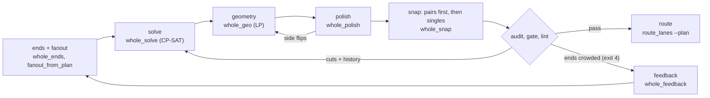

| stage | decides | how |
|---|---|---|
| [**ends**](#the-ends-whole_endspy) | each net's tooth and berth | a search over the fanout's escape menus, judged by the whole route's own via and congestion estimate |
| [**frame**](#the-frame-whole_framepy) | the trunk, the rings round the destination, the two orders, each lane's reference path | read off the board alone |
| [**solve**](#the-solve-whole_solvepy) | every crossing and every layer change, all lanes at once | CP-SAT, proved optimal in vias |
| [**geometry**](#the-geometry-whole_geopy) | each lane's offset along the trunk and the rings | one joint LP (HiGHS) |
| [**polish**](#the-polish-whole_polishpy) | the audit's measures, met in board xy | small vertex moves, an LP per round |
| [**snap**](#the-snap-whole_snappy) | octilinear paths on the router's grid, the pairs first | a grid search per lane |
| [**audit, gate, lint**](#the-audit-the-gate-and-the-lint) | whether the router can lay it | every `plan_audit` check, nothing waived |
| [**loop**](#the-loop-whole_routepy---loop) | what to try next | findings back to the solve as cuts and history |
| [**feedback**](#feedback-whole_feedbackpy) | which ends to move | findings at the ends, back to the fanout |
| [**route**](#the-route-route_lanespy---plan) | the copper | the production router, each lane in its band |

Each stage below has a short summary; its full rules and the measurements
behind them are in the collapsed block under it.

#### The ends (`whole_ends.py`)

`fanout_from_plan.py` under `PLAN_JUDGE=ends`. Each net's tooth at the source
and berth at the destination are chosen together from the fanout's escape
menus, because **the ends decide the braid**: the teeth's order round the
source and the berths' round the destination fix every crossing, and the
layers at the two ends fix what each crossing costs. The fanout lays what the
model chose, and the result is judged **as laid**.

<details>
<summary>Details</summary>

**The estimate.** The route's layer changes are estimated from the ends alone:
the end-layer changes, a least-weight cover of the crossings between lanes on
one layer end to end, the settling of a lane whose end layers differ, and the
coupling of two such lanes. The best few states are then ranked **exact** on
their orders: the whole solve's order model without its lengths, CP-SAT on
one worker to a deterministic work limit.

**The objective** is the solve's, in order:

1. nets over two vias;
2. vias -- the ends' own and the route's -- with each lane's ride at
   `select_moves.VIA_MM` a via;
3. **congestion** on the trunk between the arrays: each lane's load there
   (the room its crossings and changes take, over the trunk's length) priced
   by the square of its excess over half, and each crossing there a fifth of
   a via.

Why price crossings at all: the solve's work follows its crossings, not its
vias. K35 at 131 crossings proved in 10 s, at 163 in 121 s. K41's ends at a
twentieth of a via a crossing stalled unproved; at a fifth they prove in
26-38 s, for a few mm of ride.

**The search.** One lane's tooth or berth at a time (one other lane ejected
where it is in the way), then iterated from seeded random kicks; first with
the teeth as laid, then with the teeth free from the berths just chosen. Each
state is scored once (the search asks a third of them again) and each end's
place round a grown box is cached: the same answer, twice as fast.

**Laid as asked, or not kept.** A board the fanout did not lay as asked is
not kept, and the moves it missed are planned again without them.

**Never chosen:**

- two moves the fanout cannot lay together (an F exit stacked over a B one
  is allowed; two exits on one layer closer than a track and a clearance are
  not);
- a tooth move through another run net's laid tooth;
- a pair's legs apart;
- a tooth on the source's far face.

**Never offered** -- which halves each pass:

- a berth on the destination's far face from a ball in the array's other half;
- a tooth on a source side face from a ball in the other half.

Over K15-K41 the model chose 3 of 341 berths on the far face, all from its
own half, and asked none of the 387 teeth on the source's north face.

**Far dog-bones.** A dog-bone whose via stands past its ball's diagonal cells
goes to the engine with its stub as a walked `path`, the one way the engine
takes a caller's far site.

**Street berths** (`DST_STREET`, 2 under the ends, 0 = off; `escape_moves`
`street=`). The array's empty rows between two groups of balls -- DU1's
3.2 mm between its north and south halves -- are lanes a track pitch apart. A
ball beside them runs on its own layer into a lane of its half, dives at its
stub's line or a half pitch on toward the source, and leaves along the lane
on the other layer. The human stands 20 of its 30 signal vias at DU1 in that
band. The conflict test prices the stub's legs on its own layer and a via
within reach of a lane a track pitch away. They make the braid far simpler:

| | crossings | solve | whole run | vias |
|---|---|---|---|---|
| K35 with street berths | 132 | 10 s | 287 s | 58 |
| K35 without | 162 | 121 s | 606 s | 52 |

(K28 32 vias against 34; K15 12 and 12.)

</details>

#### The frame (`whole_frame.py`)

The whole route's own frame of a bench, read off the board alone -- no braid
corridor, branch or path:

- a straight **trunk** spine from the source's pad box through the
  destination's;
- a **ring** round the destination for each of its north and south faces;
- the two **orders** the solve inverts: the teeth round the source, the
  berths round the destination;
- each lane's taut **reference path**.

<details>
<summary>Details</summary>

- **A pair whose stub stands across the trunk** -- a tooth on the source's
  side face -- starts at the end of its end run out of the tooth and the run
  its turn onto the trunk takes, as a ring pair lands (the geometry holds it
  there and chamfers the corner at the tooth). Started at the tooth, the
  lanes from the face's far part passed across its front and it folded
  between them and its teeth (K35 and K41: SCK on U1's south face).
- **A tooth on the source's far face** has no way round the source here, and
  is refused.

</details>

#### The solve (`whole_solve.py`)

Every lane's route is one coordinate: the trunk from its tooth, then its ring
round the destination (the pad box unrolled from a cut between the branches)
to its berth. One CP-SAT model decides every crossing and every layer change
for all lanes at once. **Only a plan proved optimal in its vias goes on to
the geometry**; one the search could not prove is no plan.

<details>
<summary>Details</summary>

**Crossings.**

- Every pair of lanes whose launch and berth orders disagree crosses once;
  the braid rule holds over every triple.
- A lane's crossings keep a pitch along a stayer and less along a mover's
  sweep; a pair's two crossings of opposite ways keep its turning run apart.
- Crossing lanes are on different layers.
- No crossing and no change in the band along the source's near face, where
  the teeth stand.

**Layer changes.**

- Up to three per lane, each a via's room from its own crossings -- the room
  of both lanes there, a pair crossing the via's lane the wider by its second
  leg.
- A single's change is a change's room from both its ends, and far enough
  along the route from a neighbouring lane's (a neighbour at either end, or a
  lane it crosses) that the two vias clear the via-to-via rule.
- An opposite-hands pair makes at least one change where its tooth and berth
  share a layer. (Elsewhere the berth rule asks one already -- a constraint
  that binds nothing still moves CP-SAT to another of its equal optima.)

**Pairs and fixed obstacles.**

- A pair's end keeps crossings out of its **end connector**
  (`pairs.end_connector`: its legs converging at 45 degrees from its tips
  onto a pose on the grid), and its own layer changes beyond its **dive
  room** (`pairs.dive_room`: that connector, then the pair router's straight
  run from the pose into its via).
- A pair's changes stay off the turns its route is known to make before any
  geometry -- its spine's and its ring's corners, the handoff onto its ring
  -- and beyond the turn onto an end whose stub stands more than its
  connector's 45 degrees off the route there.
- Every lane's changes stay off the stretch where its reference passes within
  a via's reach of another part's pad or the tooth of a net outside the bus
  (`whole_ctx.foreign_teeth`, the list the geometry keeps its lanes off); a
  pair's the longer by its dive's straight run, since its lane bends round
  the item. These are the **built-in via cuts**.

**The objective**, in order:

1. no net over two vias on the board (its stubs' own and its lane's changes,
   a pair's leg a barrel a dive) -- a preference, never a cap;
2. the fewest vias;
3. **history** congestion, as a negotiated router prices a place overused
   before: every place an earlier round's audit found the plan short
   (`whole_gate --hot`), the route within a via's room of it priced by how
   many audits found it so -- a crossing there a lane pitch square of copper,
   a change a via's patch. Only those places carry terms, so the first solve
   prices nothing and is proven optimal in seconds.

**Proving it.**

- **The workers.** Two LP searches (the default and the strongest
  relaxation), core-based search and the objective's lower-bound search
  (`SUBSOLVERS`): a plan's vias are proved from below. The default four ran
  nothing that raises the bound -- K51's first solve was unproved at 421 s,
  best 56 vias against a bound of 40; now it is proved in 22-37 s (K41
  15-19 s, K35 4-6 s).
- **The fallback.** When they cannot prove it -- K51 on the human's fanout:
  best 2 nets over two and 38 vias against a bound of none and 32 -- the
  plan-finding workers they leave out run on (`FALLBACK`: quick restarts, the
  search without the LP, and core-based search to close the proof), from the
  first run's best plan and with its bound a constraint, and prove it (68 s
  more).
- **The root's floor.** A re-solve is floored by the root's proof -- the
  bench's first solve, with no geometry cuts. A re-solve only adds cuts to
  it and history below a via, so it can do no better, and a plan it finds at
  the root's nets over two and vias is proved at once. (A K51 re-solve at the
  root's 42 vias, bound 36, stopped unproved at 193 s; floored, proved in
  73 s.) The root rides in each solve's JSON to the next, taken only where
  its signature -- the lanes, their orders and end layers, stub vias, the
  change limit and the built-in cuts -- is the re-solve's.

**Bounded in work, not time.** A count of CP-SAT's interleaved batches, the
workers sharing no clauses (`WHOLE_SOLVE_BATCHES`). Bounded by deterministic
time, or sharing clauses, one model gave a different answer on every run. It
stops sooner:

- once the vias are **proved** (the plan's vias no more than the bound's
  whole vias, read off the search's own log: only the history's tie-break
  open); or
- once it has a plan and the search **stalls**: three of its own model
  reductions in a row with no better plan or bound -- events, never a clock.
  (K35 found its one plan at 46 s and spent 145 s more on nothing.) Before a
  first plan, the budget decides.

</details>

#### The geometry (`whole_geo.py`)

One joint LP over the trunk and both rings, columns four grid steps apart,
places each lane: its offset per column, in the solve's order, on its solved
layers, same-layer neighbours a bar apart, a via's room round every change,
inside the board and off the pad boxes. A second pass holds each lane to one
side of every island near it. What the LP had to pay for goes back to the
solve as **cuts**.

<details>
<summary>Details</summary>

**The first pass.** Hard rows: each lane's offset per column in the solve's
order on its solved layers; same-layer neighbours a bar apart
(slope-corrected); a via's room round every change; inside the board and off
the pad boxes. Soft costs:

- the length each column's sideways move adds -- from below by tangent cuts,
  so a small move costs next to nothing and a lane takes the **comfortable
  pitch** (a track more than the bar) wherever there is room, as the human's
  lanes do;
- the bends;
- every neighbour short of that comfortable pitch, four times as steeply
  below halfway to the bar, so the tightest are spread first.

A lane turns at most 45 degrees a column; a pair 45 degrees per turning run
(two segments that run apart within 45 degrees, the bound taken at the first
pass's heading; elastic). A lane is bounded by the free interval its
reference lies in -- or, where the reference cuts a pad box's corner, by the
one it was in a column before: it cannot leave that interval across the box.

**The second pass: islands.** Each lane is held to one side of every piece of
static copper near it: one split per island and layer, in the lane order,
pinned by the lanes' own ends, the room either side measured where the
island's rows reach past any pad box it stands in.

- An island is a part (a lane goes round it, not between its pads), or parts
  no lane can surely pass between (`whole_ctx.part_islands`: closer than a
  track, a clearance and the router's corner buffer either side and a grid
  step). K35 had routed SA4 through R4 and R5's 0.37 mm, where the router's
  grid has no column.
- The island rows hold a lane over its whole piece but its own tooth and
  berth (a trunk's free end at the handoff included: zynq K32's DQ3 ended its
  trunk 0.15 mm from C98's pad), and a pair's via is held off an island by
  its barrels' reach, not its half width.

**Pairs.** A pair runs straight for the pair router's straight run either
side of each dive. Where a dive falls within reach of its fixed end, it runs
straight from the end right through it: its sideways shift onto its terminal
comes before the dive, never between the two (elastic, as the other rules).

**Joining trunk and ring.** Each lane of a ring enters it where its trunk
**ends**, re-anchored after the first pass from where that pass laid the
trunk's end: the join ties the two pieces' offsets, not where along the ring
the trunk's end lies. Started at one origin column for every lane, each
lane's stretch from its trunk end to it was in no column at all -- no pitch,
static or via row -- and the output joined the pieces across it straight
(zynq K42: DQ10 across C98's pad at U2's corner).

**Cuts.** What the geometry had to pay becomes cuts for the solve: an island
a lane could not be kept off, a change it could not give its room, a pair's
dive it could not lay straight.

**The solver.** The LP goes to SciPy's HiGHS as its **dual** -- a row per
column, every elastic slack a plain inequality -- and the lanes are read back
from the dual's multipliers: the same optimum, six times faster (K51's second
pass 30 s, not 188). The interior point is capped at 500 iterations (it ends
in 58-103), past which the dual simplex solves the same LP: zynq's second
passes ran for half an hour on a face of optima, residuals at 1e-15, never
declared optimal (K26's now 80 s). With `detmath`'s tie-break either method
lands on the one optimum.

</details>

#### The polish (`whole_polish.py`)

The audit's own measures -- pitch, via rooms, static clearance, turns -- met
in board xy by small vertex moves, one LP per round. Each bar is the snap's
plus a grid step, so every gap the snap later splits holds a grid row. A lane
that cannot be held on its side of an island is **flipped**, and the geometry
runs again with the flip before anything is snapped.

<details>
<summary>Details</summary>

- **Static clearance** is measured to a pad as KiCad draws it, its corners
  rounded, and for a single in a pad's corner zone, the router's corner
  buffer further (`pairs.pad_corner_buffer`). A pair is priced at its legs'
  reach at a 45-degree corner plus the half step its off-grid legs and
  barrels take.
- **Shape.** The audit's own shape findings (a fold at a vertex or at the
  lane's scale, a notch) are straightened before the rounds and after them,
  and the rounds run again. The rounds stop once a round moves no vertex
  further than a nanometre (KiCad's own unit).
- **A pair's end run** (`pairs.end_run`) is laid straight and held: its end
  connector along the stub, then the straight the pair router probes past its
  pose, within `max_setback_angle` of it, and a dive of its own just past it
  on that same line.
- **A pair's dive** is kept, at the three cells the pair router tests (the
  centre and two either side across its heading, on the pair's map), a via,
  a track and the clearance plus half the pair's pitch from every other
  lane's line, and a via and the clearance from every via site. A dive not
  yet laid is priced at the worst offset off the grid its barrels can take
  once laid (0.033 on a diagonal heading, where half a step left the snap
  4 um).
- **A single's ends.** Its last track and clearance at either end stay inside
  the arc of router directions that each keep within 90 degrees of its stub
  -- the moves the snap may make there -- so its grid path cannot fold where
  lane and stub meet.
- **Flips.** A lane held off an island's side -- no room for its clearance,
  or no approach to its stub -- is flipped, and the geometry runs again with
  the flip before anything is snapped. Only a part the geometry holds lanes
  to one side of flips: never the source or the destination.
- **Via cuts.** A pair's dive it cannot lay straight without folding the
  lane, and a change the rounds cannot give its room, go to the solve as via
  cuts, with the geometry's.
- **Held pairs.** A held pair's crossover barrels are kept off the other
  lanes as its dive barrels are -- the router's ring round each, not a via's
  copper alone -- and a single's via off a held pair's end legs and crossover
  legs the same way: the router's ring and the half step of a leg off the
  grid (0.319, as the audit and the snap ask), not the via-to-track clearance
  (0.306).
- **Pairs not yet laid** are held off static copper from their **poses** on.
  The stretch from a pair's tips' midpoint to each pose is its end connector,
  whose legs converge from the tips either side of whatever stands between
  them (the audit measures those legs). Measured as a line with a rounded end
  on the midpoint, every pair's end read 0.113 mm short of the ball between
  its tips (legs 0.27 clear of it): a row no move could meet, paid in every
  round.

</details>

#### The snap (`whole_snap.py`)

The smooth plan made octilinear on the router's grid, one lane at a time: a
grid search in a band round each lane's smooth line (length, bends, distance
from the line). The **pairs** go first and alone, moving as the pair router
does; they are then **held** while the polish fits the singles round them,
and the snap lays the singles.

<details>
<summary>Details</summary>

**Pairs** (`--pairs`).

- **They move as the pair router does:** 45-degree turns, a turning radius's
  straight run after each, a via only on a straight run either side of it.
  They go where they need to, but each step inside a single's share of a gap
  costs its length again, so a pair takes a single's room only where its
  turns and dives need it.
- **Keeping to its line.** A slanted line is laid as a staircase of runs on
  the two router headings either side, each at least the turning radius
  long, so a pair cannot keep nearer it than half the smallest such staircase
  (`pairs.stair_spread`: nothing on a router heading, 0.14 mm apart across a
  line 19 degrees off one). Beyond that and a grid step it pays `W_KEEP` per
  mm of length per mm. (K51's SDQS0 took 1.5-2.3 mm runs rather than a bend
  and strayed 0.21 mm into SDQ7's room, and SDQ7 fitted beside it on one
  machine and not on the other.)
- **End connectors** (`pairs.end_legs`): two legs from its tips to a **pose**
  on the grid, on a router heading, turning 45 degrees at most -- at each end
  the shortest whose legs clear everything. The pair step lays them as drawn
  and the pair router takes over at the pose with no setback of its own
  (`pairs.handover_setback`; `diff_pair_setback_floor` 0, no ladder), so the
  plan and the router share one end.
- **Pose to pose.** The search runs pose to pose, owing the router's probe
  past each pose (`pairs.pose_probe_steps`), and turning as the pair router
  lets it (`pairs.pose_turn_over`, the router's own counters: two signed sums
  of the turns, one restarted every hundred steps and the other fifty steps
  after it, a via starting a fresh pose, and a full turn either way at most --
  connect gives the router both end directions, and a pair may then wrap
  round its end). Past that a path curls back onto itself: zynq K26's DQS1
  was laid a 450-degree hook round a dive 0.57 mm from its berth, which the
  router refused. Held to 180 degrees over any stretch -- what the ladder's
  pairs happened to turn -- the snap refused paths the router lays (zynq
  K38's DQS0, round its berth).
- **A pair the step cannot lay** sends its change nearest where it got stuck
  back to the solve as a via cut, a jog's room wide (`pairs.jog_room`: the
  router's straight from the via and a 45-degree jog out and back), and the
  loop solves again.

**The crossover.** An **opposite-hands** pair -- P on one side of its travel
at its tooth and on the other arriving at its berth (SCK) -- swaps its legs
at its dive with a crossover (`pairs.crossover`), as a designer does:

- the first diver jogs out at 45 degrees to its barrel and dives; the other
  jogs at 45 degrees over the first's new-layer leg to its barrel just beyond,
  and back onto its line at 45;
- no leg turns more than 45 degrees, so the lane's own turn into the dive
  cannot make a fold of one;
- both barrels are on one side, staggered by the least whole grid steps that
  keep a via's pitch and each jog's clearance, on the side where the singles
  not yet laid leave room for its barrels.

It is laid as drawn. The search reserves its half-span and the router's probe
on each side, and the pair router routes the two one-hand spans either side
of it. Its dive is the pair's **first**, from the lane's first layer to its
second (a pair that changes twice, F-B-F, has a plain dive later).

The whole plan knows the crossover's shape before the snap lays it
(`pairs.crossover_shape`, the same `pairs.crossover` and probe steps): a
longer straight run than a plain dive's either side (0.375 / 0.400 mm on an
axis against 0.225), both barrels on one side, staggered along it, and no
via's room at all on its other side -- in the geometry's rows (the side
chosen from its first pass), the polish, the audit's dive check and the
solve's rooms and cuts. Audited as a plain dive, K41 SDQS0's crossover passed
with 0.25 mm each side, and the pair router could not lay it.

**Singles.**

- **A single starts and ends where the router does:** at the grid point
  nearest its tooth and berth (the join the audit grades), wherever a track
  fits there, the join within that rounding drawn on to the lane's next grid
  point. A grid point of the snap's own choosing was a start the router never
  made (K51 SA5: planned a cell east of its tooth, laid from the one 7 um west
  of it, 0.230 from SA2 where the bar is 0.232, and SA2 refused).
- **Off-grid terminals.** An off-grid tooth or berth joins the nearest grid
  point whose join folds neither against the stub nor against the lane, a row
  off where the nearest would crowd a neighbouring terminal, and every move
  within a track width of an end runs within 90 degrees of its stub. A lane
  that cannot arrive so is laid without that rule and named, and the gate
  fails it.
- **Shares.** A lane not yet placed keeps its share of every gap -- the side
  of the midline nearer its own smooth line, less half a bar, for its track
  and for its via -- so the lanes laid first cannot take the room the later
  ones need.
- **Two sweeps** then lay every lane again against the others' real copper --
  one the first pass could not lay first -- which turns the staircases the
  shares force into clean jogs.
- **A single the snap cannot lay** is named with where its search got stuck
  (the farthest along the lane any path from its start reached), and the
  loop sends that place to the solve.

**What it measures against.**

- **Static copper** is read from the router's own base map (its pad stamps
  with their corner buffers, other nets' stubs and vias, holes, the board
  edge) over each lane's window, a pair's with the pair's extra clearance.
- **Placed copper** at the audit's bars: a pair as its two mitred legs; a via
  by the ring the router stamps round it -- round the grid point it rounds
  to, as the router, and round the barrel itself, as the audit; a piece off
  the grid (a join onto an off-grid terminal) half a step wider, both ways; a
  single's via a track's ring from every placed pair's legs, its end legs and
  crossover's among them.
- **A pair's dive** where the pair router tests it, each barrel and each leg
  clear of static copper at the audit's own bars, and no nearer either end
  than its dive room at the dive's own heading.
- Copper laid as drawn -- a pair's end legs, its crossover's legs and barrels
  -- carries no half grid step of its own, and a barrel's offset off its grid
  point is counted once.

**Speed.** A single's search runs in the router's Rust core
(`grid_router.lane_search`: the same search, the same path; an older binary
searches in Python), and a lane asked again on a board unchanged since it was
laid is answered as before. The Python search (every pair's) packs each state
-- cell, heading, vias taken, run counters -- into one integer in the tuple's
own order, so it pops the same states in the same order at a fraction of the
memory (K35's pairs: 843 MB, now 520).

</details>

#### The audit, the gate and the lint

`whole_ctx.lanes` installs a plan in the whole route's own lanes exactly as
the router will get it. `whole_audit.py` runs every `plan_audit.py` check on
it; `whole_gate.py` passes it only when it is complete and clean with
**nothing waived**; `whole_lint.py` checks what the snap promises.

<details>
<summary>Details</summary>

**What the router gets** (`whole_ctx.lanes`, `PlanLanes` on the whole frame:
no braid corridor): reservations, via sites, bands, layer runs, search
windows. A **snapped** lane's band is its own grid line -- half a grid step
either side, its end cells and its via cells -- since a lane free to roam a
track and a clearance either side takes the next lane's row.

**The audit** (`whole_audit.py`) runs every `plan_audit.py` check:

- pads as KiCad draws them (rounded corners, an oval a stadium), a single's
  track and via held the router's corner buffer further in a pad's corner
  zone;
- a single's terminal join as the router lays it (exactly, to the grid point
  its end rounds to);
- each piece's allowance: none where it is fixed or on the grid, half a grid
  step at a free end off it, linear between;
- a pair's end connectors and crossover as its exact copper, the crossover's
  barrels one each;
- a pair's dive also for its straight runs and its room from both ends, and
  at the three cells the pair router tests for it (the centre and
  `pairs.pose_via_cells` grid steps either way across its arriving heading,
  on the pair's map: a via, a track, the clearance and half the pair's pitch
  from another lane's line, a via and the clearance from its via site -- as
  the polish and the snap keep them; barred at its barrels alone, a lane
  0.04 mm short of a dive's cell passed and the snap could not seat the
  dive);
- every pose for the straight the router probes past it;
- bands sampled on the router's grid, pose to pose;
- a via against a pair's own legs (a track's ring) as well as its
  centreline, against unplated holes by the hole-to-hole rule, and against
  every stub by its whole length.

**The gate** (`whole_gate.py`) passes a plan only when it is **complete**
(every corridor member laid) and clean on every check -- nothing waived, a
band's length outside it read to the micron, and every lane's band joining
its tooth to its berth.

**The lint** (`whole_lint.py`) checks what the snap promises:

- grid points, 0/45/90 pieces, continuity, no reversal;
- no fold where a lane meets its stub, its way measured from the router's own
  start or end (the terminal's nearest grid point). A fold is named with its
  place, which the loop sends on as it does the audit's; with none, zynq
  K42's A6 folded at its berth and the loop stopped with nothing to try;
- a via at every layer change;
- a pair's turns and dives as the pair router makes them, and its end
  connectors;
- an opposite-hands pair's crossover: both poses on the grid, each leg
  changing layer at its own barrel, the legs swapping sides.

</details>

#### The loop (`whole_route.py --loop`)

Every stage is fed a measurement of the one before. What the audits find goes
back to the solve as **cuts** and **history**, so a round that fails solves
again rather than stopping; side flips go back to the geometry. The loop
stops when it is not converging, or when the trouble is at the ends, which
only the fanout can move.

<details>
<summary>Details</summary>

- **Findings become history.** The loop sends the solve every audit's findings
  as history with the cuts, so a round the geometry has no cut for -- a
  pitch, a shape, the singles not fitting round the held pairs, a snapped
  plan short, a single the snap could not lay -- solves again rather than
  stopping (each finding's place and the lanes it names: `whole_gate --hot`).
- **Not converging.** It stops after two rounds that do not beat the best
  score so far (how far the plan got -- smooth, the pairs held, snapped --
  then its findings there, a folded lane among them). A round with new side
  flips to try is not counted.
- **Flips and cuts together.** A round with new side flips and cuts or
  findings takes both at once: the solve with them, then the geometry with
  the flips. An island cut is dropped from the solve only where its flip was
  already given to the geometry that made it -- made again after the flip,
  both sides failed, and the solve gets it. (Zynq K42's C98 cut was once
  dropped for good, and the solve never saw it.) The flips the polish finds
  with the pairs held are tried as the smooth plan's are.
- **The stage cache.** Every expensive stage runs through `stage_cache.py`:
  a stage whose script, arguments, environment (the agent's and the
  terminal's own session variables aside) and every file it read -- its code
  and its data, by content -- are unchanged, and every file it looked for and
  did not find still absent, is restored, not run. A stage that a file it
  read changed under while it ran is not recorded, and an entry's meta is
  written last and whole. It is a cache for a **harness** that redoes the
  same bench: off by default -- a user's run writes nothing beside the code
  -- and on in `whole_route.py` (`STAGE_CACHE=1`, as the braid's taut memo is
  `TAUT_MEMO=1`; `=0` turns either off there).
- **The planned bench.** The bench every stage plans is planned once and
  saved (`whole_ctx.plan`, under `tmp/ctx_cache`, keyed and checked the same
  way; the braid's closures saved by value), so a stage loads it in a third
  of a second.
- **Refusals.** A bench outside the canonical frame (`flow_frame.py`) or with
  more than two copper layers is refused, not misread.

</details>

#### Feedback (`whole_feedback.py`)

`FEEDBACK=`, `INCREMENTAL=`. A finding the audits make **at the ends** is the
fanout's to move. The loop stops for it (exit 4), and the next fanout round
chooses again, incrementally, with those ends priced.

<details>
<summary>Details</summary>

- **At the ends** means beside a face within the width its lanes stack to,
  or in front of it within the band the solve keeps clear.
- **How it is priced** in the ends model: two lanes named together become a
  pair of ends not to choose together again; one alone, an end to avoid.
- **When the loop stops for it:** at once for a finding no solve moves (a
  pitch, a static clearance there), and for any that stands two rounds
  running -- once the round has no side flip left to try.
- **The next fanout is incremental**, as `replan.py`'s rounds were: from the
  previous round's source board, only the teeth the feedback names free,
  every other berth held, the run's nets the previous round's.
- **The chain stops** rather than pay for a round it has had: when the
  feedback adds nothing new, or when the fanout lays the previous round's
  ends again (feedback priced, not followed). Zynq K42's three rounds were
  one run three times, and K38's second and third one run twice.

</details>

#### The route (`route_lanes.py --plan`)

The production router on the plan installed in the whole route's own lanes:
the pairs first, then the singles, each in the berths' order round the
destination, every lane in its band, post-passes off.

- A pair's end connectors and crossover are laid as given and the pair router
  runs between them (`connect.connect_pair`'s `a_given` / `b_given` /
  `x_given`).
- Each lane alone, or all in order (`--mode seq`). `--write` writes the board
  for `check_connected` and `check_drc`: a lane the router reports routed is
  not proof its net connects. A lane whose routing raised is named, and the
  run exits 1.
- The copper is written back in the board's own frame: a board whose pairs
  read the other chirality is turned over for the braid, and every lane is
  laid on the turned board.

### A worked example: K51 on the human's ends

The first run of the whole route to pass (2026-09-25), on `HHe`: the human's
ends at K51, 51 nets, 45 singles and 3 pairs, 48 lanes. The plan passes every
check with nothing waived, and it **routes**. From the human's board, by the
[stage-by-stage commands](#running-it):

1. **The bench and the solve** (16 s).
2. **Loop round 1.** The first polish flips SCAS to the far side of C6, and
   finds SDQ15 short of its pitch to SDQS1 and SCKE0 of its to SCKE1 and SA6.
   The geometry cannot keep SA8 off C4 or C3, nor lay SDQS1's dive straight,
   nor give SCK's change its room.
3. **Loop round 2.** The solve again with those cuts and those places priced
   (28 s; both solves 36 layer changes), the geometry with the flip -- and
   the second smooth plan passes. The pairs are laid (SCK with its
   crossover), the singles fitted round them and snapped, the lint clean.
   Both rounds: 169 s.
4. **Again, from the cache.** The loop on the same inputs restores every
   stage from the cache (1.4 s). Every step writes the same bytes on every
   run (the geometry and the polish checked again under a second Python hash
   seed).

What it came to:

- **The plan** changes layer 36 times where the human's copper does 38
  between the same ends (a pair's dive counted once; on the board, 39 vias
  against 41).
- **Routed** by the pair step and the router, post-passes off: the pairs at
  zero widening, 3 of 3 in their bands; each lane alone, 48 of 48; **all at
  once, 48 of 48 in their bands**, `check_connected` all 51 nets connected,
  `check_drc` clean at the route's clearance.
- **Over the whole board** on the 51 nets: 86 vias against the human's 88, no
  net over two (the human has none either), and 1257 mm of copper against
  1337 -- the human's includes its length-matching meanders, and this route
  matches no lengths.

Since then: with the solve's fallback (2026-09-27) the same chain routes it
again, 48 of 48 lanes all at once, every net connected, DRC-clean, 88 vias
against the human's 88 in 1262 mm against 1337. On the code of 2026-09-28 it
routes on both machines -- 88 vias in 1263 mm on the Mac and 1261 on Linux --
where the fallback had stopped unproved on Linux before it ran its whole
budget.

The braid planner changes the whole route was first made on (berth rows, the
rings' order and dips, directional pair floors, leg costs) are in `braid.py`
and change the braid's default routing.

### Each machine, the same answer

**The standard:** every rung routes on every machine, no solve hangs, it runs
as fast as it can, and a machine gives the same board on every run of a rung,
whatever Python's hash seed. Two machine types may route a rung to different
copper -- their C libraries round differently in the last bit, and CP-SAT
keeps a different plan among equal optima -- which is accepted; a rung that
routes on one and not the other is not.

**Where it stands (2026-09-29).** With nothing pinned, every rung of both
ladders routes connected and DRC-clean on this Mac, and every H3 rung on
Linux (`modal_whole.py`), at the vias and copper in the tables above -- the
same on both as when the transcendental functions were fdlibm's (below). On
the Mac, H3 K41 run twice, each run under its own random hash seed and one of
them with every cache off, writes the same 45 files, and its copper is bit
for bit the copper it routed with fdlibm's functions.

| what could move a machine's answer | what holds it |
|---|---|
| an LP with a face of optima | `lp_tie_break` and `lp_round` on both LPs (`detmath.py`) |
| the order of a set or a dict under a hash seed | sorted wherever the order reaches a model |
| a clock budget | none: every budget is in work |

<details>
<summary>Details</summary>

**An LP with a face of optima.** HiGHS returns one of an LP's equal optima,
decided by its own rounding, so a change that should not matter (a row order,
an input's last bit) moved the plan: the geometry's first-pass LP has many
optima, and the second pass is built from the first.

- Both LPs (the geometry, the polish) carry `lp_tie_break` -- a fixed cost per
  column, 1e-4 times 0.5..1.5, below any real cost's step and above the
  solver's tolerances -- so the optimum is one point, and `lp_round` takes the
  solver's last bits off (a 2^-24 grid).
- The same change ended a stall: zynq K18's second-pass LP ran for half an
  hour in the interior point without terminating on its face of optima; it
  now solves in 11 s, and the rung routes (18 of 18, connected, DRC-clean).

**The hash seed.** Python gives every process its own string hash, so a set's
iteration order changes run to run; where that order reached a model (the
order of a CP-SAT model's constraints, of the geometry's rows) the same inputs
routed different copper. Those iterations are sorted, and nothing pins
`PYTHONHASHSEED`. To check a change still keeps it so, run a rung twice with
two seeds and every cache off and compare the two OUTDIRs file for file:

```bash
STAGE_CACHE=0 TAUT_MEMO=0 PROBE_MEMO=0 PYTHONHASHSEED=1 python3 whole_route.py 15 OUT1
STAGE_CACHE=0 TAUT_MEMO=0 PROBE_MEMO=0 PYTHONHASHSEED=2 python3 whole_route.py 15 OUT2
```

**No swap of the platform's functions.** Until 2026-09-29 every chain stage
swapped math's and numpy's transcendental functions for fdlibm's (computed
from `+ - * / sqrt` alone), so a Mac and a Linux box gave the same bits up to
K35. The standard no longer asks for that, and the swap replaced the functions
for the whole process: the bus step will run inside KiCad's own process, where
it would have changed every later computation there. `tests/test_622_detmath.py`
holds the LP helpers to one answer per model and every awx module to no such
swap.

</details>

---

## The braid chain and the evolution

The earlier approach, and where most of the machinery the whole route reuses
was built. One **plan** decides both ends of every net; the **fanout** lays
exactly the plan's moves and reports what it could not; the **braid** routes
the lanes in a corridor of two pages. Then a **population** of routed boards
evolves: each world descends by probing single moves with the real router as
the judge, jumps to nearby worlds, and exchanges ends with the others, until
the best board is a local optimum of every move the menus offer. The records
on every rung came from that evolution.

> **These tables predate the braid planner changes the whole route was made
> on** (berth rows, the rings' order and dips, directional pair floors, leg
> costs), which are now in `braid.py` and change the braid's default routing.
> They were run with the portfolio chain (`CHAIN_FANOUT_AB=1
> CHAIN_BRAID_AB=1`), which is no longer the default.

### Running the chain

Run everything under the chain's own environment, `PLAN_PAGES=1
PLAN_JUDGE=count PLAN_JUDGE_LEN=lane`.

```bash
bash chain_k.sh TAG 28 41 51                      # the chain: -> tmp/TAG_k<K>.kicad_pcb, graded
python3 evolve.py TAG 51 --seeds=STEM,... --pop=4 --gens=3 \
        --descend="--rounds=2 --worst=6 --probes=2 --min-vias=2 --coupled=census --grade=inproc --par=4"
python3 replan.py STEM 51 --from=STEM --out=OUT --mode=incremental --apply=strip ...   # one descent
python3 evolve_movie.py TAG 51 --gif                # the movie of a run
python3 make_bench.py BOARD SRC DST OUT             # another array pair, from any board
bash pose_gate.sh BOARD SRC DST 15 28               # the same pair in every pose
```

### Records

**The H3 bench** is `fb_t2q_fresh`: an H3 BGA `U1` to a DDR3 `DU1`, routed
over the coherent K-ladder (`coherent_nets` counts whole rivers, so "K51" is
a 48-net problem). It carries no differential pairs, so its K's are not the
same net lists as the whole route's `fb_t2q_pairs`, and the human's counts
differ between the two. Every board below is 0 open and 0 DRC at the routed
0.1 mm floor, graded independently (`grade_k.py`), and carries the same
out-of-run nets as the reference boards.

| vias | K15 | K28 | K35 | K41 | K51 |
|---|---|---|---|---|---|
| the chain alone (the portfolio's best arm; 2026-09-22, on main's engine) | 18 | 36 | 58 | 76 | 99 |
| **the evolution (2026-09-18/19)** | **14** | **34** | **56** | **64** | **83** |
| human | 22 | 46 | 58 | 70 | **81** |
| evolution time, this laptop | 2 min | 2 min (the chain) | 7 min | 12 min | 35 min |

**K15, K28, K35 and K41 beat the human; K51 is two vias short of it.** How
each record was found:

- **K15:** a jump world, descended.
- **K28:** the chain; nothing improved it.
- **K35:** a jump world from the 58, descended.
- **K41:** the 74 arm descended to 67, that to 64.
- **K51:** an open-net arm descended to 91, then 91 -> 87 -> 85 -> 83 with the
  climb menus.

Notes:

- The chain-alone row reproduces exactly after the rebase onto main
  (2026-09-19; [What this adds to `py_router`](#what-this-adds-to-py_router)
  has the run).
- The 83 carries two grazes of 7 and 8 um under 0.1 on B.Cu -- the
  grid-quantisation class the chain's `--clearance-margin 0.1` filters, as
  `check_drc` documents. The 85 is the last board clean with no
  margin at all.
- **83 is a local optimum** of every single-net move class with the climb
  menus, at descent thresholds of three and two lane vias. Five generations
  of descents, near jumps and crossovers at K51 over two runs stood nothing,
  and the last run ended with four distinct 83s: every jump and
  crossover world descended back to 83.

**The zynq article** (2026-09-19). The public Zynq board of *Building the
zynq article*, the Zynq `U1` (CLG400) to its DDR3 `U2`, built by `make_bench.py
--two-layer` in 15 s (that day's net selection; today's build differs): 46 nets between the two arrays, two refused at the
source, 44 in seven rivers, checkpoints 9 18 26 32 38 42 44. The human routed
this bus on F and B only (the inner layers are planes; 103 vias over the same
44 nets, every one F-to-B), so the two-layer article is a fair comparison.
The pair points -y, so the chain runs it through one quarter turn of the flow
frame; the frame article (`zynqF`) grades identically at every rung, and the
evolution runs on that.

| vias | K9 | K18 | K26 | K32 | K38 | K42 | K44 |
|---|---|---|---|---|---|---|---|
| the chain alone (2026-09-22, on main's engine) | **8** | 16 | 39 | 52 | 68 | 89 | 92 |
| **the evolution** | **12** | 16 | **34** | **50** | **59** | **71** | 88 |
| **the descent alone, from the chain (2026-09-22)** | | | | | | | **83** |
| human | 25 | 45 | 57 | 74 | 86 | 97 | 103 |
| chain wall, this laptop | 33 s | 1 min | 2 min | 3 min | 5 min | 6 min | 8 min |

All 0 open, 0 DRC at 0.1 mm, and below the human at every rung. How the
evolution row was found:

- **K9, K18, K26, K32:** the population as the H3 ladder runs it (pop 3, two
  generations; K9 one; K18 gained nothing).
- **K38:** both the population (a near-jump world, descended) and the descent
  alone.
- **K42, K44:** the descent alone carrying `--length=1 --worst=8`, three
  rounds: 90 -> 77 -> 71, and 105 -> 97 -> 95. On main's engine
  (2026-09-22) the same three rounds take the chain's 92 to 91 -> 87 -> 83,
  below the evolution's 88.
- **Then a K44 population** seeded from the 95 (pop 4, two generations,
  length rule on, 53 min): every descent of the 95 null; the crossover of the
  95 with the chain's 105 (seven of their fourteen differing ends) descended
  108 -> 93, and that 93 to 89; a near jump from the 93 (two nets) descended
  101 -> 88. The population ended 88 / 89 / 93 / 95.
- **The length tie rule** -- an equal-via board that shortens the copper
  stands -- is what let the K38 descent take nine vias in one round where the
  same round without it took four.

Where the human's board never puts more than four vias on a net (one net),
the chain's K44 carries seven nets at four and three at six -- the
multi-divers the descent exists for. Two defects the article shows that the
H3 bench cannot:

- **A far-face tooth.** A net the main spine cannot reach is split into a
  one-net corridor and planned onto a far-face source tooth: a channel escape
  through seventeen rows of the Zynq, then straight back (DQ12 at K38, DQ13
  at K44, ~24 mm of hairpin each, priced by the count judge as a via saved).
- **One big corridor.** At K42 the whole bus becomes one 42-net corridor with
  eleven in-band refusals.


### How the chain works

**The chain** (`chain_k.sh`) makes the seeds.

1. `coherent_nets.py K` picks the first K routable nets of the coherent
   ladder (`k_ladder_coherent.txt`: whole rivers, tightest first).
2. `flow_frame.py` turns the pair by the quarter turn that points source to
   destination along +x, and turns the result back, so any of the four poses
   is the same computation.
3. `fanout_from_plan.py` plans both ends of every net with one CP-SAT
   (`pages_first.py`: a destination move, a source move and a page per net,
   two crossing-free chains, a swimmer priced at 100), and realises the plan
   with the production fanout engine in a realise-and-confirm loop (a move
   the engine did not lay as asked leaves the menu and the round re-plans).
4. The braid routes the fanout board.

By default the chain is one fanout and one braid. **The portfolio**
(`CHAIN_FANOUT_AB=1 CHAIN_BRAID_AB=1` -- the one to run before a number is
recorded, and the one every table here used) makes two fanout arms
(`SRC_REFAN_JOINT` 0 and 1) and two braid arms per fanout board (the
sidecar's pages-first marker on and off): four routed boards, of which
`pick_braid` keeps the best by (open, vias). Deduplicated by copper, all four
are the population's seeds -- the K51 record's lineage began in an arm with
two nets open. `modal_k.py` runs the chain as its arm's environment says: an
arm that should match these numbers sets both flags.

**The braid** (`braid.py`) routes a fanout board:

- corridors from the geometry (`corridor.py`), a relaxed spine per corridor,
  launch and target orders from the lanes' offsets, and the two-page schedule
  (`schedule.py`);
- every lane routed by the production grid router inside its band
  (`connect.py`, the Rust A* behind it);
- a refused lane climbs a **rescue ladder** -- its band widened, both layers
  opened, then a free window;
- what is still refused gets a **blocker-directed rip**: the router's blocked
  frontier attributed to this run's lanes, a min-cut probe naming the cut
  set, victims re-laid or negotiated one level down.

**A world** is a fanout board with its plan sidecar and the routed board with
its braid record, graded `(open nets, DRC, vias)`. **The evolution**
(`evolve.py`) keeps a population of them and runs three operators, each one
subprocess:

- **descend** (`replan.py`): the route as the judge. Each round takes the
  worst nets -- refused ones, then those carrying the most lane vias
  (`--min-vias`, two at the frontier) -- and for each ranks its other classes
  at both ends by the plan model, screens them with an engine dry run, and
  **probes** the survivors: the net and its **coupled set** (the lanes its new
  end conflicts with, the lanes the braid's own census says walled it, the
  co-moved berths) are stripped to their fanout copper, the moved end is
  re-fanned by the engine, the set is braided alone in the frozen field, and
  the board is graded. A probe that grades strictly better **stands**, and in
  incremental mode its board is the board the next net is probed on. The
  round ends by deriving the next fanout board from the routed one (its lanes
  stripped), so the standing ends are exactly the laid ones. Monotone by
  construction.
- **jump** (`replan --perturb=N`): a few random nets moved to random other
  classes through the same probes, the landing taken whatever its grade. It
  lands a move or two away, routed.
- **cross** (`replan --cross=STEM_B`): B's ends asked for on A's board for a
  random half of the nets whose ends differ, one probe each, taken where they
  leave no net open. Population members differ in a handful of ends (2-10 of
  41 at K41), so this is a few probes.

Every new jump and crossover world is descended in the same generation before
it is judged ("jump, then evolve to its local minimum, then judge").
Selection is elitist on exact grades, deduplicated by copper. A world whose
descent gained nothing is **closed** and never descended again. Every probe,
engine screen and CP-SAT solve is memoised, so the same question on the same
copper is read back. Descents run their probes on resident worker processes
(`--par=N`).

### The descent (`replan.py`)

```bash
python3 replan.py STEM K --from=STEM --out=OUT --mode=incremental --apply=strip \
    --rounds=2 --worst=6 --probes=2 --min-vias=2 --coupled=census --grade=inproc --par=4
```

| | |
|---|---|
| `--from=STEM` | the world: `STEM_fo.kicad_pcb` (+ `.plan.json`) and `STEM.kicad_pcb` (+ `.log`, `.pack.json`, `.census.json`) |
| `--worst=N`, `--min-vias=V` | the nets probed each round: refused first, then the N with the most lane vias (at least V; their vias off the board minus their ends' vias) |
| `--probes=P` | candidates probed per end (the top P of the ranked, screened menu); joint tooth-and-berth pairs are probed too |
| `--coupled=census` | the re-lay set: the end's conflicts + the braid's blocker census + co-moves |
| `--mode=incremental --apply=strip` | a standing probe's board is the next board; the round's fanout board is DERIVED from the routed board by stripping the lanes (the re-fan apply was unfaithful) |
| `--grade=inproc` | the checks in-process; a probe's grade is SCOPED to the nets it changed when the reference board is DRC-clean (same answer, less than half the time) |
| `--par=N` | N resident probe workers (`probe_worker.py`): each holds the round's Board and applies the parent's advances; one net's candidates are probed N at a time, the engine screens too |
| `--perturb=N --seed=S` | the near jump; `--perturb-tries` candidates per net |
| `--cross=STEM_B --cross-frac=F --seed=S` | the probe crossover |
| env `DST_CLIMB`, `SRC_CLIMB` | the climb classes in the menus (the descent runs `DST_CLIMB=2`; the chain's solve cannot afford them) |
| env `PROBE_LADDER` | `open` (default): a probe braid's rescue ladder starts at the rung that opens both layers; `full` is the full braid's ladder |
| env `PROBE_MEMO`, `PROBE_MEMO_DIR`, `PROBE_MEMO_CODE` | the memo (`tmp/memo/k<K>/{probe,screen,closed}`), keyed on copper, move, code hash and knob hash; off by default, `1` on (`evolve.py` and the chain scripts set it); a pinned code hash carries the memo across an edit known not to change copper |

A probe's log line says:

- what the engine laid: exact, in class, or another class (a substitute the
  engine lays instead of the ask is probed as the ask from then on);
- what was re-laid with it;
- the whole-board grade against the reference: `STANDS`, `rejected`, or
  `unjudged` (the local braid refused a lane with everything else frozen,
  which is not a verdict on the move).

A move the engine will not lay is banned at that net for the run.

### The population (`evolve.py`)

```bash
python3 evolve.py TAG K --seeds=STEM[,STEM...] [--pop=4] [--gens=3] [--jumps=2] [--cross=1]
    [--jobs=1] [--jump=near] [--jump-nets=2] [--cross-mode=probe]
    [--descend="..."] [--descend-env="DST_CLIMB=2"] [--jump-env="DST_CLIMB=2 SRC_CLIMB=4"] [--seed=N]
```

Seeds are chain stems (`STEM_fo_k<K>` + `STEM_k<K>`, every portfolio arm
imported) or replan stems. Each generation: every population member descends;
`--jumps` near jumps and `--cross` crossovers land; the new worlds descend;
selection. Outputs go to `tmp/TAG/g<N>/...`, `tmp/TAG/best_k<K>` whenever the
best changes, and the ledger `tmp/TAG/evolve_k<K>.json`.

**The movie.** `evolve_movie.py TAG K [--view X0,Y0,X1,Y1] [--gif] [--verify]`
films a run from its ledger: one canvas per generation, the population row,
each descent under its parent, jump and crossover worlds with lineage arrows,
per-probe steps with the copper that changed lit and ghosted, and a lineage
ribbon. `--runs TAG,... --descents DIR,...` films several runs and standalone
descents as one continuous evolution, worlds identified by their copper.

**Memory.** `--jobs` runs operators side by side. On this 8 GB machine one
job with four workers is the budget (a worker is 300-450 MB, and six workers
with two parents got a run killed for memory), so a laptop population runs
`--jobs=1 --par=4`. Each operator is the shape of a cloud container.

### Speed, measured (this laptop: 8 cores, 8 GB)

| | now | before (2026-09-18 morning) |
|---|---|---|
| one probe, serial | 3.7 s | 7-9 s |
| the K51 null descent, 31 probes | 50 s with four workers, 120 s in one process, 5 s warm from the memo | 216 s |
| the K41 descent 67 -> 64, 55 probes | 77 s with four workers, 205 s in one process, 13 s warm | 440 s |
| a jump | 20-60 s, landing a few vias away | -- |
| a crossover | 14-36 s, landing near the parents | -- |
| the chain, K41 / K51 | 124 s / ~345 s | 147 s / 372 s |
| a two-generation K41 population | 1241 s | 5430 s |
| a two-generation K51 population | 1028 s (550 + 475) | 7503 s for three |

What made it -- each checked for identical verdict lines on the K51 null
descent and the same standing moves on the K41 descent:

- **The memo** (`probe_memo.py`). A probe's verdict is a function of the
  copper of every net outside its coupled set, the fanout copper the set
  keeps, the move and co-moves, the code (a hash over every `.py` of `awx/`
  and `py_router/` and the router binary) and the knobs. A hit is read back
  with the boards the original probe wrote; screens and closed worlds the
  same way. Warm re-descents are seconds.
- **Resident workers** (`probe_worker.py`): the braid called in-process
  (`braid.run`), the round's Board built once per worker, N candidates of one
  net probed at once. Utilisation with four workers is 52-60 percent (a menu
  of about five is a wave of four, then one).
- **The scoped grade.** On a DRC-clean board every new violation involves a
  changed net, so the DRC and connectivity checks run over the coupled set
  only; the fanout board's graze check and the realize gate the same way,
  in-process. 0.56 -> 0.25 s a grade, same answer.
- **The probe ladder starts where it lands.** Over 436 probe braids, lanes
  landed on the ladder's first two rungs 16 and 16 times and on the third
  (both layers open) 355 times, and a rung costs 0.06-0.33 s whether it lands
  or not. Probes start at the third rung.
- **A CP-SAT solve read back instead of run** (`solve_memo.py`). The plan
  solver is deterministic, so the model's text plus its parameters is an
  exact key; a hit is replayed through the caller's solver with every
  variable fixed. A fanout arm is 35 s cold, 12 s warm; the chain's second
  arm shares all four solves with the first.
- **Smaller:** probe braids skip the smoother (`smooth_board.py` smooths the
  final board once, byte-identical to the braid's own); lane spans cached on
  each move; four of a probe's twelve board parses gone; sidecars copied
  rather than re-scanned inside a probe; `taut_fast` chunks its Hausdorff and
  freezes a string past 5,000 points (one diverged string once asked for
  26 GB).

**Where a probe's 3.7 s goes now:** the braid about 2 s (Rust A* and Rust
obstacle stamps a third each of that, the corridor band strips and the Python
map build the rest); the engine's re-fan and realize about 0.3 s (the fanout
engine's cost is stamping its occupancy grid, not its under-pad search, which
is 5 ms a call); the scoped grade 0.25 s; board parses and writes the
remainder.

### The pack (`pack_board.py`, opt-in)

A braided board's lanes are the router's staircases: legal, graded the same,
and longer than the taut string between their ends. The pack pulls every
lane of a **finished** board taut against its neighbours, after the fact,
without moving a via:

```bash
python3 pack_board.py BOARD.kicad_pcb --fanout BOARD_fo.kicad_pcb --nets NET,NET,... --src U1 --passes 4 [--out STEM]
```

A diff pair's two legs among `--nets` are held as laid: the pack pulls one
lane taut on its own, and a leg pulled alone would leave its partner (K51:
92% of every leg already at the pair's pitch, the rest at the balls' own
spacing, its dives and its corners). They stay in the DRC gate's scope.

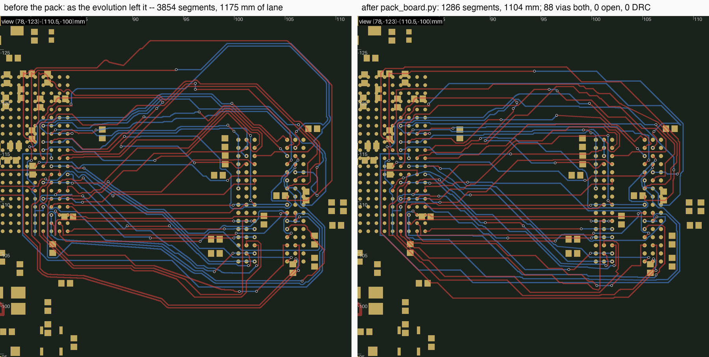

*The zynq K44 record of 88 vias, as the evolution left it
and packed: 3854 -> 1286 segments, the lanes 1175 -> 1104 mm, 88 vias both,
0 open, 0 DRC, 56 s.*

<details>
<summary>What it does, per lane</summary>

- **The lane** is everything outside the net's two **stub chains** -- the
  copper reachable from a pad through fanout-matched segments only -- with the
  chains' tips as its ends at their exact coordinates (the packer chains on
  four decimals). A run that meets its via inside the annulus is not a
  break: a tiny gap is snapped onto the centre (`PK_VIA_SNAP`, 0.03 mm), a
  larger one bridged with a link, and a duplicate whose both ends lie on the
  chain is dropped as a loop.
- **Before the pack, the source trim and the coupled re-lay.** The write-time
  source trim (`braid.note_source_joint`) runs again on the finished board,
  in rounds, until a round splices nothing -- a board the evolution assembled
  from probes carries backtracks no braid saw whole (34 mm at K44). A splice
  the trim refused because another lane of the run stands between the stub
  and the backtrack is tried again with that lane **lifted** and routed anew
  between its own tips by the production router (`--relay`, on). It is kept
  only when the pair's copper is shorter, no lifted lane gained a via, and
  the scoped DRC over the nets involved names nothing new.
- **The string.** Each lane is relaxed to a taut string against the board as
  it stands -- pads, foreign copper, the lanes packed before it -- and
  re-emitted where the string runs: octilinear legs, a wrap round a via or a
  pad as a 45-degree chamfer, an unclear grid leg replaced by the string's
  chords between its ends, and a vertex the path doubles back at dropped when
  the chord past it is clear. Every pass does this for every lane, so each
  sees the room the last pass left (`--passes`, 4 on the records).
- **Taut, not following.** `PK_FOLLOW=0` is the whole-board default: a lane
  snapped into the tube of the lane packed before it copies that lane's jogs,
  and from the wall inward the outer lanes copy the router's still-ragged
  inner ones (K18's bundle read as a wave, 392.6 -> 394.8 mm with the follow;
  taut, 386, bending together at the cap pads).
- **Vias never move.** A via its lane would move is checked against copper
  and against the hole-to-hole rule, a disc per drilled pad and per other
  via, read off the board.
- **The grade is the gate.** A scoped DRC before any edit and after the
  passes; every lane a new violation names goes back to the copper it came
  with.

</details>

Measured on the zynq evolution records (2026-09-19); vias unchanged on every
rung, 0 open, 0 DRC with and without the margin, every lane packed:

| K | 9 | 18 | 26 | 32 | 38 | 42 | 44 |
|---|---|---|---|---|---|---|---|
| lanes, mm (best -> trimmed + taut pack) | 185 -> 181 | 393 -> 383 | 662 -> 630 | 801 -> 769 | 954 -> 915 | 1054 -> 996 | 1203 -> 1104 |
| run copper, mm | 221 -> 217 | 468 -> 458 | 774 -> 736 | 971 -> 940 | 1171 -> 1121 | 1300 -> 1235 | 1477 -> 1350 |

- **Re-run after the audit** (2026-09-22): the K44 record packs to the same
  1104 mm (3854 -> 1286 segments), and the H3 K51 record of 87 goes 1003 -> 939 mm, 1744 -> 1469 segments, at 87
  vias, 0 open, 0 DRC.
- **What a lane keeps after all that is its wrap:** a lane that goes the
  long way round its bundle at the same via count is invisible to the chain's
  judge, which prices vias and never copper.
- **`BRAID_PACK=1`** is the same pack inside the chain, per corridor at the
  braid's write time. On the chain as it stands it is not a gain: the
  smoother, the source trim and the re-escape already take the slack a
  corridor's pack was for -- K28 36 vias either way, 622 -> 630 mm and
  573 -> 604 segments; K41 76 either way, 1069 -> 1063 mm and 1063 -> 1621
  segments (2026-09-22). The whole-board pass over a finished board is the
  form that pays.
- **Instruments:** `BRAID_PACK_DEBUG=1` (the per-lane log),
  `BRAID_PACK_TRACE` / `BRAID_PACK_DUMP` (one lane's string, step by step,
  and its pieces to disk), `BRAID_PACK_PROFILE`, `PK_WHOLE_DUMP` (a
  whole-board lane's chains and tips).

### The source stub trim and the served-under-the-part rule

Two things the zynq article asked for (2026-09-19, the second pass over it),
each general:

- **The source stub trim** (`braid.note_source_joint`, on by default;
  `SRC_TRIM_REACH=0` turns it off) is the source-side mirror of the berth
  trim. At write time every lane is walked from its tooth, every vertex
  projected onto the net's own stub chain, and the deepest splice that
  shortens the copper and grades no worse on the net's scoped DRC stands: the
  stub's dead tail and the lane's backtrack go, and one cross segment joins
  them. Vias never change.
  - Measured, the trim on: zynq K38 68 = 68 vias with DQ12 58 -> 37 mm, K44
    105 = 105 (six lanes, -20 mm); H3 K28 34 = 34 (SA1 -3.4 mm), K35 60 = 60
    (SDQ10 + SDQ13 -28 mm), K41 74 = 74 (-13 mm), K51 98 = 98 (SBA1 + SDQ11
    + SDQ13 -57 mm).
  - A dead-copper audit of every board finds no dangling tail at either end:
    the berth trim is complete on these boards. What it does not catch is a
    lane that never touches its stub again (DQ13 at K44 climbs six
    millimetres up the far face before turning back, and the 3.6 mm splice
    the trim found took 5 mm, not 20).
- **The served-under-the-part rule** (`py_router`,
  `KICAD_FANOUT_SKIP_UNDER=1`, `bga_fanout.escape.under_part_candidates`). A
  ball whose net's every off-footprint pad lies inside the ball field -- a ZQ
  resistor or a decoupling cap on the far side, straight under it -- gets no
  escape stub; its connection is a via at the ball and a short far-side
  track.
  - The H3 bench's `SZQ` (ball V10 to R6.2, 0.09 mm away on B.Cu, drawn a
    2.4 mm stub toward the edge) is the case; on the corpus H3 board the
    switch drops exactly that stub and touches no bus net.
  - It rides #472's deferral plumbing, so the balls stay routable through
    the route steps' zone exemption.
  - Opt-in: the always-on form is a fanout-laid pad drop (via at the ball,
    track to the pad), not built. A bench rebuilt with it loses `SZQ` from
    the K51 ladder, which is right: it is not a bus net.

### Differential pairs in the braid (2026-09-20)

A DDR bus is its pairs as much as its vias: the strobes (SDQS0/1) and the
clock (SCK) must run **coupled**, and the ladder never carried them. They are
in now, opt-in: `BRAID_PAIRS=1 PLAN_PAIRS=1`, on the pair bench
`fb_t2q_pairs` (`fb_t2q_fresh` plus the six pair nets in their rivers,
checkpoints in `fb_t2q_pairs.ladder.txt`; K34 = the old K28 + the DQS legs,
K36 = + SCK).

- A pairs run of the chain needs `BASE=fb_t2q_pairs.kicad_pcb` as well:
  `chain_k.sh` defaults to the fresh bench, and a pairs run on it grades
  against the wrong list.
- Off, everything is byte-identical (checked by copper comparison on the
  recorded K34 braid and by the ladder: K28 34, K41 74).

#### The pair router, and a pair's copper is protected

`braid.route_pairs_free` -- the last resort of the planned flow below.

- A pair is routed by the production pair router (`connect_pair` ->
  `route_diff_pair_with_obstacles`: one centreline, P and N generated either
  side of it), free of any band in a 6 mm window when it comes to that.
- Only the singles' **exit stubs** are reserved: a millimetre in front of
  every tooth and berth (`BRAID_PAIR_EXIT_RESERVE`). Without it a pair laid
  across a tooth row sealed SA4 into its tooth.
- Its copper joins the base copper, so the corridors plan and route the
  singles around it and no rescue, rip or re-lay touches it; the output
  project records the legs as protected nets (#521). Each pair lands in
  under a second.
- **A pair is never routed as singles:** one it cannot couple is refused,
  both legs open and named.

#### The plan knows a pair

`pairs.py`, `pages_first.py`, `fanout_from_plan.py`.

- **One member per pair**, with midpoint ends and the room of two slots
  (`Corridor.lane_w`, `pair_floor`).
- **In the CP-SAT**, both legs take moves of one face and one layer, with
  neighbouring exits at both ends and nothing of another net between them
  (SDQS1's teeth 0.96 mm apart with two teeth between, on a 0.32 mm comb,
  passed the reach alone), and one **handedness** at both ends (`pairs.hand`:
  which side of travel P lies on; arriving at a berth is against its escape
  -- SCK's teeth P-west leaving south, with berths P-west entered from the
  south, was the router's "polarity mismatch cannot be resolved").
- **A held berth standing between a pair** is freed before a re-solve, or the
  re-solve is infeasible and the greedy choice, which knows no pairs, stands.
- **The judge** prices a bad pair end at `PLAN_PAIR_BAD_W` (50 vias): without
  it the source residue round judged the pair's moved teeth worse by count and
  reverted them.
- **One unit.** That round also keeps a pair's teeth one unit
  (`split_pairs`): a realized board with fewer pairs whose teeth stand on
  different faces or layers wins before any count, one that splits a pair
  never does, and a move set that unites a pair but judges worse is laid
  again with the pair legs' moves alone (zynq K44: DQS0_N's move rode in a
  set of six judged 353 -> 399 and reverted; alone 353 -> 354, kept).
- **`pairs.harmonise`** is the post-fix on a plan chosen one leg at a time.
- **Tie vias.** A ball with a pad of its own net under it on the other layer
  (a back-side termination the placement step moved under a clock ball) takes
  no via-in-pad escape and is served by a tie via at the ball on the shipped
  fanout board (`tie_vias_under`; inside the destination loop the audit read
  it as an unasked via-in-pad berth and re-planned eight passes).

#### Two more benches (2026-09-20 evening)

**The zynq article** (the 2026-09-19 build; K44 carries
both DQS pairs as legs; CK stays out, its R20 is 4 mm from the balls). Two
rules came from it:

- **Room at the exit.** A pair leg's move must have room for the pair at its
  exit (`pair_exit_clear`: the ray past the exit for 1.2 mm clear on the
  leg's own line and on one side, where the partner runs). C105, a back-side
  cap 0.6 mm behind DQS0's tooth, refused every pose.
- **Converge after the comb.** When a pair has no neighbouring combination at
  an end, one face and one layer is accepted and the router's approach
  converges the legs after the comb (`connect._appr`: each leg runs on along
  its escape until the two can converge at 30 degrees without touching
  anything). DQS0's P ball is an outer-column ball with two tooth moves, both
  boxed.

**The synthetic bench** (`synth_bus.py --pairs N`, `synth_ladder.py --batch
pairs`: two pairs among sixteen, balls neighbouring at both ends; the
interleave pattern has none and runs as the control). Re-run 2026-09-22:
every case exact against its optimum with the pairs on or off (sorted 0,
blocks 16, interleave 14 vias), the pairs coupled 0.82 / 0.82 (sorted) and
0.74 / 0.71 (blocks) at the pair pitch against 0.00 as singles. (The census's
pitch is the mode among pair-like distances, so two legs a ball pitch apart
read as 0.00, not 0.92.)

#### A pair's termination is a waypoint (2026-09-20, late)

A two-pad part with one pad on P and the other on N -- the zynq's R20 on CK,
4 mm from U1's balls -- is a place the pair **passes through**, as the human
takes it (four segment ends on its pad).

- `coherent_nets.admissible` admits such a net (its ends are still the two
  arrays), and `make_bench.pair_nets` selects by the same rule.
- `braid._route_pair_legs` routes the pair in legs -- teeth -> the part's
  pads -> berths -- each leg by the same router, the pads leaving square to
  the part on the side of the next stop (a slanted direction had the router's
  connector graze the partner's pad by 0.03 mm).
- A part **under** the balls is not a waypoint: the tie via serves it.
- **The pairs' order is retried.** A pair refused because the pairs before
  it took its room (K47: DQS1 walled by DQS0's copper, the free window
  exhausted at 20000 cells) is tried first in a new order, and the order
  landing the most pairs, then the fewest vias, stands.

#### The pair is part of the plan (2026-09-20, latest)

`BRAID_PAIRS_PLANNED`, default on. Andy: "we need the diff pair to be part of
the planning." Every pair is a corridor member -- its slot, page and dives
are the one plan's -- and after the plan each pair is routed **first**,
inside its own planned band (`route_pair_lane`):

- the slack ladder `BRAID_PAIR_SLACKS` (0.6, 1.2 mm);
- the other members' planned lanes reserved, except at the **fan-in**:
  within `BRAID_PAIR_FANIN` (2.5 mm) of the pair's ends only their 1 mm exit
  stubs are reserved -- the lanes there are born on the tooth's layer and
  cross in front of the pair's teeth, and a pair's pose needs room no single
  needs;
- its dive zones wider than a single's (`BRAID_PAIR_DIVE_EXTRA`, 0.6 mm each
  side of a planned change: two barrels side by side).

A refusal falls through, in order:

1. a refusal with no frontier -- the router's own intra-pair check on the
   pose it chose -- retried with straight approaches twice and three times as
   long;
2. the converging approach bent onto the planned lane, when the tips lie far
   apart along a comb;
3. free in a window;
4. free of the plan (`route_pairs_free`), the last resort.

A pair through a termination part goes by its legs, and the pairs' order is
retried. Its copper is protected and the same plan routes the singles round
it (`route_pairs_planned`; the corridor skips protected members). Measured on
the chain:

| chain | in the plan | human |
|---|---|---|
| H3 K36 | **84**, 0 open | 62 |
| zynq K44 | **100**, 0 open | 103 |
| zynq K47 (CK) | 111, 1 open (WE) | 109 |

Every pair coupled in every run (K36 0.54 / 0.89 / 0.64, K44 0.85 / 0.84, K47
CK 0.76 through R20 / 0.83 / 0.85). On K47 both DQS pairs land only by the
last resort, so their copper is not in the singles' plan and one single stays
open. Pairs off is byte-identical to the recorded K34 braid.

#### The economy's guard, the joint re-lay and the comb discipline (2026-09-20)

Andy drew the obvious route for K36's SBA1 over the render, in magenta. The
chain had it at 0 vias and 44.7 mm -- round the outside of the DDR and back
up under its balls to its own dogbone via -- where 2 vias and 20 mm, or 0
vias and 22 mm, were there. Two defects, both general:

- **The econ re-lay** (the post-completion pass that rips a heavy lane and
  keeps a re-lay with fewer vias) accepted fewer vias **at any length**: SBA1
  2 -> 0 for +24 mm; SDQ0 5 -> 3 for +20 mm; K28's SA1 the same 21 -> 45 mm,
  and the recorded 34 contains it.
- **SA0**, refused in its band and routed at the last call with an open
  search, had hugged the DDR's comb 0.2 mm in front of SBA1's berth, so the
  way in from above was taken.

Three rules:

- **`BRAID_ECON_MM_PER_VIA`** (6 mm; 0 = the old rule): a re-lay may buy a
  via with at most this much copper. The human's own economy is about 4 mm a
  via; a DDR lane 24 mm over its group is 24 mm of meander on every other
  lane of the group at the length-matching phase.
- **`BRAID_ECON_JOINT`** (1): when a lane's cheaper re-lay is too long for
  the guard, or an extra-long lane has no cheaper lane alone, `rip_for`'s
  min-cut probe -- a tight window round the planned lane, every lane of this
  run priced at 1 mm a cell, not blocked -- names the lane(s) its short path
  would cross. The trial rips them, lays the lane free round its planned
  path, re-lays each victim (band first), and keeps the set only when it is
  cheaper **in all**: fewer vias under the same guard, no lane ending with
  more vias than it had, no lane growing past its own guard, and never for
  millimetres alone. Measured on the way there:
  - a set judged by its direct victims alone shipped +6 vias on three lanes
    a nested negotiation had re-laid, so nested rips are off in econ and
    every changed lane is counted;
  - a via moved onto a neighbour (SDQ12 2 -> 4 for SDQ13's 5 -> 3) reshaped
    the board and cost SA7 and SA8 their 0-via re-lays after it;
  - a length-only joint (SODT0 3 mm shorter by ripping SODT1) took the space
    SA2's 0-via re-lay needed (K41 arm B 46 -> 48);
  - the joint offered to every lane with a via was 82 at 64 s, against 79 at
    35 s.
- **`BRAID_APPROACH_RESERVE`** (1.0 mm): at the last call, every other
  member's berth approach -- a millimetre out from its berth along the
  arrival direction, on its arrival layer -- is virtual copper, so a lane
  searched free of its band cannot park in front of a neighbour's berth.
  Neutral on K36 (SA0 then arrives at 45 degrees like a comb lane).

SBA1 itself ends at 2 vias and 20 mm: its 0-via path crosses three byte-lane
lanes, not one neighbour.

#### The room a pair's converging approach needs at the comb (2026-09-20)

Zynq K47's DQS pairs landed only free of the plan, and a single stayed open
(111 vias, 1 open).

- **The band.** A probe of the band mask at the fan-in showed the pair's teeth 1.55 mm apart with DQ6's and DQ0's
  teeth between them, and the pair's band a single lane's wedge from the
  pair's centre: one cell of it at the P tooth, and the converged tips 2 mm
  out outside it altogether.
- **The berth.** The pair diagnostics (`BRAID_PAIR_DEBUG`) then showed the
  planned attempts dying at the berth: the lane-guided connector hooks into
  the berths from the north, 0.3 mm from them, between a reserved lane and
  cap C102.2, and the router gave up before laying copper ("stopped at the
  source (no copper)" was the message; the source was free), while the
  free-of-plan call arriving along the berths' own direction landed at once.

Two fixes:

- **`BRAID_PAIR_FANIN_BAND`** (0.6 mm): the **convergence zone** -- the
  pair's band ORed with a box at each end, `BRAID_PAIR_FANIN` mm out along the
  escape (arrival) direction from the two ends' midpoint, half the ends'
  separation plus this across, on that end's layers
  (`Corridor._pair_fanin_band`; the boxes' corners join the window).
- **`connect.py`:** a pair route that makes no copper with a lane-guided
  connector at either end is tried again with the plain approaches along the
  escape and arrival directions, inside the same band, before it is refused
  -- like the frontier-less retry.

| chain | before | after | human |
|---|---|---|---|
| H3 K36, pairs | 84 | **71**, 0 open | 62 |
| H3 K28 | 34 | 36, 0 open | 46 |
| H3 K41 | 74 | 74, 0 open | 70 |
| H3 K51 | 98 | **96**, 0 open | 81 |
| zynq K44, pairs | 100 | 102, 0 open | 103 |
| zynq K47, pairs + CK | 111, 1 open | **97**, 0 open | 109 |

Every pair lands in its planned band at K36 (SDQS1 and SCK at 0 vias) and at
K47 (all three at 0 vias, DQS0 +1.2 mm, DQS1 +0.6, CK through R20), coupled
0.54-0.88. K28's +2 is the guard refusing SA1's 24 mm for 2 vias.

#### Away teeth and the re-escape (2026-09-21)

Andy: "both renders show away teeth with long roundabouts -- I thought we'd
fixed that in the past?" Two different things:

- **On H3** the looping nets (SCAS, SA7, SRAS, SODT0/1, SWE, SA13, SA9, SA12)
  sit at the bottom-left of a 0.65 mm ball field the lanes cannot cross, and
  the human loops them the same way (its SCAS/SA7/SRAS/SA13 run 38-39 mm and
  reach 4-5 mm below the array).
- **On the zynq** three of them are real away teeth -- BA0, WE and DQ15,
  balls on the east side of U1 (x 80-84, U2 east at 100+), teeth at the west
  edge (x 68).

What does help is Andy's other reading: "the long west tooth can clearly be
removed after the fact by a re-lay". **`re_escape.py`** (`BRAID_RE_ESCAPE`,
mm over the airline; `RE_ESCAPE_DEFAULT`) is the other half of the write-time
source trim, which can only splice a lane that ran back along its own stub.

The re-escape takes a lane whose stub + lane run more than this far over its
pad-to-berth airline, and:

1. lifts the lane and the **whole** source-side stub (dogbone via included --
   the tip chain alone left a via and its pad segment dangling);
2. routes the net again from its pad, free, against everything else as laid;
3. ships the new copper only when it is cheaper at `BRAID_ECON_MM_PER_VIA`
   (6 mm a via) and no worse in scoped DRC.

- It runs **before** the trims (routed to a berth the berth trim had just
  removed: open).
- It takes the lanes **worst offender first** (SCAS's route from its pad was
  there until SRAS, the adjacent ball, went first and took the channel).
- It strikes the lifted fanout vias from the board text (the writer starts
  from the fanout file, which spells vias in the net-name dialect; a
  re-placed via on the same site read as a hole-to-hole DRC).

Measured:

- **K36 braid arm A:** 8 lanes routed again, -97 mm -- SCAS 43 -> 26, SRAS
  38 -> 26, SODT0 34 -> 25, SDQ8 33 -> 9, SDQ15 37 -> 12 -- at the same 71
  vias, 0 open, DRC 0.
- **Same-fanout control on zynq K47** (both arms, DRC 0): arm A 110 vias /
  1 open -> 106 / 1 open (the open is DM0's last-call refusal, untouched) for
  -96 mm; arm B 97 / 0 -> 100 / 0 for -104 mm -- the 6 mm rule buying 104 mm
  with 3 vias.
- The chain's grade counts vias, so the pass reads as +2..+3 where it trades
  under the rate; `BRAID_RE_ESCAPE=0` is the vias-only regime.
- The rest of the bottom-face group stays: a route from the pad costs 2 vias
  for 8-10 mm there, a wash at 6 mm a via (SA7 0 vias / 54 mm vs 2 / 41),
  which is also what the human pays.

| chain | re-escape off | on | human |
|---|---|---|---|
| H3 K36, pairs | 71 | 71, -97 mm | 62 |
| H3 K28 | 36 | 36, -22 mm | 46 |
| H3 K41 | 74 | 76, -24 mm | 70 |
| H3 K51 | 96 | 99, -44 mm | 81 |
| zynq K44, pairs | 102 | **98**, -72 mm | 103 |
| zynq K47, pairs + CK | 97 | 100, -104 mm | 109 |

#### The pairs bench at K41 and K51, and the cross-corridor reservation (2026-09-21)

- **K41 with the pairs:** 95 -> **91**, 0 open (human 70 on the same list;
  pairs-off 76), all three pairs in their planned bands.
- **K51 with the pairs:** **144, 5 open** (SA15, SA3, SCKE0, SDQ12, SRST;
  human 88; pairs-off 99 / 0 open), every portfolio arm 5-13 open, 20 lanes
  at the last call. SCK was refused in its band, widened and free, landed
  free of the plan, and the singles' plan was blind to its copper.

SCK's refusal had two layers.

1. **A launch pocket** in front of its berths, the same 402 cells every
   attempt. The map rebuilt piecewise (a probe) showed copper alone leaves
   those cells free and the virtual pieces block them, and the piece was the
   1.5 mm end stamp of a lane from **another** corridor -- SA10, a one-net
   corridor berthing 1.2 mm east of SCK's on the DDR's comb -- which the
   pair's fan-in rule had never covered. It does now
   (`BRAID_PAIR_CROSS_FANIN`, 1): a cross-corridor piece with an end within
   `BRAID_PAIR_FANIN` of either of the pair's ends is left out. K41 95 -> 91
   is this rule; zynq K44 98 and K47 100 are unchanged by it.
2. **The comb run** stands. SCK's lane runs the length of the DDR's top edge,
   where four neighbouring berths' lanes converge at the fanout's 0.4 mm
   pitch round the pair's berths, SCKE0's berth, via and stub between the
   pair's two, and the pose clouds from the two ends never meet (a
   whole-window frontier in every band). The corridor's slot for a pair
   member is already the pair's width (`lane_w`); the comb run is the
   fanout's pitch.

#### One pair at a time at K51, and the human's comb (2026-09-21 evening)

Andy: "rethink how pairs are incorporated; add one pair at a time; compare to
the human's SE and pair routing, fanout, berths." `BRAID_PAIR_ONLY=SCK,SDQS0`
(`pairs.py`) couples only the named pairs -- every other pair's legs are
singles in the plan's clauses, harmonise, the judge and the braid alike --
and the ladder's admission ignores it (`coherent_nets.admissible` passes
`admit_all`), so every arm routes the same 51 nets. Measured on the pairs
bench (the chain; re-run 2026-09-22 on the tree as it stands):

| arm | vias | open | pairs coupled |
|---|---|---|---|
| the six pair legs as plain singles (`BRAID_PAIRS=0`) | **143** | 4 | -- |
| SCK the only pair | 121 | 5 | SCK open |
| SDQS0 the only pair | 146 | 2 | 0.85 |
| SDQS1 the only pair | 132 | 3 | 0.82 |
| all three (the pairs record) | 144 | 5 | 0.87 / 0.82 / 0.65 |
| the human, the same 51 nets | 88 | 0 | 0.90 / 0.83 / 0.92 |

So coupling the three pairs costs one via and one open over the same nets as
singles, and a pair alone can take the count down (SDQS1: 132) or leave its
own legs open (SCK).

- **The pair nets, not the coupling, are the cost.** The "98 / 0" this was
  measured against is the pair-less bench's K51 -- 48 different nets (minus
  SA14, SDQ1, SZQ; without the six legs). The six pair nets, as singles, take
  the chain from 99 / 0 to 143 / 4, where the human pays two vias each.
- **Where the human puts them.** Their balls all stand on the rows facing
  the depopulated band (SCK J7/K7 and SDQS1 C7/B7 on the top block's bottom
  row, SDQS0 F3/G3 on the lower block's top row). The human serves every one
  by a dogbone **into** the band, and brings 13 of the 51 nets in through the
  DDR's **west** edge riding the band on both layers (on B SDQS1N@64.59
  SDQS1P@65.04 SDQ9 SDQ11 SDQS0N SDQS0P@66.61 at ~0.4 pitch; on F SDQ15 SDQ13
  SDQM0 SDQ2 at 0.56). Our plan gives the west edge 6 berths and the bottom
  edge 26 (the human 13 and 19).
- **SCK.** The human keeps its teeth on U1's south face (F, 125.56/125.87),
  runs east **under** every lane, and climbs B up the J/K columns from a via
  south of the DDR into the band -- zero crossings, 2 vias a leg. Our plan
  moves the teeth to the east face on B and berths on the top comb, so the
  lane crosses the whole byte-lane bundle, 3 vias a leg.
- **SCK alone is refused at its own teeth.** The bench's source comb (the
  production fanout, which knows no pairs) reads SA5@125.08 SCKP@125.38
  SA6@125.73 SCKN@126.03: a foreign tooth between the pair's.
  `make_bench.fanout_source(diff_pairs=, escape_method=)` hands the engine
  `diff_pair_patterns` at the braid's pair gap, and `refan_pairs.py IN OUT
  SRC` re-fans every pair leg and every tooth between a pair's teeth that
  way: with the under-pad engine the comb is the human's (SCKP@125.58
  SCKN@125.85, SDQS1 adjacent on B, SDQS0 on F, no DRC, the same ladder) --
  `fb_t2q_pairs2.kicad_pcb`. On that bench the plan still moved SCK's teeth
  to the east face (three pairs 141 / 5, coupled 0.91 / 0.85 / 0.67; legs as
  singles 156 / 6; 2026-09-22).
- **Where the loss is,** from the planner's own log: the CP-SAT's page model
  counts 8 swimmers with SCK on page B and the byte lanes crossing it on F;
  the braid's schedule seeds pages by born layer and counts 17; the re-solve
  meant to move a swimmer's berth is infeasible with 34 nets held at one
  move, and the greedy plan ships, under a via-count berth price that prefers
  a surface berth two faces away to a dogbone into the band.

#### Pair instruments

`grade_k.py` prints one PAIR line per pair (routed or not, coupled fraction
at the inferred pitch, skew, barrels); `pair_census.py` is the same on any
board; `BRAID_PAIR_DEBUG=1` prints each end's connectors and a map probe
(centre / P / N cells, via mark, the other layer, why blocked) and writes
`tmp/pairdbg_<pair>_<n>.png` with the band, the pieces, the reserved vias and
the poses. Knobs: `BRAID_PAIR_GAP` (default the hug plus a grid diagonal,
`rules.pair_gap`), `BRAID_PAIR_SEP`, `PLAN_PAIR_SWIM`.

### The braid on the human's ends (`human_ends_bench.py`)

The braid alone, on the ends a human fanned out: `human_ends_bench.py` clips
the human's board to each net's stubs at both arrays (teeth and berths
exactly as the human laid them, the bench's other nets' teeth kept as
obstacles) and writes the plan sidecar the braid reads.

```bash
NETS=$(python3 coherent_nets.py 51 --board=fb_t2q_pairs.kicad_pcb)
python3 human_ends_bench.py fb_t2q_human.kicad_pcb tmp/hp/HHa_k51.kicad_pcb "$NETS" \
    --others bench:fb_t2q_pairs.kicad_pcb --ladder fb_t2q_pairs.ladder.txt --sidecar --marker
PLAN_PAGES=1 PLAN_JUDGE=count PLAN_JUDGE_LEN=lane BRAID_PAIRS=1 PLAN_PAIRS=1 \
BRAID_EXACT_PAGES=0 PLAN_PAGES_SIDERS=2 \
    python3 braid.py --board tmp/hp/HHa_k51.kicad_pcb --dest DU1 --nets "$NETS" --out OUT
```

K51 with the pairs (48 lanes, three of them pairs): **101 vias, 0 open,
0 DRC** in 1:46; the human's own copper on the same nets is 88. (The whole
route on the human's ends: 88, [above](#a-worked-example-k51-on-the-humans-ends).)
What makes the braid route it, each rule general:

<details>
<summary><b>The trunk and its branches</b> (the default; <code>BRAID_BRANCH=0</code> turns it off). Without branches: 109 vias, 2 open.</summary>

- A corridor's side exits leave it at **handoff** points just past its
  ribbon (`HAND_DS`) and ride a **branch** per side round the destination, on
  a spine along the octilinear hull of its pads and stubs
  (`corridor.build_wrap_spine`), as a human's ring does.
- A branch keeps the order its lanes arrive in -- a peel-off leg crosses the
  lanes still inside by layer -- and tightens as they peel: each lane moves
  in by the gap of the one that left, on 45-degree ramps staggered
  tan(22.5) x the distance per lane, so neighbouring ramps stay a pitch
  apart.
- `_order_ring` lifts every ring lane clear of the lane inside it (a disc,
  not an offset at one s; a via's room where that lane changes layer at its
  corner; any passive on a layer it must take).
- A peel-off leg may cross a lane only where the plan has room for it: the
  branches are planned in the order the lanes arrive, and any pair whose
  leg's planned copper **collides** with a lane still inside on one layer is
  handed off with the first to peel inside, the trunk's braid doing that
  reordering (`_uncross_colliding_legs`, `_order_handoffs`). On zynq K44 the
  DQ branch's berths stand 0.4 mm apart a millimetre inside the ring, and ten
  tails ran over lanes still riding round; handing every crossing to the
  trunk instead cost HHa 16 vias and a net.
- The trunk still routes each lane end to end: its band is the trunk's
  before the handoff line and its branch's past it.

</details>

<details>
<summary><b>Reservations where the plan puts the lane.</b> Reserved on every allowed layer instead: 123 vias, 1 open.</summary>

- A lane not routed yet is reserved only on the layer its profile has there
  -- on both only inside the run allowed both layers that holds one of its
  planned changes, where its via may go -- and a join leg on its tooth's
  layer (`_planned_layers`).
- In the branch frame a neighbour also narrows a band only on the layer it
  will be on (`planned_vec`; without it 111 vias).

</details>

<details>
<summary><b>Via sites that can exist.</b></summary>

- In the branch frame a corner is a reserved via only where the plan changes
  layer there.
- A swimmer's reserved diamonds keep a via pitch from every other planned
  site and a via's room from every other net's static copper, this
  corridor's teeth and berths included (`_via_static_ok`).
- A lane's own tooth and berth are cleared of the others' reservations for
  its own search (`clip_round_ends`).

</details>

<details>
<summary><b>Lines that are where the plan says.</b></summary>

- An exit block laid past the outline is squeezed onto the board toward the
  pair floor (`_fit_block`).
- A lane holds its offset through a spine corner (drawn as a chord to the
  mitre, it ran shallower than every (s, o) check assumed).
- An offset line's mitre never lies behind its piece's start
  (`corridor.Spine.lane_xy`).
- A fan-in goes round a tooth standing a pitch or more ahead of its own on
  its layer, on the side the tooth faces (`_round_teeth_ahead`: zynq K44's
  DQ2 ran 0.047 mm over DQS0_N's tooth on the BGA's south row).

</details>

<details>
<summary><b>Pairs.</b></summary>

- In the branch frame a pair owns only its **approach boxes** -- its
  connectors' reach (`BRAID_PAIR_APPROACH`, 1.2 mm) out along each end's
  escape, the tips' spread plus a track and a clearance across -- where the
  others' planned lanes are cut and their exit stubs clipped (the fan-in rule
  dropped whole pieces 26-32 mm long), and its legs are placed as its two
  conductors (without the clipped stubs: 2 open).
- A pair refused in its band under the boxes tries the band again under the
  fan-in rule before it goes free (zynq's DQS1, teeth 0.80 mm apart, landed
  in band only so).
- The envelope search stamps the reservations at the size of the single
  tracks and barrels they stand for (at the envelope's width each stood
  0.136 mm a side too wide: 113 vias, 1 open), and counts its partner leg's
  copper as its own.
- A pair whose two ends have **opposite hands** crosses its legs at a dive,
  as the human's SCK does (`connect._connect_pair_cross`;
  `BRAID_PAIR_CROSS=0` turns it off, and HHa then leaves 3 open).
- A termination the board already wires is part of its end, not a stop on
  the way (`pairs.wired`: the human's R1 sits inside SCK's berth stub).

</details>

**Checking a plan before routing it.** `plan_audit.py` checks a plan against
the router's own rules before anything is routed: reservation pitch (track +
clearance, plus half a grid step for each piece off the router's grid, which
lands up to half a step from its line), via sites (a pair's dive as its two
barrels), clearance to other nets' static copper, shape (folds and notches,
a turn also measured at the lane's own scale), bands and swimmers.
`route_lanes.py` routes chosen lanes one at a time in their bands, with
renders and the router's frontiers on a refusal. The whole route's audit is
built on both.

### The chain's other pieces

**The pages-first planner** (`pages_first.py`, `PLAN_PAGES=1`).

- One CP-SAT chooses a destination move, a source move ({the tooth as it
  stands} + the source menu) and a page for every net. Two nets on one page
  are never inverted between the launch and target orders; a net may still
  swim at 100 vias.
- Keys are the braid's own slots (`braid_slots`: corridors built on the seed
  plan); `verify` runs the braid's planner on the answer; a damped loop
  re-solves only the nets it swims, each barred from the berth that swam.
- Deterministic: one worker under `PLAN_PAGES_DET` deterministic time, never
  a clock.
- The judge is the braid's own count plus lane length (`PLAN_JUDGE=count
  PLAN_JUDGE_LEN=lane`). Its objective is measured **anti-correlated** with
  the routed count at K41 and K51 -- a proven-optimal solve routes worse --
  which is why the plan is a seed and the route-judged descent does the
  optimising.

**The braid's arms.**

- `BRAID_EXACT_PAGES` / `PLAN_PAGES_SIDERS`: the sidecar's marker; the B arm
  turns both off.
- `BRAID_ATTEMPTS` (6: the launch pitch widened) and `BRAID_BUDGET_X` (the
  rescue budget).
- `BRAID_LADDER` (`full` | `open`).
- `BRAID_SMOOTH`: the octolinear smoother at write time.
- `BRAID_PACK=1`: [the pack](#the-pack-pack_boardpy-opt-in), at the braid's
  write time -- opt-in.

Every budget is in work (judge calls, CP-SAT deterministic time), never wall
clock.

### What the human does, and what the K51 gap is

The human never routes a net above two vias: at K51, 40 nets at exactly two,
7 at zero. Class each via as source-end, destination-end or mid-field, and
the dominant pattern is one via at the destination and one in the **field**
(21 of 41 two-via nets), a mid-field via on 32 of 41: a lane that holds F at
both pads and dives once where the lanes it crosses are on F. That is the
**F-block law**, exact on 47 of 47 nets on both boards:

> vias = 2 x (maximal blocks of crossing partners on the lane's own pad layer)

So the run structure costs, not the crossing count -- the two boards carry
the same crossings (337 against 338).

- **Our double-divers** (two blocks, four vias) are load-bearing:
  `joint_floor.py --cap 2` is infeasible over our own paths, and where the
  cap can be met it costs six vias, because five double-divers buy eight free
  rides.
- **The channel itself** is two-via-infeasible from about K=16 on uniform
  permutations (`synth_bus.cap_sat_feasible`).
- So "no net above two vias" is not a target for the braid. **What the human
  has is better ends.** The one test that used the human's ends (their ends,
  our braid, then our descent) reached 79, below the human's own 81 -- which
  is how it was learned that the gap at K51 is the ends, not the
  realization, and that the human's ends differ from our menus only in the
  climb classes. The descent's menus carry those classes now (`DST_CLIMB=2`
  in descents, `SRC_CLIMB=4` in jumps): the CP-SAT plan cannot use them, the
  route-judged descent can, and it closes the gap from 98 to 83.
- The whole-route plan, on the human's ends, does keep every net at two: its
  paths are not the braid's.

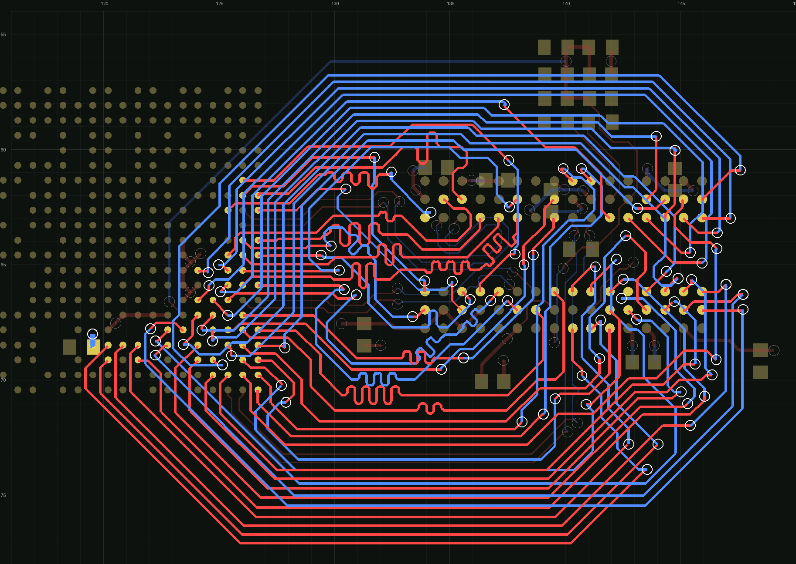

*The same 48 nets as the human routed them: 81 vias, most nets on one layer
between two escape vias, the address nested round the destination. A
benchmark to approach, not a pose to match.*

### The braid's ingredients, in pictures

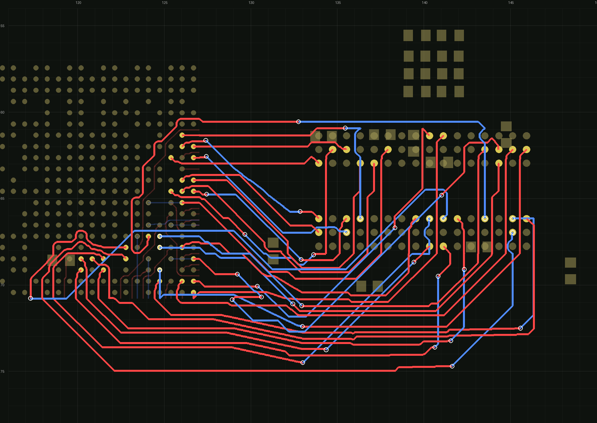

*K28, two pages. A front lane and a back lane cross for free; a page lane
keeps its layer through the schedule region and pays a via only where its
tooth or berth is on the other layer.*

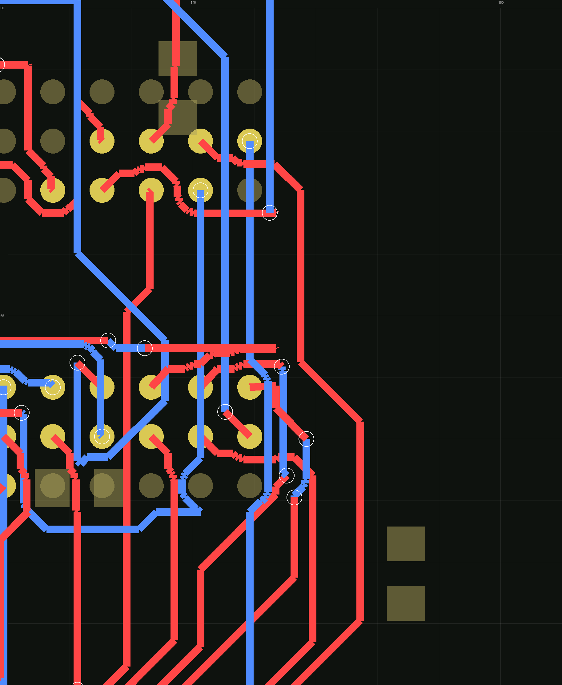

*Far-face exits: a berth on the destination's far face is a side exit of the
main corridor whose leg lies beyond the array.*

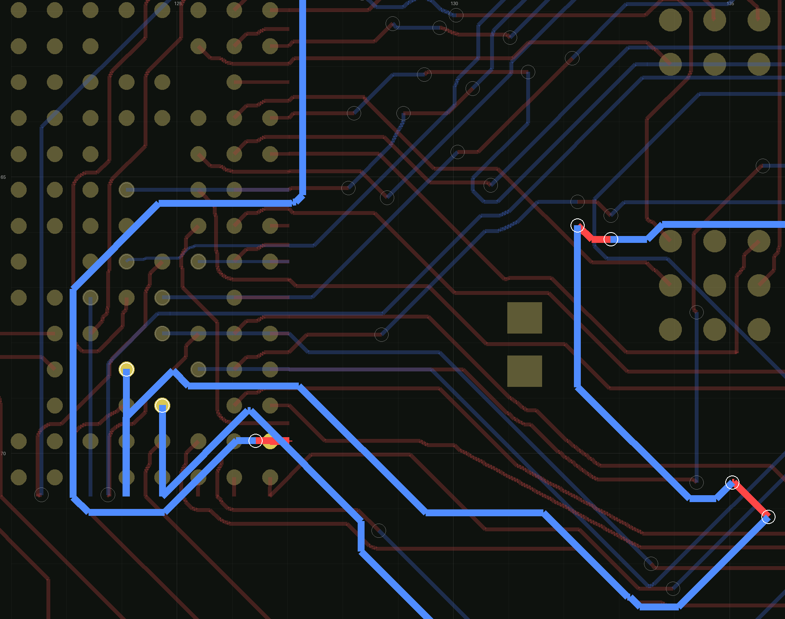

*The blocker-directed rip: SBA2 (highlighted) was refused at the last call,
boxed by lanes routed before it. Its blocked frontier named the lanes on it,
the min-cut probe found the cheapest crossing set, SCKE1 was ripped, SBA2
routed, SCKE1 negotiated in turn. This is what first completed K41 and K51.*

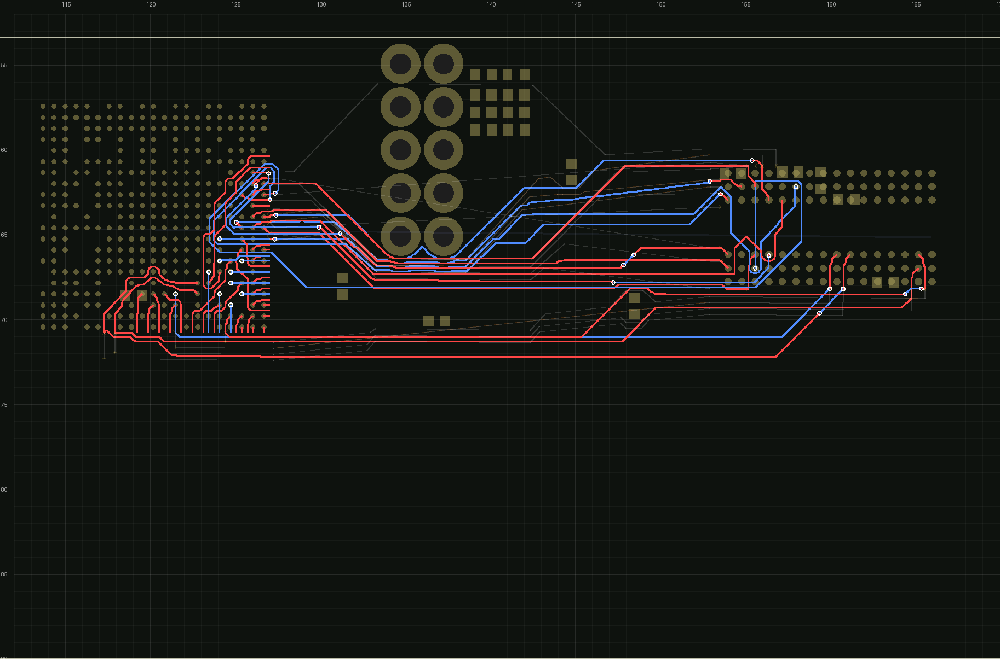 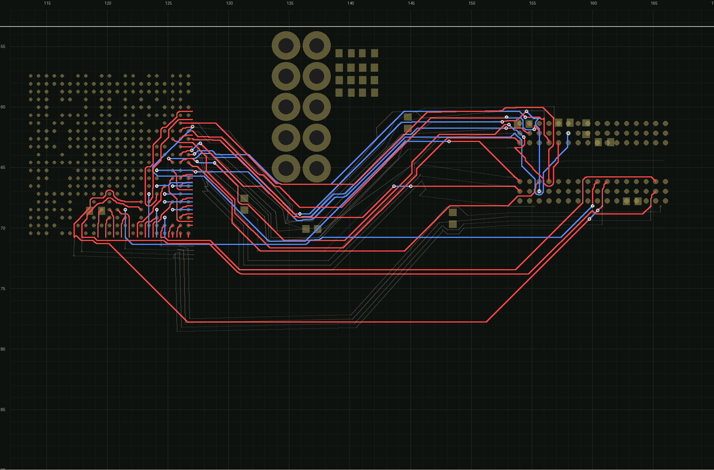

*The spine. With a straight chord the lanes are squeezed under the part one
by one (24 vias); with the relaxed medial spine, the default, the ribbon
rounds the part in 45-degree legs (26 vias, far fewer segments).*

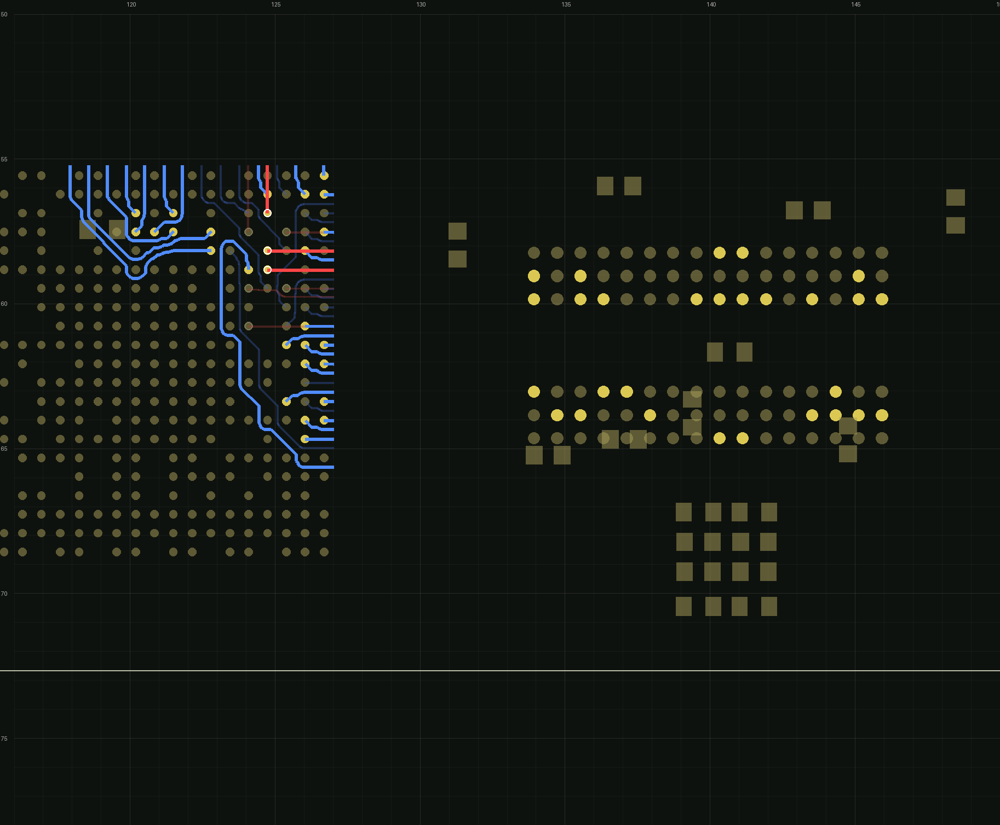

*The pose gate: the bench flipped through its plane, every part on the other
face, every stub on the other layer. Every isometry grades as the control to
the via and the segment (K15: 21 vias, 203 segments, the translation, the
quarter turns and the mirror alike, 2026-09-22); the selector and the braid
each run a pair in the pair's own canonical frame, and the plan's
candidates, the engine's per-pad asks and the in-memory DRC gate are turned
into that frame with it.*

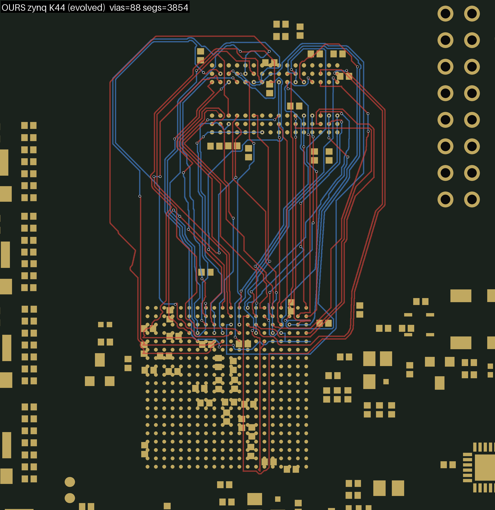 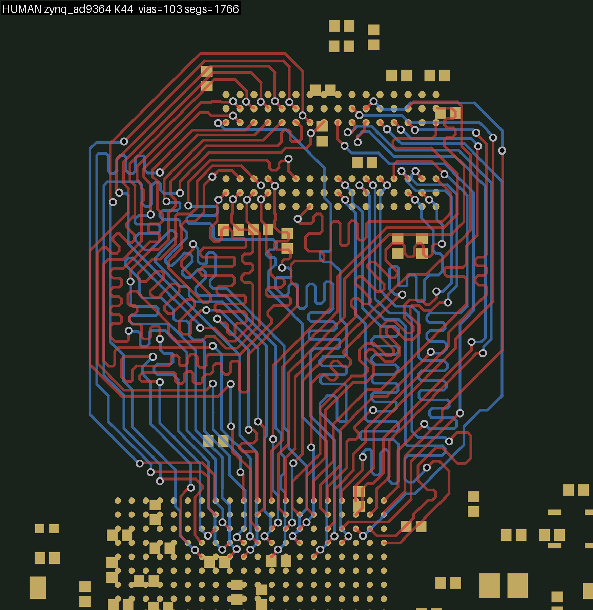

*The second article (`make_bench.py --two-layer`, zynq to DDR3), all 44
nets, after the evolution: 88 vias against the human's 103 (right, meanders
and all). Three general defects had to be fixed before this article ran at
all, none visible on the H3 bench: the flow frame turned point tokens at
depth 2 only (a board-level copper polygon and every zone stayed put while
the pads turned; the verifier also assumed orthogonal pads);
`dedupe_boards.py` let the parser's warning onto the stdout the chain
word-splits into its board list; and the evolution never handed
`--board`/`--dest` to its descents. Each fix is byte-inert on the H3 bench
(K28: 34 vias, 786 segments, as recorded).*

### The synthetic harness

Every braid number above comes from one bench against one human.
`synth_bus.py` writes a case with a known answer -- a 2-layer board at the
bench's process, two arrays across a channel, K nets in a chosen pin
pattern, and a `.truth.json` -- and `synth_ladder.py` runs batches through
the chain.

```bash
python3 synth_bus.py --self-test              # the truth model checks itself
python3 synth_bus.py out.kicad_pcb --k 15 --pattern interleave
python3 synth_ladder.py --batch b1 [--regrade]
```

Its truths:

| | |
|---|---|
| `lb` | `2(K - LIS)`, always |
| `opt` | the best whole-lane solution |
| `dp` | the best over all routings (K <= 22) |
| `pages_model` | the exact optimum of the planner's own model, at any K |
| `channel_lower_bound` | a bound below every routing in the channel-confined class. The bench leaves that class -- a fifth of the bus reaches its pad through or around an array, so K28 routes ten below its own floor -- and the bound is a diagnosis, not a scorecard |

It is what showed the planner's objective **degenerate** (constant across
plans that route 12 vias apart), and the escape move worth 42 percent of the
floor on the bench.

---

## Shared pieces

### Grading

`grade_k.py BOARD NETS`: connectivity scoped to the run's nets, whole-board
DRC at the routed floor with `--clearance-margin 0.1`, and the via census
over the run's nets. `via_census.py` and `census_vs_human.py` break a board
down per net.

The whole-board DRC includes `check_drc`'s `via-in-paste` rule (#962), so
every write that can put a via in a pad -- the plan's fanout and its tie
vias, the source realize, the bench's source comb -- declares Type VII on it
(`ship_vias.stamp`, the route step's own
`fab_notes.ship_via_protection_file`). Without the declaration the fanout
stage failed its own DRC gate and the pairs bench's realize step refused
every move (2026-09-22, the merge of main).

### One source for every routing number (`rules.py`)

`awx/rules.py` is the single definition of the chain's design constants:
every module's constant defaults to it, and every stage installs from it
(`rules.install_defaults()` in each entry point). This exists because a
swimmer was once priced five different ways.

It does **not** resolve numbers from the board, on purpose: `py_router`
already does that resolution in one place, and the topo chain will be driven
by the main router with the geometry supplied
(`Rules.from_router_config(cfg)` is the seam).

| quantity | source | value |
|---|---|---|
| spec clearance | `rules.SPEC_CLEARANCE` -> `topo_strings.SPEC_CLEAR` | 0.1 (fanout, grade, the project written) |
| braid hug clearance | `Rules.hug` -> `braid.CLEAR` | 0.105 = clearance + 5 um |
| lane track / fanout track | `rules.TRACK` / `Rules.fan_track` | 0.127 / 0.1 -- the board carries two widths on purpose |
| via size / drill | `rules.VIA_SIZE` / `VIA_DRILL` | 0.25 / 0.15 |
| lane slice, lane pitch, exit pitch | `Rules.lane_slice` / `.lane_pitch` / `.exit_pitch` | 0.232, 0.35, 0.38 |
| hole-to-hole / edge | `Rules.hole_to_hole` / `.edge_clearance` | read off the board, tighten-only |

`braid.CLEAR` (0.105) and `topo_strings.SPEC_CLEAR` (0.1) are different
quantities; `TOL`, `STEP`, `MARGIN`, `CAP`, `PROX_TRACK`, `HW_COL` look
shared and are not.

### Measuring honestly

- **A board with open nets has artificially low vias.** Only 0-open boards
  compare, and `better()` requires 0 DRC.
- **A single K is not a result.** Judge on K28, K35, K41 and K51 together;
  run-to-run spread on one board is 2-3 vias.
- **Quote the arm with the number.** A number is meaningless without its
  arm.
- **For the braid, cloud numbers are a different measurement from local
  ones.** CP-SAT stops the braid's plan solve at platform-dependent feasible
  points, so a chain on Modal starts from a different plan than the same
  chain here. Compare cloud to cloud, local to local. (The whole route
  repeats itself on each machine; two machines may differ.)
- **A rung that routes on one machine and not on another is a defect**, and
  so is a run that does not repeat itself on its own machine; the copper
  may differ between machines. Find a run that does not repeat itself by
  comparing two runs' stage outputs in the order the chain writes them: the
  first that differs names the stage.
- **There are no clocks.** Every budget is in work; a clock budget makes a
  slower machine answer differently, not later (two identical cloud runs of
  one baseline came back 72 and 58 vias).
- **Verify every new flag byte-identical with the flag off**, and every speed
  change by identical verdict lines on a recorded descent.
- **Grade at the routed floor with the right checker**, and re-verify a
  "clean" board's connectivity separately from its DRC.
- **The profiler inflates hot Python rows three to five times.** Time
  without it before deciding what to port or cache.
- **Look at the renders.** `../py_router/route_render.py`; the copper is the
  plan.

### The tools

**The whole route:**

| | |
|---|---|
| `whole_route.py`, `modal_whole.py` | one rung of the whole route end to end on our own ends -- fanout, solve, loop, route, checks, and the feedback rounds -- graded in one line (`WHOLE K=..`); the ladder in the cloud, one container per rung, and one command replayed there on the laptop's files at their own paths (`modal_whole.py::stage`) |
| `whole_ends.py`, `whole_frame.py`, `whole_feedback.py` | the whole route's own choice of ends (the fanout's `PLAN_JUDGE=ends`); its own frame of a bench; the audits' findings at the ends, back to the fanout |
| `whole_solve.py`, `whole_geo.py`, `whole_polish.py`, `whole_snap.py` | the crossing and layer solve, the geometry LP, the polish, the snap onto the router's grid (the loop that drives them is `whole_route.py`'s) |
| `whole_audit.py`, `whole_gate.py`, `whole_lint.py`, `whole_render.py`, `whole_ctx.py` | a whole-route plan installed and audited, gated (complete and clean), linted, drawn; the bench they share |
| `stage_cache.py` | a whole-route stage run, or restored when its script, arguments, environment and every file it read are unchanged |
| `awx_settings.py` | what every awx module reads by name (a policy, a knob, a stage's hand-off): the values a caller gives for a call, else the environment |
| `detmath.py` | one answer per LP: the geometry's and the polish's tie-break and rounding |
| `whole_movie.py` | a film of one run (`whole_route.py`'s OUTDIR), the fanout to the copper: the solve drawn as its braid under the board (u on the trunk is the board's x), the geometry LP as the shadow prices of the rules that bind; the root solve and the geometry re-run under observation, and refused unless they write what the chain wrote |

**Shared by both routers:**

| | |
|---|---|
| `fanout_from_plan.py`, `pages_first.py` | the planner and both fanouts |
| `select_moves.py`, `escape_moves.py`, `plan_ends.py` | menus (with climbs), conflicts, plan cost |
| `source_realize.py` | realise a source plan with the production engine, audited per dimension |
| `connect.py`, `corridor.py`, `topo_strings.py`, `taut_fast.py` | the real router, corridors, the taut relaxation |
| `pairs.py` | a differential pair's rules: its hand, end connectors, dive room, crossover, the staircase it can keep to; `harmonise` |
| `plan_audit.py`, `route_lanes.py` | a plan checked before routing (reservation pitch, via sites, static clearance, shape, bands, swimmers, what is reserved near a point); chosen lanes routed one at a time in band, with renders and a refused search's frontiers |
| `human_ends_bench.py` | a bench on a human's ends: their teeth and berths clipped from their board, with the plan sidecar |
| `ship_vias.py` | a via the chain lays in a pad declares IPC-4761 Type VII, as the route step does (#962) |
| `rules.py` | one source for every routing number |
| `grade_k.py`, `via_census.py` | the grade, and the per-net via census |

**The braid chain and the evolution:**

| | |
|---|---|
| `chain_k.sh` | the chain |
| `braid.py`, `schedule.py` | the router: corridors, schedule, lanes, ladder, rip; `braid.run` is the callable form; the pages |
| `replan.py` | the descent, the near jump, the probe crossover; the route as the judge |
| `evolve.py` | the population: descend / jump / cross, elitist, closed worlds |
| `evolve_movie.py` | the movie of a run, or of several runs stitched by copper |
| `probe_memo.py`, `probe_worker.py`, `solve_memo.py` | the memo, the resident workers, the plan-solve memo |
| `smooth_board.py` | the octolinear smoother once over an assembled board's lanes |
| `dedupe_boards.py` | boards identical by copper (the portfolio, the population) |
| `pack.py`, `pack_board.py` | the pack: every lane of a finished board a taut string, vias fixed (opt-in) |
| `re_escape.py`, `refan_pairs.py` | a long source escape routed again from its pad; a pair's teeth re-fanned as a pair |
| `modal_k.py`, `arms.example.json` | cloud arms, one container per (arm, K); `return_board`, `return_files` bring artifacts back |

**Benches, frames and comparisons:**

| | |
|---|---|
| `coherent_nets.py`, `k_ladder_coherent.txt` | the coherent K-ladder: whole rivers, tightest first |
| `flow_frame.py`, `pose_gate.sh`, `make_bench.py`, `rotate_board.py`, `mirror_board.py` | the canonical frame, the poses, articles from any board |
| `human_at_k.py`, `census_vs_human.py`, `cmp_copper.py` | the human's count at a K, per-net comparisons, copper diffs |
| `joint_floor.py` | the floor: the non-circular MILP over a board's own paths (`--cap N`) |
| `synth_bus.py`, `synth_ladder.py` | the synthetic channel with a known optimum |
| `wall_probe.py`, `pinch_gate.py`, `judge_gate.py`, `floor_survey.py`, `ledger_cal.py`, `cut_ledger.py`, `rule_table.py`, `solve_curve.py`, `modal_curve.py` | probes and gates: a lane's walls, the braid's refusals, the plan judge, the floor per net, a corridor's cut, the length rule over arms, the CP-SAT's convergence |

### What this adds to `py_router`

**The branch is rebased onto main `ad243b74` (2026-09-19).** The delta against
main is 13 `py_router` files, +1895/-265 (`git diff main -- py_router/` is the
exact list). Two of the branch's `py_router` changes were already on main as
twins and dropped out of it: the smoother's trusted foreign-segment cache
with its bounding boxes built once (`d4c8bd0f`), and the zero-is-UNSET floor
in `fix_kicad_drc_settings`. Nothing in `awx/` is touched by main, so the
chain is the same code before and after; what the merge changed is main's
routing under it, measured below.

What the delta holds:

- **`KICAD_SEG_DIST_EXACT=1`** (default off since 2026-09-19; changes every
  board when on): the segment-to-segment distance in `single_ended_routing`
  is exact -- four point-to-segment distances -- instead of a 0.02 mm
  sampled sweep whose minimum was always at or above the truth. Only ever
  more conservative.
  - It ran on by default while the ladder records up to 2026-09-19 were
    measured, so a replay of those needs `=1`.
  - It is off now so that merging this branch does not change main's
    behaviour, and it owes the corpus A/B before it becomes the default
    anywhere.
  - On the bench at K28 it is inert: knob on and off route the same 935
    segments and 42 vias.
- **`generate_bga_fanout(..., escape_dir_hints=...)`**: a per-pad planned
  escape, a bare face or a full move. The under-pad engine follows a full
  move in its plan-follow phase, negotiates a blocked ball against the same
  call's escapes, degrades along the least damaging dimension, and reports
  every ball per dimension in `pcb_data._fanout_plan_report`.
- **`flip_frame.py`, and `rotate_frame` extended**: a BGA on the back fans
  out as the mirror of the same BGA on the front (`to_front_frame`,
  `flip_hints`, `flip_results`; 18 of 51 escapes differed before), and the
  plan-follow hints, the frame's quarter turn (`KICAD_FANOUT_FRAME_QUARTER`)
  and the back-side plane drops all go through the rotation frame.
- **Translation invariance**: every last-bit tie the fanout engine, its
  rescues, the plane drop's cell choice (`plane_fill_model`) and the main
  router's pad keep-out (`routing_utils`) decide is decided by a key rounded
  to a nanometre, so the same board shifted in memory routes the same.
  `_SWEEP_CHUNK` runs the clearance sweeps in row chunks of 512 KB --
  bit-identical; what changes is what macOS malloc keeps of a freed matrix.
- **`KICAD_FANOUT_SKIP_UNDER=1`** (opt-in): a ball whose net's every
  off-footprint pad lies inside the ball field gets no escape stub
  ([above](#the-source-stub-trim-and-the-served-under-the-part-rule)).
- **`check_drc.run_drc(..., pcb_data=)`,
  `check_connected.run_connectivity_check(..., pcb_data=)`**: a caller with
  the board parsed hands it over (additive; the default parses as ever).
- **`GridRouteConfig.diff_pair_setback_floor`** (default `None` = the old
  floor, track/2 + clearance, so nothing else changes): the least setback the
  pair router takes from a terminal. The whole route's pair step sets it to 0
  with `diff_pair_setback_no_ladder`, so the router takes over at the plan's
  own poses -- the end connectors' and the crossover's -- where the legs are
  already coupled copper in open space. A config field only: no CLI flag or
  GUI control reaches it.

**What the merge changed under the chain, measured (2026-09-19).** The chain
alone (`chain_k.sh` under the documented environment, knob off), re-run on
the rebased tree, reproduces the recorded row at every rung:

| chain alone | K15 | K28 | K35 | K41 | K51 |
|---|---|---|---|---|---|
| recorded before the merge | 16 | 34 | 60 | 74 | 98 |
| after the rebase onto main `ad243b74` | 16 | 34 | 60 | 74 | 98 |

Every rung 0 open, 0 DRC at 0.1 mm; the five rungs took 14 min on this
laptop. In a bare environment at K28 the pre-rebase tip and the rebased tree
route the same 42 vias and 725.6 mm of copper, and main's `#958`
equal-length collapse halves the segment count (1832 -> 935) at the same
length. The evolution's records were not re-run.

---

## TODO

Ordered, highest value first. An item leaves this list when it is done or
abandoned with a measurement. Untried ideas live here and nowhere else.

### First, the bus step in the routing chain

The whole route becomes a step of the production chain. It owns an array
pair's bus: both ends of every net, the pairs among them, and the lanes
between them. It hands the board on with that copper laid and protected.
A* routes everything else, including any lane the step refuses. The plan
is never handed to A* as hints: the ends are chosen for the lanes the
plan lays, and are worth nothing without them.

The chain:

- pour the planes;
- fan out every array, all nets, plane drops included;
- the cap nudge;
- **the bus step**;
- the other differential pairs;
- the impedance pass;
- `route.py` on the rest, with the plane finalize.

The basics come first, in this order. Length matching and routing on inner
layers follow once the basics route real boards (*later*, below).

1. **An engine function, `route_bus`.**
   - One call on a parsed board. The CLI and the GUI call the same code.
     It stays in `awx/` until the basics route real boards, then moves
     into a `py_router/bus_topo/` package that awx's harnesses import
     from: code that is still changing is not moved.
   - The driver is `whole_route.py`. It runs each stage as a process of
     its own; the GUI needs them as calls in its own process.
   - Each stage becomes a function driven by its arguments, not by argv
     and the environment.
   - Importing `whole_ctx` no longer changes directory.
   - The caches are off, and everything the step writes goes beside the
     board.
2. **The real board as it is.**
   - The flow frame's quarter turn is done in memory, and the copper is
     written back in the board's own frame. Today the board must be turned
     beforehand, and the output is not turned back.
   - A board with inner copper layers is accepted. The lanes run on F and
     B, and the inner layers are obstacles the through vias pass.
   - The outline is read as drawn, not as its bounding box, and zones and
     keepouts are read.
3. **Other nets' copper in every stage.**
   - Today only the snap and the polish see foreign tracks and vias,
     through the production obstacle map.
   - The geometry and the solve see only pads and array stubs, so a plan
     can run through a foreign via and fail late, in the audit.
   - The benches carried no foreign copper. A real board carries every
     other ball's escape and plane drop.
4. **The router's rules.**
   - Clearance, track and via come from the same resolution `route.py`
     makes: net classes, `.kicad_dru` layer rules, the fab tier and
     `--clearance-ceiling`. They go through `Rules.from_router_config`.
   - The `.kicad_pro` floor is written back.
   - Today `rules.py` holds fixed constants.
5. **Finding the buses.**
   - A detector names every pair of parts that share enough point-to-point
     nets and have an array on at least one side. The step takes the whole
     bus, not a ladder prefix.
   - Pairs are found by their name suffixes, and termination parts serve
     as waypoints, as today.
   - Fly-by and multi-drop nets stay with A*, and are reported by name.
6. **The handoff.**
   - The step writes its laid nets into the project's `protected_nets`.
     Without that, `route.py` registers an earlier step's small nets as
     rip candidates by default, and the plane finalize rips unprotected
     signal nets to make room for its taps.
   - A lane the step refuses is left with no partial copper, unprotected,
     and listed in a JSON summary. `route.py` skips connected nets, so it
     routes exactly those.
   - The bus's own pairs belong to the step, so the routing skill stops
     sending them to `route_diff`.
7. **Plane vias before the bus.**
   - Pads of plane nets inside the bus's area (decoupling capacitors,
     termination resistors, VREF) get their plane vias before the plan.
     The plan then sees them as copper, the way the fanout's plane drops
     already take their sites first.
   - Today they are tapped by `route.py`'s finalize, after the bus, when
     the lanes may already have closed round them.
8. **Crossings, measured.** Some other nets have pads on both sides of the
   bus's corridor, so their copper must get across it. The expectation is
   that A* weaves them through the bus's gaps and layer changes, or routes
   them round its ends. Measure it:
   - a census on the bus-pair boards: which nets have to cross;
   - the whole-board A/B (item 10), with the step on and off: whether A*
     still routes them.
   - If many fail, the bus is kept to a subset of the signal layers,
     leaving a layer or two free for the nets that must cross it (*later*,
     with routing on inner layers).
9. **The front ends.**
   - A CLI step: `record_invocation`, `KRT_TOOL`, a JSON summary, and exit
     codes by outcome.
   - The GUI calls the same function in-process, like every other routing
     call, on a worker thread with progress and cancel.
   - The wiring CLAUDE.md asks for:
     - the plan executor's action, with controls named after the
       parameters;
     - `reset_params_to_defaults` and settings persistence;
     - `manifest_to_plan`'s `TOOL_ACTIONS` and `FLAG_PARAMS`;
     - `test_cli_postpass_coverage`;
     - a parity gate that runs the GUI step against the CLI on a bench.
   - ortools becomes an optional dependency in `deps_check`. Without it the
     step refuses with the install line, and the rest of the chain is
     untouched.
   - The `lane_search` crate change needs its release binaries. Without
     them, Python falls back.
10. **The gate.**
    - The full chain is run with and without the step on the stress
      corpus's array-pair DDR boards (allwinner_h3_ddr3, zynq_ad9364,
      orangecrab, keks, ulx5m_gatemate, sechzig).
    - The grade is the whole board's: unrouted plus broken nets and real
      DRC not worse, and the bus's vias down.
    - Paired and directional, on three boards or more, as CLAUDE.md
      requires for a default change.
    - Then the routing skills emit the step, and `test_431` holds their
      flag claims.

**Later, once the basics route real boards:**

- **Length and time matching inside the step.** Group spreads and pair
  skews go in the judge, room for meanders is planned in the geometry, and
  the production matching runs on the step's own copper. It has to be the
  step's: `route.py`'s matching never lengthens copper an earlier step
  laid; that copper only sets the group's target.
- **Routing on inner layers.** The page pair is chosen among the signal
  layers, with escape vias spanning to them.
- **Fly-by and multi-drop nets,** as legs in daisy order.
- **A row part at one end** (TSOP-II SDRAM, SODIMM, edge connectors).
  Until then `route.py --bus`, the old attraction mode, stays the opt-in
  tool for such buses.
- **A layer left for the nets that cross the bus,** if item 8 finds many
  of them failing: the bus is kept to a subset of the signal layers, and a
  layer or two stay free for the crossers. This needs a board with more
  signal layers than the bus uses.
- **Feedback from `route.py`:** failures that name bus copper as the
  blocker are sent back to a re-run of the step as reservations.

### Next, the whole route (`whole_*.py`)

- **A pair's change, as the board counts it.** The solve counts a lane's
  layer change as one via; a pair's lays a barrel on each leg, two on the
  board (the ends model counts it so). Among its equal plans the two
  machines keep different ones at K51: the Mac's dives the pair SDQS0 twice
  (four barrels, 80 vias), Linux's the single SDQ4 (two, 78). A tie-break
  below a via toward the single's change -- in the terms under the vias,
  where the proof of the vias does not look -- is untried.
- **Tune the policy weights.** The ends model's price of a crossing on the
  trunk (`whole_ends.X_TRUNK`, a fifth of a via) is one comparison: a
  twentieth stalled K41's solves, a fifth passed K15-K41, and nothing
  between or above was tried. It could follow a property of the board
  instead -- the solve's own size (its crossings on the trunk, its triples)
  held where a solve proves within a minute. The other policies to sweep the
  same way:
  - the ends' congestion (`W_CONG`, `LOAD_OK`);
  - the feedback's prices (`FB_AVOID`, `FB_PAIR`);
  - the ends' search effort (`ILS_ROUNDS`, `ILS_KICK`, `ILS_PATIENCE`,
    `EXACT_TOP`);
  - the solve's budget and stall (`WHOLE_SOLVE_BATCHES`, `SOLVE_STALL`);
  - the geometry's comfort pitch (`P_COMF` and its weights);
  - the snap's pair keep (`W_KEEP`);
  - the loop's `PATIENCE` and the street sites (`DST_STREET`).

  One at a time, over K28-K51, the zynq rungs and synthetic buses
  (`synth_bus.py`), judged on passes on every machine (a Mac and Linux), then
  vias, then time.
- **The ends, proved.** The ends are chosen by a local search
  (`whole_ends.choose`: improving moves, random kicks, the best few re-ranked
  on the exact route), so nothing proves them best: CP-SAT proves the fewest
  vias only for the ends it is given. The search's estimate is exact in its
  parts (each layer's cover a chain on a permutation graph, the settling a
  min cut), so a CP-SAT model that chooses every lane's tooth and berth with
  that estimate as its objective -- the fanout's conflicts as forbidden pairs
  of options, the congestion's square piecewise linear -- could prove the
  best ends under it. Untried: against the local search on K15-K51, for the
  ends each finds, its time, and the vias the whole route then gets.
- **Round 1 passing: the side of a small part.** The geometry chooses which
  side of each island (a capacitor's or resistor's pads) a lane passes from
  its room estimate (`whole_geo.static_sides`), and the LP then cannot hold
  some of those sides: the lane is paid through the pads, the polish finds
  it inside them, and the side flips only in the next round, a solve and a
  geometry later. On K51 every one of three tied plans failed round 1 so
  (SA4 through R4+R5, SA11 through C3 and C4, SDQ15 through C9); with those
  sides given up front, one plan's smooth plan passed at once. A side the
  first geometry pays for could be flipped and the geometry run again within
  the round, or the room estimate made the LP's own.
- **Room beside a pair at an island** (`GEO_PAIR_ROOM=1`, opt-in, off by
  default): the geometry's island split takes a side that holds a pair with
  less than a lane's pitch to spare only when every split that fits does the
  same. To try where a pair's pinch beside a part fails (the larger zynq
  rungs).
- **A review's open findings.** A read of every stage for rules one stage
  keeps and another does not left these untried, most valuable first:
  - an island's room is measured alone -- its neighbours' pads aside, and on
    a tilted frame its box inflated (a 2x2 block of 0402s with 0.41 mm slots
    shows no slot at all);
  - a lane paid across another lane's end, stub or stub via is never fed
    back, though those are the largest payments (0.6-0.8 mm);
  - history prices every lane's crossings where a finding names two, and
    cannot buy a via -- a hard **layer** cut (off the island's layer over its
    span) for a static that survives its flip could;
  - a pair's pose or crossover shortfall, and a pair the snap cannot lay,
    carry no place for the loop to send on;
  - the snap reserves a crossover's dive room where the audit asks its
    crossover room;
  - with the pairs laid first, a pair's dive barrels do not see the singles'
    lines;
  - a crossover's two barrels ignore the hole-to-hole rule;
  - the snap rounds to the grid as `round(x / g)`, the router as
    `round(x * inv_step)`;
  - the geometry's slope correction leaves its flat cut unscaled (up to 4%
    under);
  - a via is placed where its column was not checked (up to 50 um at 45
    degrees);
  - end holds run along the spine, not the stub;
  - the smooth plan's pairs turn up to 100 degrees within one turning run
    where the pair router turns 45 -- the snap lays the real pair, and
    nothing fails on it yet; the polish, the later stage, could hold a pair
    to its turns.
- **Units.** `rules.py`'s margins on `via_need`, `lane_min` and `end_keep` (a
  "cell" of 0.03 and 0.02 / 0.05 mm, rather than the grid), the braid's
  planning distances the whole route starts from (`BLOCK_GAP`, `ROW_O`,
  `TOL_S`, `DIST_O`, `HEAD_RUN`, `RING_DIP`) and the snap's `W_DEV` (per mm)
  are still millimetres where they should be the rules' units.
- **Speed.** A K51 loop is under three minutes, half of it the geometry's LP
  in HiGHS itself: one elastic column per pitch rule, rather than one per
  tangent cut of it, would shrink it. The pairs' snap is the longest stage
  at K35 (97 s), and its searches are a third of that: the rest (each pair's
  windows, its pose candidates) is unmeasured. A pair's grid search (its
  pose counters, its crossover) is still Python.
- **Memory.** The pairs' search states are packed integers, but their cost
  and predecessor still sit in dicts and the heap holds a tuple per push
  (K35: 1.8 M states, 520 MB); flat arrays indexed by the packed state -- the
  layout a Rust search would take -- would keep every stage well under 1 GB
  at K51 and past. The rest is a floor of about 85 MB per process in
  imports: `braid.py` pins HiGHS at import, which loads `scipy.optimize` in
  stages that solve no LP.
- **Intra-pair skew.** Nothing plans a pair's two legs to one length: K35's
  SDQS1 legs differ by 1.06 mm (the human's 0.54, with a serpentine),
  SDQS0's by 0.47 (0.01), SCK's by 0.32 (0.02). The crossover and the turns
  make the difference; a skew term in the snap's pair search, or a serpentine
  the geometry reserves, would bound it.
- **Runs from a band via into the ball field.** A street berth
  (`DST_STREET`, [the ends](#the-ends-whole_endspy)) leaves only along its
  lane in DU1's empty band, toward the source. The human stands 10 of K35's
  vias deep in that band (0.5-1.6 mm from the ball rows; ours 4) and runs
  from many of them on B into the ball field, between the other balls' vias,
  out of whichever face it needs -- SRAS, SCAS, SWE, SA0, SA12 and SA9 from
  under DU1's east end. Ours from there run F west along the band's half
  lines, which the street berths' stubs cross: at K35 SWE and SA12 lost
  those runs, left by the south face and crossed its bundle, 2 vias each.
  Destination climbs are the other half of it (`DST_CLIMB` is 0, and
  building `Ends` does not yet scale to them: conflicts only for the options
  a search asks).
- **awx in production.** The harness commands turn the caches on
  (`TAUT_MEMO`, `STAGE_CACHE`, `PROBE_MEMO`) and keep them under `awx/tmp`
  -- inside the installed plugin once awx ships -- and with `TAUT_MEMO=1` the
  braid writes `<board>.taut.json` beside the board; `evolve.py`,
  `evolve_movie.py`, `pack.py` and `replan.py` write their runs under
  `awx/tmp` too. A production route through awx needs its caches off or in a
  per-user cache directory with a size cap, and its outputs beside the board
  or per user, not in the install directory.
- **The ladder after the braid planner changes.** The braid tables predate
  the berth rows, the rings' order and dips, the directional pair floors and
  the leg costs now in `braid.py`: the ladder again, with the portfolio
  chain.

### Then

1. **One placement of every layer change** (`place_dives`). A lane's layer
   changes are placed by separate rules one after another -- the exit
   corner, the split leg, a swimmer's diamonds -- each against what the
   others placed before it, and `plan_audit.py dives` still finds sites on
   the human's ends that cannot exist (a corner inside a passive's
   clearance, a pair's via on a neighbour's planned line). All corridors'
   changes placed together, in board coordinates, once the lines are final:
   hard rules (static copper, a via's room from every line, the via pitch, a
   pair's two barrels), soft ones (a millimetre or two from other nets'
   ends, as the human's are; staggered), and the bands and reservations
   derived from the sites.

2. **Speculation inside a descent.** Rank and dispatch the next net's probes
   while the current wave runs, and discard them when a net stands. Four
   workers sit idle for close to half of a descent. No verdict changes.

3. **Stop the evolution when it stalls, and braid the chain's arms side by
   side.** A stalled generation still costs its jumps, crossover and their
   descents; the chain's four braids are most of its wall and independent.
   Both are small.

4. **The evolution on the cloud.** A generation is seven independent
   operators; one container each (`modal_k.py` ships the tree and pins the
   stack) makes its wall the slowest operator, and width is free. The memo
   store wants a shared volume.

5. **K51's last two vias.** The next move class past the single-net classes
   is a **group** move: re-layer a lane together with its crossing partners
   in one probe (the coupled probe already routes such a set); or jumps that
   land nearer than two random nets.

6. **The chain's seeds.** The evolution optimises past the plan's objective,
   but better seeds are a better start. The berth menu is one-per-face at
   `CANDS=4` (row pruning, not column generation), and a plan-time floor over
   the planned lanes rather than the channel is the one untested ranker.

7. **The planner's comb for a pair.** No third berth between a pair's two,
   layer or no layer; and the room a pair's converging approach needs at the
   comb, given at plan time rather than found at the last call.

8. **Pairs and the evolution.** The descent moves single nets' ends, so a
   pair must land at the chain stage; a move class that moves a pair's two
   ends together would let the population improve a pairs board.

9. **Generality.** Tuned on one bench. What the zynq article shows: a
   singleton corridor's source tooth may be planned on the far face of the
   source array (the count judge sees a via saved; the length judge prices
   the lane from the tooth's exit and the berth's run but not the tooth's own
   escape through the array -- `_length` of the source move is the missing
   term), and the top rungs lose their in-band execution. Off-axis poses
   (R30, R45) still break the plan's compass faces.

10. **The corpus A/B for the `py_router` changes, then the PR to main.**
    `KICAD_SEG_DIST_EXACT` ships off so the merge leaves main's copper alone;
    the A/B decides whether it turns on, with a per-board attribution first
    (cparti_fpga is a BGA board: the fanout tie-breaks are the suspect).

11. **The `.kicad_dru` is read with real layer names inside the turned
    frame**; a per-layer rule lands on the opposite face for a back-side
    part. Shipped `py_router` code, so it blocks the merge.

12. **`pick_braid` ignores DRC** -- it judges (open, vias) only.

13. **Audit `modal_k`'s `KEEP`**: an infeasible solve prints no
    `pages-first:` line and reads like "never ran".

14. **Unverified review findings**: `dedupe_boards` fingerprints copper but
    not the sidecar; `blockers_of` double-counts half a track; `flip_frame`
    does not mirror `pad.polygons`.

15. **The pages-first solve may not be reproducible.** `pages_first.py`
    bounds CP-SAT by deterministic time with four workers sharing clauses.
    On the whole-route model (OR-tools 9.15) those settings gave a different
    answer on every run, alone or under load; a batch count with clause
    sharing off gave identical answers. Not yet measured on the pages-first
    model.
