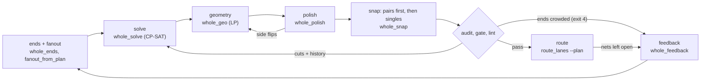

# awx -- topological routing of a BGA-to-BGA bus (#622)

awx routes a fanned-out bus between two BGAs -- an SoC and its DDR3, say --
as one problem: where each net escapes each array, where each lane crosses
the others, and where each changes layer. It holds two routers:

| | how it works | status |
|---|---|---|
| **The whole route**<br>`whole_route.py`, `whole_*.py`, `route_bus.py` | Chooses every net's ends, then plans every lane's **whole path before anything is routed** -- crossings, layer changes, geometry on the router's grid -- checks the plan against the router's own rules, and routes every lane in its band at once. | **The current router.** Every rung of both benches routes connected and DRC-clean on a Mac, with fewer vias and less copper than the human; on Linux all but two. |
| The braid chain<br>`chain_k.sh`, `braid.py`, `evolve.py` | A CP-SAT plan of both ends, a corridor braid routed stage by stage, then a population of routed boards improved by probes the real router judges. | The earlier router. The whole route reuses its fanout, router, benches and audits. |

Two rules both keep:

- **It is general.** No net, face, board or part name anywhere in the code;
  every rule is geometric.
- **It is an autorouter.** The human's boards are tests, never seeds.

**Contents**

1. [The whole route](#the-whole-route) -- [results](#results), [running it](#running-it), [the bus step](#the-bus-step-on-a-real-board), [how it works](#how-it-works), [the same answer on each machine](#each-machine-the-same-answer); its two solvers explained: [CP-SAT and HiGHS in the whole route](https://drandyhaas.github.io/KiCadRoutingTools/solvers/)
2. [The braid chain](#the-braid-chain)
3. [Shared pieces](#shared-pieces) -- grading, `rules.py`, measuring honestly, the tools, what this adds to `py_router`
4. [TODO](#todo)

<details>
<summary><b>Words this README uses</b></summary>

| | |
|---|---|
| **bench** | a board prepared for the problem: the two arrays, the bus nets, everything else as obstacles. `fb_t2q_pairs` is an H3 BGA `U1` to a DDR3 `DU1`; the zynq **article** is `zynq_ad9364` from the stress corpus, built by `make_bench.py` |
| **K, rung, ladder** | "K51" is a checkpoint on the coherent ladder (`coherent_nets.py`: whole rivers, tightest first). K51 on `fb_t2q_pairs` is 51 nets -- 45 singles and 3 pairs, so 48 lanes |
| **tooth / berth** | a net's escape at the source array / at the destination array: the end of the fanout's stub, where the lane starts / ends |
| **lane, single, pair, legs** | a net's routed copper between its tooth and berth; a single-ended net; a differential pair, one lane of two legs (P and N) |
| **dive, layer change** | a via along a lane; a pair's dive is two barrels |
| **tie via** | a ball's via to a pad of its own net straight under it on the other layer |
| **bar** | the least centre-to-centre distance two neighbouring lanes may have (0.232 mm here) |
| **island** | a piece of static copper -- a part's pads -- that a lane must pass on one side |
| **the human** | the original board's hand-routed copper on the same nets: a benchmark to approach, not a pose to match |
| **v** | vias, in the tables |
| **open, DRC** | nets not connected; DRC violations at the routed 0.1 mm floor |

</details>

---

## The whole route

The whole route decides every lane's whole path first, checks it against the
router's own rules, and only then routes it.

### Results

Both benches route on **our own ends**: the fanout chooses every net's tooth
and berth with the whole route's ends model, and the whole route plans and
routes on them, every lane in its band at once. Each cell counts every via
and millimetre of the run's nets on the board; the human's are counted the
same way. Every Mac cell, and every Linux cell with numbers, is connected and
DRC-clean.

H3 to DDR3 (`fb_t2q_pairs`):

| | K15 | K28 | K35 | K41 | K51 |
|---|---|---|---|---|---|
| **the whole route, Mac** | **12 v, 192 mm** | **32 v, 541 mm** | **48 v, 775 mm** | **54 v, 958 mm** | **80 v, 1330 mm** |
| the whole route, Linux | 12 v, 192 mm | 32 v, 544 mm | 48 v, 764 mm | 54 v, 958 mm | no grade: stopped at the 3 h cap |
| human | 22 v, 232 mm | 48 v, 678 mm | 60 v, 889 mm | 70 v, 1081 mm | 88 v, 1337 mm |

Zynq to DDR3 (the article's first build, 44 lanes in the ladder; see
[Building the zynq article](#building-the-zynq-article). The human's copper
carries its length-matching meanders):

| | K18 | K26 | K32 | K38 | K42 | K44 |
|---|---|---|---|---|---|---|
| **the whole route, Mac** | **14 v, 453 mm** | **28 v, 745 mm** | **38 v, 968 mm** | **50 v, 1170 mm** | **60 v, 1286 mm** | **66 v, 1373 mm** |
| the whole route, Linux | 14 v, 453 mm | 28 v, 745 mm | 38 v, 968 mm | 50 v, 1170 mm | 1 open (62 v, 1257 mm) | 66 v, 1373 mm |
| human | 45 v, 662 mm | 57 v, 923 mm | 74 v, 1166 mm | 86 v, 1373 mm | 97 v, 1534 mm | 103 v, 1617 mm |

Reading the tables:

- **Rounds.** Every rung routes in its first fanout round but zynq K42 and
  K44, which take a second.
- **Mac and Linux** keep different plans among a solve's equal optima, and
  the ends model's exact ranking can part on them too. Two Linux rungs fail
  that way (the [TODO](#next-the-whole-route-whole_py) has both): at zynq K42
  round 2's solve kept another plan, whose loop stopped at crowded ends with
  one net open; at H3 K51 Linux chose other ends (375 crossings against the
  Mac's 315), on which the solve found no plan before the cap.
- **Time.** The Mac ran three rungs at a time: K51 took 21 min, zynq K42 and
  K44 18 and 17, the rest under 12. On Linux (a container a rung, slower
  cores) the same rungs took two to three times as long.


*K51: left, our fanout's ends and the whole route on them; right, the
human's board. The pairs are yellow. (`whole_compare.py`.)*


*The zynq article at K44 (both DQS pairs yellow), in our frame -- the human's
board turned the same quarter turn: left, the whole route on our own ends;
right, the human, much of its copper length-matching meanders.*

### Running it

One rung, end to end -- the fanout on our own ends, the solve, the loop, the
route and the checks, with up to `ROUNDS` fanout rounds (default 3):

```bash
cd awx
python3 whole_route.py 51 OUTDIR                                       # the H3 bench (BASE=fb_t2q_pairs.kicad_pcb DEST=DU1)
BASE=tmp/zynq/zynqF.kicad_pcb DEST=U2 python3 whole_route.py 9 OUTDIR   # the zynq article (build it first, below), any rung of its ladder
```

It never ends with nothing while a plan for some of the lanes can be laid
(see [the rounds, and never nothing](#the-rounds-and-never-nothing-whole_routepy)).
Every round's result is graded, and the best -- the fewest open nets, then
the fewest vias -- is written to `OUTDIR/best.kicad_pcb` (beside its own
round's `rN/seq.kicad_pcb`). Its last line is that result's grade:

```
WHOLE K=.. round=.. lanes=../.. vias=.. copper=..mm connected=0|1 drc=0|1 secs=.. open=..
```

It exits 0 when that board is connected and DRC-clean, 1 when nets are left
open or a violation stands, and 2 when nothing could be laid at all (no
fanout board, or no plan even for half the lanes).

Each stage runs as a process of its own. `--inproc` runs every stage in the
driver's own process instead, as a routing call inside KiCad's process will:
the same outputs, file for file, in less wall time. In one process no stage
reads or writes the environment: every awx module reads its settings through
`awx_settings`, which the driver gives each stage.

The ladders on this machine, three rungs at a time, each stopped at an hour
with every stage it started, one grade line per rung (`OUT/ladder.txt`):

```bash
python3 whole_ladder.py OUT                          # both benches (zynq: build it first)
python3 whole_ladder.py OUT --bench h3 --ks 41,51 --jobs 2 --cap 3600
```

The ladder on Linux, one container per rung: `modal run awx/modal_whole.py::main
--ks 15,28,35,41,51 --out DIR` (from the repo root; the zynq article with
`--env "BASE=tmp/zynq/zynqF.kicad_pcb;DEST=U2" --ins
tmp/zynq/zynqF.kicad_pcb,tmp/zynq/zynqF.kicad_pro,tmp/zynq/zynqF.ladder.txt
--ks 18,26,32,38,42,44`). Each rung is stopped at `--cap` seconds (3 h by
default, the cloud's cores being slower), its log and best board still
returned. `modal_whole.py::stage` replays one command in the cloud on the
laptop's files at their own paths.

When two runs part -- two machines, or a run before and after a change --
two tools find where:

```bash
python3 fanout_logdiff.py RUN_A/r1/fo.log RUN_B/r1/fo.log    # the first decision the two fanouts made differently
python3 resolve_round.py RUN/r1 OUT [--dest U2]              # a round's first solve again, on that round's own board
```

<details>
<summary><b>The same, stage by stage</b></summary>

**1. A bench** -- the human's ends, or our own:

```bash
NETS=$(python3 coherent_nets.py 51 --board=fb_t2q_pairs.kicad_pcb)
# the human's ends ...
python3 human_ends_bench.py fb_t2q_human.kicad_pcb tmp/hp/HHe_k51.kicad_pcb "$NETS" \
    --others bench:fb_t2q_pairs.kicad_pcb --ladder fb_t2q_pairs.ladder.txt --sidecar --marker
# ... or our own (the fanout's plan environment: PLAN_PAGES=1 BRAID_PAIRS=1 PLAN_PAIRS=1)
mkdir -p tmp/e tmp/e2
PLAN_JUDGE=ends python3 fanout_from_plan.py tmp/e/fo.kicad_pcb 51 --board=fb_t2q_pairs.kicad_pcb
export BENCH=tmp/hp/HHe_k51.kicad_pcb NETS DEST=DU1   # (or tmp/e/fo.kicad_pcb) the bench every whole_* tool reads
```

**2. The plan:**

```bash
python3 whole_solve.py SOLVE.json                  # crossings and layer changes
python3 whole_route.py --loop SOLVE.json OUTDIR   # geometry -> polish -> audit -> pairs -> singles -> snap
python3 whole_render.py OUTDIR/plan.json OUT.png   # look at it (AUDIT=FILE marks the audit's findings)
```

`whole_route.py --loop` exits 0 with `OUTDIR/plan.json` the snapped plan that
passed, 1 when no round got there, 3 when it stopped not converging, and 4
when it stopped at crowded ends.

**3. Route and check** -- a lane the router reports routed is not proof its
net connects:

```bash
python3 route_lanes.py all --plan OUTDIR/plan.json --board $BENCH --nets "$NETS" --dest DU1 \
    --mode seq --write ROUTED.kicad_pcb            # the router on the plan, each lane in its band
python3 ../py_router/check_connected.py ROUTED.kicad_pcb   # and check_drc.py
```

**4. Feedback to the fanout** (on our own ends):

```bash
python3 whole_gate.py OUTDIR/p1.json OUTDIR/p1.audit --hot HOT.json
python3 whole_feedback.py tmp/e/fo.plan.json FEEDBACK.json HOT.json          # the audits' crowded ends
python3 whole_feedback.py --name tmp/e/fo.plan.json FEEDBACK.json [NET ...]  # or: lanes to move, by name
FEEDBACK=FEEDBACK.json INCREMENTAL=tmp/e/fo.plan.json PLAN_JUDGE=ends \
    python3 fanout_from_plan.py tmp/e2/fo.kicad_pcb 51 --board=tmp/e/SOURCE_BOARD   # the 'source board:' its log names
```

</details>

### The bus step on a real board

`route_bus.py` is the step the production chain will call. It takes a board
as the chain hands it on and two arrays, and writes the board back with the
bus laid, in the board's own frame:

- the bus is every net between the two arrays that the ladder admits, and
  their copper, if any, is stripped;
- the source array is fanned out for them, and the board is turned into the
  flow frame;
- the whole route runs on the ladder's nets (`--k K` for its first K);
- the routed board is turned back.

It is graded where it is written:
- every bus net connected;
- no DRC violation on a bus net;
- the whole board no worse than it came.

It hands on what it laid connected, never nothing for the sake of a few nets:
a net the whole route left open, and a bus net the grade finds open on the
board or named in a violation of the bus's (or of the board's, when the board
came out worse), goes back as it came -- its own copper, if it had any -- and
the rest are graded again, up to three times. The nets put back are named in
the summary's `refused`, for the rest of the chain to route. Only a failure
no bus net is named in refuses the whole bus.

A board with inner copper layers is taken as it is. The lanes run on F.Cu
and B.Cu, and the inner layers' copper meets the through vias only. A pair
that passes through a termination part (the zynq's CK through R20) is
refused and named: the whole route lays no waypoint yet.

It routes at the chain's sizes, given as the routing CLIs take them
(`--clearance`, `--track-width`, `--via-size`, `--via-drill`, ... and
`--fanout-track-width` for the escapes). One omitted is resolved as
`route.py` resolves its own: see
[One source for every routing number](#one-source-for-every-routing-number-rulespy).
A via in an array's ball is sized to the pad by the production fanout, as in
the chain's own fanouts.

`--joint-fanout` (opt-in) also fans out the two arrays' other nets and plane
balls. The bus is laid as without it, but round a via site kept free in every
other ball. The rest are planned together round the bus in the first fanout
round (`joint_escape.plan_array`: every move kind, straps, drops, one CP-SAT
solve; the conflicts as groups, `conflict_groups.py`) and laid by the
under-pad engine's joint escape (`bga_fanout/underpad.py`, `joint=True`),
stepped down the fab ladder together only while a ball is left. A later round
holds them as it holds its own teeth: only a ball whose copper the round's
moved bus stubs now meet is planned again (`joint_escape.carry`).

`zynq_ad9364` from GitHub, its planes poured as the stress run poured them,
and the whole bus at the stress run's sizes -- its fanouts' 0.12 mm track at
0.09 mm, its routes' 0.15 mm track and 0.45/0.3 mm vias:

```bash
cd awx
mkdir -p tmp/zynq/src/boards_set1
U=https://raw.githubusercontent.com/kangyuzhe666/ZYNQ7010-7020_AD9363/main/kicad/ZYNQ7020_AD9364_V2
curl -L -o tmp/zynq/src/boards_set1/zynq_ad9364.kicad_pcb $U.kicad_pcb
curl -L -o tmp/zynq/src/boards_set1/zynq_ad9364.kicad_pro $U.kicad_pro
STRESS_DIR=tmp/zynq/src /Applications/KiCad/KiCad.app/Contents/Frameworks/Python.framework/Versions/Current/bin/python3 \
    ../tests/stress/strip_routing.py zynq_ad9364
python3 ../py_router/route_planes.py tmp/zynq/src/boards_unrouted_set1/zynq_ad9364.kicad_pcb tmp/zynq/planes.kicad_pcb \
    --nets GND RFGND VCC_1V8 --plane-layers In1.Cu In1.Cu In2.Cu --layers F.Cu In1.Cu In2.Cu B.Cu \
    --clearance-ceiling 0.2 --hole-to-hole-clearance 0.25 --via-size 0.45 --via-drill 0.3 \
    --power-nets GND RFGND VCC_1V8 --power-nets-widths 0.4 0.4 0.4
python3 route_bus.py tmp/zynq/planes.kicad_pcb tmp/zynq/bus.kicad_pcb --src U1 --dest U2 --inproc \
    --clearance 0.09 --track-width 0.15 --fanout-track-width 0.12 --via-size 0.45 --via-drill 0.3
```

Its last line is the grade:

```
BUS U1->U2 K=.. round=.. lanes=../.. vias=.. copper=..mm connected=0|1 drc=0|1 secs=.. | on the board: ...
```

It exits 0 when every bus net it hands on is connected and clean (those it put
back are in `refused`), and 1 when it hands on none.

### Building the zynq article

The second bench is built from a public board: `ZYNQ7020_AD9364_V2` from
[kangyuzhe666/ZYNQ7010-7020_AD9363](https://github.com/kangyuzhe666/ZYNQ7010-7020_AD9363),
the Zynq `U1` (CLG400) to its DDR3 `U2`. Its routing is stripped, the bench is
made two-layer with `U1` fanned out, and the result is turned into the flow
frame (one quarter turn), where `whole_route.py` runs it:

```bash
cd awx
mkdir -p tmp/zynq/src/boards_set1
U=https://raw.githubusercontent.com/kangyuzhe666/ZYNQ7010-7020_AD9363/main/kicad/ZYNQ7020_AD9364_V2
curl -L -o tmp/zynq/src/boards_set1/zynq_ad9364.kicad_pcb $U.kicad_pcb
curl -L -o tmp/zynq/src/boards_set1/zynq_ad9364.kicad_pro $U.kicad_pro
# strip the routing with KiCad's bundled python (macOS path shown) -> tmp/zynq/src/boards_unrouted_set1/
STRESS_DIR=tmp/zynq/src /Applications/KiCad/KiCad.app/Contents/Frameworks/Python.framework/Versions/Current/bin/python3 \
    ../tests/stress/strip_routing.py zynq_ad9364
python3 make_bench.py tmp/zynq/src/boards_unrouted_set1/zynq_ad9364.kicad_pcb U1 U2 tmp/zynq/zynq.kicad_pcb --two-layer
NETS=$(python3 coherent_nets.py 47 --board=tmp/zynq/zynq.kicad_pcb)
read K CX CY <<< "$(python3 flow_frame.py quarter tmp/zynq/zynq.kicad_pcb U2 "$NETS" | tail -1)"
python3 flow_frame.py turn tmp/zynq/zynq.kicad_pcb tmp/zynq/zynqF.kicad_pcb $K $CX $CY   # its .kicad_pro and .ladder.txt beside it
```

This build gives 48 two-pad nets between the arrays, `DDR3_A14` refused at
the source, 47 in the ladder (checkpoints 9 17 25 31 37 42 47). The table
above is on the article's first build -- 44 in the ladder, checkpoints 9 18
26 32 38 42 44 -- whose net selection `make_bench` no longer makes, so this
build does not reproduce it rung for rung.

### How it works

The two solvers at its heart -- CP-SAT for every crossing and layer change,
HiGHS for the geometry's LP -- and how they negotiate have a page of their
own, with interactive demos:
**[CP-SAT and HiGHS in the whole route](https://drandyhaas.github.io/KiCadRoutingTools/solvers/)**.



| stage | decides | how |
|---|---|---|
| [**ends**](#the-ends-whole_endspy) | each net's tooth and berth | a search over the fanout's escape menus, judged by the whole route's own via and congestion estimate |
| [**frame**](#the-frame-whole_framepy) | the trunk, the rings round the destination, the two orders, each lane's reference path | read off the board, with the ends model's far-face cut |
| [**solve**](#the-solve-whole_solvepy) | every crossing and every layer change, all lanes at once | CP-SAT, proved optimal in vias |
| [**geometry**](#the-geometry-whole_geopy) | each lane's offset along the trunk and the rings | one joint LP (HiGHS) |
| [**polish**](#the-polish-whole_polishpy) | the audit's measures, met in board xy | small vertex moves, an LP per round |
| [**snap**](#the-snap-whole_snappy) | octilinear paths on the router's grid, the pairs first | a grid search per lane |
| [**audit, gate, lint**](#the-audit-the-gate-and-the-lint) | whether the router can lay it | every `plan_audit` check, nothing waived |
| [**loop**](#the-loop-whole_routepy---loop) | what to try next | findings back to the solve as cuts and history |
| [**feedback**](#feedback-whole_feedbackpy) | which ends to move | findings at the ends, a refused fanout, a round's open nets -- back to the fanout |
| [**rounds**](#the-rounds-and-never-nothing-whole_routepy) | what the run hands back | the best round's board; never nothing while a plan for some lanes can be laid |
| [**route**](#the-route-route_lanespy---plan) | the copper | the production router, each lane in its band |

#### The ends (`whole_ends.py`)

`fanout_from_plan.py` under `PLAN_JUDGE=ends`. Each net's tooth at the source
and berth at the destination are chosen together from the fanout's escape
menus, because **the ends decide the braid**: the teeth's order round the
source and the berths' round the destination fix every crossing, and the
layers at the two ends fix what each crossing costs. The fanout lays what the
model chose, and the result is judged **as laid**.

<details>
<summary>Details</summary>

**What can stand together.** One conflict test, the same in the planner that
seeds the berths and in the ends model that judges them: two escapes conflict
when they cross (every crossing counts: `select_moves.SEL_XING` is 2 under
`PLAN_JUDGE=ends`, and 1 -- a crossing only where a move climbs -- for the
braid's judges), or when two exits on one layer stand closer than a track and
a clearance. An F exit stacked over a B one is allowed, and the engine checks
a stub against other nets' tracks on the stub's own layer only, so it lays
what the model allows.

**The estimate.** The route's layer changes are estimated from the ends alone:
the end-layer changes, a least-weight cover of the crossings between lanes on
one layer end to end, the settling of a lane whose end layers differ, and the
coupling of two such lanes. The best few states are then ranked **exact** on
their orders: the whole solve's order model without its lengths, CP-SAT on
one worker to a deterministic work limit.

**The objective**, one sum in vias:

- every via, the ends' own and the route's -- a pair's change two, its two
  barrels;
- **five more for every via a net carries past two** (a net of 0, 1, 2, 3, 4
  vias costs 0, 1, 2, 8, 14), a tie via not counted toward the two;
- each lane's ride at `select_moves.VIA_MM` a via;
- **congestion** on the trunk between the arrays: each lane's load there
  (the room its crossings and changes take, over the trunk's length) priced
  by the square of its excess over `LOAD_OK` (`W_CONG`), and each crossing
  there `X_TRUNK`, a fifth of a via -- the solve's work follows its
  crossings, not its vias;
- **stacking**: five for every two lanes' ends at one point on different
  layers where either lane changes layer, ten where either is a pair (a
  pair's dive is two barrels beside the other lane's via);
- the feedback's prices (`FB_AVOID`, `FB_PAIR`);
- a conflict, a split pair or a refused move, at a price no via count
  reaches.

**The search.** One lane's tooth or berth at a time (one other lane ejected
where it is in the way), iterated from seeded random kicks; then **ban
kicks**: up to eight times, the three most crossed lanes that have another
option get their current ends banned, the search runs with the bans and
again without them, and the better state stands (four in a row finding
nothing stop). First with the teeth as laid, then with the teeth free from
the berths just chosen; a tooth move is asked only for half a via. The best
distinct states within `EXACT_MARGIN` of the best (`EXACT_TOP`) are ranked on
the exact route, and a state whose exact route fails ranks after every one
that routes. Each state is scored once and each end's place round a grown box
is cached.

**The far-face cut.** Berths on the destination's far face go round its
north or its south side, split at the middle of the widest gap between them.
The model takes that cut from its own exits and it rides the plan sidecar
(`dest_cut`) to [the frame](#the-frame-whole_framepy), so the model and the
solve share one order: recomputed from the laid stubs, which stand a hair off
the menu's exits, two near-equal gaps could split the face differently, and
the solve then faced crossings the model never priced.

**Laid as asked, or not kept.** The destination is chosen, fanned out and
audited in passes (`DST_ITERS`, 8):

- a berth not laid as asked, or in a DRC violation, is banned and the
  berths are chosen again, each pass seeded from the last; two berths laid
  as asked but in violation of each other are learned as a pair not to choose
  together;
- a ban covers the move's class -- its kind, direction, layer and exit --
  every leg variant at once, and a pair's two legs are banned together;
- berths laid exactly are held, matched by their exact move (the sidecar's
  `berth_sig`), except those the re-plan still finds in conflict, which are
  freed;
- every pass is graded -- berths not as asked, then the model's objective --
  and the best pass's board ships, not merely the last.

At the source, a board the fanout did not lay as asked is not kept, and a
move set the realize rejects for DRC has the moves its violations name
banned.

**Never chosen:**

- two moves the fanout cannot lay together;
- a tooth move through another run net's laid tooth;
- a pair's legs apart;
- a tooth on the source's far face.

**Never offered** -- which halves each pass:

- a berth on the destination's far face from a ball in the array's other half;
- a tooth on a source side face from a ball in the other half.

**Far dog-bones.** A dog-bone whose via stands past its ball's diagonal cells
goes to the engine with its stub as a walked `path`, the one way the engine
takes a caller's far site.

**Street berths** (`DST_STREET`, 2 under the ends, 0 = off; `escape_moves`
`street=`). The array's empty rows between two groups of balls -- DU1's
3.2 mm between its north and south halves -- are lanes a track pitch apart. A
ball beside them runs on its own layer into a lane of its half, dives at its
stub's line or a half pitch on toward the source, and leaves along the lane
on the other layer, as the human stands most of its vias at DU1. The conflict
test prices the stub's legs on its own layer and a via within reach of a lane
a track pitch away.

</details>

#### The frame (`whole_frame.py`)

The whole route's own frame of a bench, read off the board -- no braid
corridor, branch or path:

- a straight **trunk** spine from the source's pad box through the
  destination's;
- a **ring** round the destination for each of its north and south faces,
  the far face split between them at the ends model's cut (the sidecar's
  `dest_cut`, mirrored with a board turned over; without one, the middle of
  the widest gap);
- the two **orders** the solve inverts: the teeth round the source, the
  berths round the destination;
- each lane's taut **reference path**.

A pair whose stub stands across the trunk -- a tooth on the source's side
face -- starts at the end of its end run and the run its turn onto the trunk
takes, as a ring pair lands. A tooth on the source's far face has no way
round the source here, and is refused (the fanout is told, below).

#### The solve (`whole_solve.py`)

Every lane's route is one coordinate: the trunk from its tooth, then its ring
round the destination (the pad box unrolled from the cut) to its berth. One
CP-SAT model decides every crossing and every layer change for all lanes at
once, proved optimal in its vias.

<details>
<summary>Details</summary>

**Crossings.**

- Every pair of lanes whose launch and berth orders disagree crosses once;
  the braid rule holds over every triple.
- A lane's crossings keep a pitch along a stayer and less along a mover's
  sweep; a pair's two crossings of opposite ways keep its turning run apart.
- Crossing lanes are on different layers.
- No crossing and no change in the band along the source's near face, where
  the teeth stand.

**Layer changes.**

- Up to three per lane, each a via's room from its own crossings -- the room
  of both lanes there, a pair crossing the via's lane the wider by its second
  leg.
- A single's change is a change's room from both its ends, and far enough
  along the route from a neighbouring lane's that the two vias clear the
  via-to-via rule.
- An opposite-hands pair makes at least one change where its tooth and berth
  share a layer.

**Pairs and fixed obstacles.**

- A pair's end keeps crossings out of its **end connector**
  (`pairs.end_connector`: its legs converging at 45 degrees from its tips
  onto a pose on the grid), and its own layer changes beyond its **dive
  room** (`pairs.dive_room`).
- A pair's changes stay off the turns its route is known to make before any
  geometry -- its spine's and ring's corners, the handoff onto its ring --
  and beyond the turn onto an end whose stub stands more than 45 degrees off
  the route there.
- Every lane's changes stay off the stretch where its reference passes within
  a via's reach of another part's pad or a tooth outside the bus
  (`whole_ctx.foreign_teeth`), a pair's the longer by its dive's straight
  run. These are the **built-in via cuts**.

**The objective**, as the ends model's:

1. **five more vias for every via a net carries past two** on the board (its
   stubs' own and its lane's changes; a tie via the fanout laid is not counted
   toward the two, leg by leg, as the ends model counts it) -- a price, never
   a cap;
2. the fewest vias, a pair's change one;
3. **history** congestion, below a via: every place an earlier round's audit
   found the plan short (`whole_gate --hot`), priced by how many audits found
   it so -- a crossing there a lane pitch square of copper, a change a via's
   patch. The first solve prices nothing.

**Proving it.**

- **The workers:** two LP searches (the default and the strongest
  relaxation), core-based search and the objective's lower-bound search
  (`SUBSOLVERS`), so a plan's vias are proved from below.
- **The fallback:** when they cannot prove it, the plan-finding workers they
  leave out run on (`FALLBACK`: quick restarts, the search without the LP,
  core-based search), from the first run's best plan with its bound a
  constraint.
- **The root's floor:** a re-solve only adds cuts and history to the bench's
  first solve, so it can do no better; the root's proof, carried in each
  solve's JSON and taken where its signature matches, floors it, and a plan
  at the root's cost is proved at once.
- **Unproved, still a plan:** a round's first solve, and the loop's last
  re-solve, keep a plan they cannot prove (`SOLVE_UNPROVED`). The nets such a
  plan leaves over two go back to the ends.

**Bounded in work, not time.** A count of CP-SAT's interleaved batches, the
workers sharing no clauses (`WHOLE_SOLVE_BATCHES`); bounded by deterministic
time, or sharing clauses, one model gave a different answer on every run. It
stops sooner once the vias are proved, or once it has a plan and three of its
own model reductions in a row find no better plan or bound.

</details>

#### The geometry (`whole_geo.py`)

One joint LP over the trunk and both rings, columns four grid steps apart,
places each lane: its offset per column, in the solve's order, on its solved
layers, same-layer neighbours a bar apart, a via's room round every change,
inside the board and off the pad boxes. A second pass holds each lane to one
side of every island near it. What the LP had to pay for goes back to the
solve as **cuts**.

<details>
<summary>Details</summary>

- **Soft costs:** the length each column's sideways move adds (from below by
  tangent cuts, so a lane takes the **comfortable pitch**, a track more than
  the bar, wherever there is room); the bends; every neighbour short of that
  pitch, four times as steeply below halfway to the bar.
- **Turns:** a lane turns at most 45 degrees a column, a pair 45 degrees per
  turning run. A lane is bounded by the free interval its reference lies in.
- **Islands:** one split per island and layer, in the lane order, pinned by
  the lanes' own ends. An island is a part, or parts no lane can surely pass
  between (`whole_ctx.part_islands`). The rows hold a lane over its whole
  piece but its own tooth and berth, and a pair's via off an island by its
  barrels' reach.
- **Pairs** run straight for the pair router's straight run either side of
  each dive; a dive within reach of its fixed end runs straight from the end
  through it.
- **Trunk to ring:** each ring lane enters where its trunk ends, re-anchored
  after the first pass.
- **Cuts** for the solve: an island a lane could not be kept off, a change it
  could not give its room, a pair's dive it could not lay straight.
- **The solver:** the LP goes to HiGHS as its **dual**, the lanes read back
  from its multipliers; the interior point is capped at 500 iterations, past
  which the dual simplex solves it. `detmath`'s tie-break makes the optimum
  one point.

</details>

#### The polish (`whole_polish.py`)

The audit's own measures -- pitch, via rooms, static clearance, turns -- met
in board xy by small vertex moves, one LP per round. Each bar is the snap's
plus a grid step, so every gap the snap later splits holds a grid row. A lane
that cannot be held on its side of an island is **flipped**, and the geometry
runs again with the flip before anything is snapped.

<details>
<summary>Details</summary>

- **Static clearance** to a pad as KiCad draws it, plus the router's corner
  buffer for a single in a pad's corner zone; a pair at its legs' reach at a
  45-degree corner plus the half step its off-grid legs take.
- **Shape:** the audit's fold and notch findings straightened before and
  after the rounds; the rounds stop once no vertex moves more than a
  nanometre.
- **A pair's end run** (`pairs.end_run`) laid straight and held; **its dive**
  kept clear at the three cells the pair router tests, priced at the worst
  off-grid offset its barrels can take.
- **A single's ends** stay inside the arc of router directions within 90
  degrees of its stub, so its grid path cannot fold where lane and stub meet.
- **Flips:** only a part the geometry holds lanes to one side of flips, never
  the source or the destination. **Via cuts:** a dive it cannot lay straight,
  a change it cannot give its room.
- **Held pairs:** their barrels kept off the other lanes by the router's ring
  round each; pairs not yet laid held off static copper from their poses on.

</details>

#### The snap (`whole_snap.py`)

The smooth plan made octilinear on the router's grid, one lane at a time: a
grid search in a band round each lane's smooth line (length, bends, distance
from the line). The **pairs** go first and alone, moving as the pair router
does; they are then **held** while the polish fits the singles round them,
and the snap lays the singles.

<details>
<summary>Details</summary>

**Pairs** (`--pairs`).

- **They move as the pair router does:** 45-degree turns, a turning radius's
  straight run after each, a via only on a straight run either side of it;
  each step inside a single's share of a gap costs its length again.
- **Keeping to its line:** a slanted line is laid as a staircase on the two
  router headings either side (`pairs.stair_spread`); beyond that and a grid
  step it pays `W_KEEP` per mm of length per mm.
- **End connectors** (`pairs.end_legs`): two legs from its tips to a **pose**
  on the grid, the shortest whose legs clear everything. The pair router
  takes over at the pose with no setback of its own
  (`diff_pair_setback_floor` 0), so the plan and the router share one end.
- **Pose to pose**, owing the router's probe past each pose and turning as
  the pair router's own counters allow (`pairs.pose_turn_over`).
- **The crossover:** an **opposite-hands** pair -- P on one side of its
  travel at its tooth and on the other at its berth -- swaps its legs at its
  first dive with a crossover (`pairs.crossover`): 45-degree jogs, both
  barrels on one side, staggered by the least whole grid steps. The whole
  plan knows its shape before it is laid (`pairs.crossover_shape`).
- **A pair the step cannot lay** sends its change nearest where it got stuck
  back to the solve as a via cut, a jog's room wide.

**Singles.**

- **Start and end where the router does:** at the grid point nearest its
  tooth and berth, wherever a track fits; an off-grid terminal joins the
  nearest grid point whose join folds neither against the stub nor the lane.
- **Shares:** a lane not yet placed keeps its share of every gap, so the
  lanes laid first cannot take the room the later ones need.
- **Two sweeps** then lay every lane again against the others' real copper.
- **A single the snap cannot lay** is named with where its search got stuck,
  and the loop sends that place to the solve.

**What it measures against:** the router's own base map for static copper
(its pad stamps with their corner buffers, other nets' stubs and vias,
holes, the board edge), placed copper at the audit's bars, a via by the ring
the router stamps round it.

**Speed:** a single's search runs in the router's Rust core
(`grid_router.lane_search`; an older binary searches in Python). The Python
pair search packs each state into one integer.

</details>

#### The audit, the gate and the lint

`whole_ctx.lanes` installs a plan in the whole route's own lanes exactly as
the router will get it. `whole_audit.py` runs every `plan_audit.py` check on
it; `whole_gate.py` passes it only when it is complete and clean with
**nothing waived**; `whole_lint.py` checks what the snap promises.

<details>
<summary>Details</summary>

**What the router gets** (`PlanLanes` on the whole frame): reservations, via
sites, bands, layer runs, search windows. A snapped lane's band is its own
grid line -- half a grid step either side, its end cells and its via cells.

**The audit** runs every `plan_audit.py` check: pads as KiCad draws them; a
single's terminal join as the router lays it; each piece's off-grid allowance;
a pair's end connectors and crossover as exact copper; a pair's dive for its
straight runs, its room from both ends and the three cells the pair router
tests; every pose for the router's probe; bands sampled on the router's grid;
a via against a pair's legs, unplated holes and every stub.

**The gate** passes a plan only when every corridor member is laid, every
check is clean, and every lane's band joins its tooth to its berth.

**The lint:** grid points, 0/45/90 pieces, continuity, no reversal; no fold
where a lane meets its stub (named with its place, which the loop sends on);
a via at every layer change; a pair's turns, dives, end connectors and
crossover as the pair router makes them.

</details>

#### The loop (`whole_route.py --loop`)

Every stage is fed a measurement of the one before. What the audits find goes
back to the solve as **cuts** and **history**, so a round that fails solves
again rather than stopping; side flips go back to the geometry. The loop
stops when it is not converging, or when the trouble is at the ends, which
only the fanout can move.

<details>
<summary>Details</summary>

- **Findings become history:** every audit's findings go to the solve with
  the cuts (`whole_gate --hot`: each finding's place and the lanes it names),
  so a round the geometry has no cut for still solves again.
- **Cuts that leave no plan** (together they can ask more than any plan
  gives) are kept as soft costs for that solve and the rounds after, with the
  history (`whole_solve SOFT_CUTS`), and that re-solve keeps a plan it cannot
  prove.
- **Not converging:** it stops after two rounds that do not beat the best
  score so far (how far the plan got, then its findings there). A round with
  new side flips to try is not counted.
- **Flips and cuts together:** the solve with the cuts, then the geometry
  with the flips. An island cut is dropped only where its flip was already
  given to the geometry that made it.
- **The stage cache** (`stage_cache.py`): a stage whose script, arguments,
  environment and every file it read are unchanged is restored, not run. Off
  by default; on in `whole_route.py` (`STAGE_CACHE=1`, as `TAUT_MEMO=1`; `=0`
  turns either off).
- **The planned bench** is planned once and saved (`whole_ctx.plan`, under
  `tmp/ctx_cache`).
- **Refusals:** a bench outside the canonical frame (`flow_frame.py`) or with
  more than two copper layers is refused, not misread.

</details>

#### Feedback (`whole_feedback.py`)

What only the fanout can change goes back to it, and the next fanout round
chooses again, **incrementally**: from the previous round's source board,
only the teeth the feedback names free, every other berth held, the run's
nets the previous round's.

<details>
<summary>Details</summary>

The channels:

- **Crowded ends** (`FEEDBACK=`): a finding the audits make beside a face
  within the width its lanes stack to, or in front of it within the band the
  solve keeps clear. Two lanes named together become a pair of ends not to
  choose together again; one alone, an end to avoid. The loop stops for it
  (exit 4) at once for a finding no solve moves, and for any that stands two
  rounds running.
- **Over two:** the nets an unproved plan leaves over two vias, each priced
  over by at least that much.
- **A refused fanout** (`--refused`): a pair the laid fanout split, and a
  tooth on the source's far face, avoided.
- **By name** (`--name`): a round that leaves nets open names them, whatever
  its audits found; one that lays nothing, with nothing new from its audits,
  names the lanes the ends model reads worst -- those over two, else those
  loaded past `LOAD_OK`, else the three most crossed.

A feedback end is matched by **any leg at any point**, so a pair cannot dodge
it by moving one leg.

</details>

#### The rounds, and never nothing (`whole_route.py`)

A run hands back the best board it laid, and lays something whenever a plan
for some of the lanes exists:

- a round whose loop does not pass is laid all the same, from the plan it
  held (`held_plan`: its snapped plan, else its best smooth plan snapped with
  no gate); a lane that cannot be laid stays open;
- a round that lays nothing, or leaves nets open, feeds the next fanout
  (above), up to `ROUNDS`;
- when no round laid anything, the **last resort** is a partial plan on the
  last ends laid: the lanes the rounds named left out (else the three most
  crossed), then more, to a quarter and to half of the lanes -- never every
  lane;
- every round is graded, and the best -- the fewest open nets, then the
  fewest vias -- is `OUTDIR/best.kicad_pcb`.

#### The route (`route_lanes.py --plan`)

The production router on the plan installed in the whole route's own lanes:
the pairs first, then the singles, each in the berths' order round the
destination, every lane in its band, post-passes off.

- A pair's end connectors and crossover are laid as given and the pair router
  runs between them (`connect.connect_pair`'s `a_given` / `b_given` /
  `x_given`).
- Each lane alone, or all in order (`--mode seq`). `--write` writes the board
  for `check_connected` and `check_drc`. A lane whose routing raised is named,
  and the run exits 1.
- The copper is written back in the board's own frame.

### Each machine, the same answer

**The standard:** every rung routes on every machine, no solve hangs, and a
machine gives the same board on every run of a rung, whatever Python's hash
seed. Two machine types may route a rung to different copper -- their C
libraries round differently in the last bit, and CP-SAT keeps a different
plan among equal optima -- which is accepted; a rung that routes on one and
not the other is not.

| what could move a machine's answer | what holds it |
|---|---|
| an LP with a face of optima | `lp_tie_break` and `lp_round` on both LPs (`detmath.py`): a fixed cost per column below any real cost's step, and the solver's last bits rounded off |
| the order of a set or a dict under a hash seed | sorted wherever the order reaches a model |
| a clock budget | none: every budget is in work |

Nothing swaps the platform's math functions: the bus step will run inside
KiCad's own process. `tests/test_622_detmath.py` holds the LP helpers to one
answer per model and every awx module to no such swap. To check a change
keeps a machine's answer, run a rung twice with two seeds and every cache off
and compare the two OUTDIRs file for file:

```bash
STAGE_CACHE=0 TAUT_MEMO=0 PROBE_MEMO=0 PYTHONHASHSEED=1 python3 whole_route.py 15 OUT1
STAGE_CACHE=0 TAUT_MEMO=0 PROBE_MEMO=0 PYTHONHASHSEED=2 python3 whole_route.py 15 OUT2
```

---

## The braid chain

The earlier router. One **plan** decides both ends of every net
(`pages_first.py`: a destination move, a source move and a page per net, one
CP-SAT); the **fanout** lays exactly the plan's moves and reports what it
could not; the **braid** (`braid.py`) routes the lanes in corridors of two
pages, every lane by the production grid router inside its band, with a
rescue ladder and a blocker-directed rip for what is refused. A
**population** of routed boards then evolves (`evolve.py`): each world
descends by probing single moves with the real router as the judge
(`replan.py`), jumps to nearby worlds, and exchanges ends with the others.

Run it under the chain's own environment, `PLAN_PAGES=1 PLAN_JUDGE=count
PLAN_JUDGE_LEN=lane` (add `BRAID_PAIRS=1 PLAN_PAIRS=1
BASE=fb_t2q_pairs.kicad_pcb` for the pairs):

```bash
bash chain_k.sh TAG 28 41 51                      # the chain: -> tmp/TAG_k<K>.kicad_pcb, graded
python3 evolve.py TAG 51 --seeds=STEM,... --pop=4 --gens=3 \
        --descend="--rounds=2 --worst=6 --probes=2 --min-vias=2 --coupled=census --grade=inproc --par=4"
python3 replan.py STEM 51 --from=STEM --out=OUT --mode=incremental --apply=strip ...   # one descent
python3 evolve_movie.py TAG 51 --gif                # the movie of a run
python3 pack_board.py BOARD.kicad_pcb --fanout BOARD_fo.kicad_pcb --nets NET,... --src U1   # every lane a taut string, vias fixed
```

`CHAIN_FANOUT_AB=1 CHAIN_BRAID_AB=1` runs the portfolio: two fanout arms and
two braid arms each, the best of four kept. `synth_bus.py` /
`synth_ladder.py` write and run synthetic buses with a known optimum
(`synth_bus.py --self-test` checks its truth model).

---

## Shared pieces

### Grading

`grade_k.py BOARD NETS`: connectivity scoped to the run's nets, whole-board
DRC at the routed floor with `--clearance-margin 0.1`, and the via census
over the run's nets. `via_census.py` and `census_vs_human.py` break a board
down per net. Every write that can put a via in a pad declares IPC-4761
Type VII on it (`ship_vias.stamp`), as the route step does (#962).

### One source for every routing number (`rules.py`)

`awx/rules.py` is the single definition of the chain's design constants:
every module's constant defaults to it, and every stage installs from it
(`rules.install_defaults()` in each entry point). It does not resolve numbers
from the board: `py_router` does that, and the chain is given its geometry
(`Rules.from_router_config(cfg)` is the seam).

`route_bus.py` supplies it, taking the chain's sizes as the routing CLIs take
them: `--clearance`, `--clearance-ceiling`, `--track-width`, `--via-size`,
`--via-drill`, the hole-to-hole and edge floors, and `--fanout-track-width`
for the escapes. One omitted is resolved as `route.py` resolves its own: the
board's Default net class, else the fallback; the clearance capped at a
ceiling; the floors the board's own; every size pinned up to the fab floor.
The rules go to every stage as one setting (`rules.SETTING`), and `rules.install()`
rewrites a module already imported, bit for bit as the import would
(`tests/test_622_rules_supplied.py`).

With nothing supplied, as on the benches:

| quantity | source | value |
|---|---|---|
| spec clearance | `rules.SPEC_CLEARANCE` -> `topo_strings.SPEC_CLEAR` | 0.1 (fanout, grade, the project written) |
| braid hug clearance | `Rules.hug` -> `braid.CLEAR` | 0.105 = clearance + 5 um |
| lane track / fanout track | `rules.TRACK` / `Rules.fan_track` | 0.127 / 0.1 -- two widths on purpose |
| via size / drill | `rules.VIA_SIZE` / `VIA_DRILL` | 0.25 / 0.15 |
| lane slice, lane pitch, exit pitch | `Rules.lane_slice` / `.lane_pitch` / `.exit_pitch` | 0.232, 0.35, 0.38 |
| hole-to-hole / edge | `Rules.hole_to_hole` / `.edge_clearance` | read off the board, tighten-only |

### Measuring honestly

- **A board with open nets has artificially low vias.** Only 0-open boards
  compare.
- **A single K is not a result.** Judge on the whole ladder, both benches;
  run-to-run spread on one board is 2-3 vias.
- **Quote the settings with the number.**
- **A rung that routes on one machine and not on another is a defect**, and
  so is a run that does not repeat itself on its own machine. Find the stage
  that does not repeat by comparing two runs' stage outputs in the order the
  chain writes them.
- **There are no clocks.** Every budget is in work; a clock budget makes a
  slower machine answer differently, not later.
- **Verify every new flag byte-identical with the flag off.**
- **Grade at the routed floor with the right checker**, and check a "clean"
  board's connectivity separately from its DRC.
- **The profiler inflates hot Python rows three to five times.** Time
  without it before deciding what to port or cache.
- **Look at the renders.** `../py_router/route_render.py`; the copper is the
  plan.

### The tools

**The whole route:**

| | |
|---|---|
| `route_bus.py` | the bus step: a board as the chain hands it on, its bus routed in the board's own frame, graded on the board (`BUS ..`) |
| `joint_escape.py`, `conflict_groups.py` | the joint fanout (`route_bus --joint-fanout`): an array's other balls planned together in one CP-SAT solve and laid by the under-pad engine's joint escape; the escapes' conflicts as cliques and bicliques (`tests/test_622_conflict_groups.py`) |
| `whole_route.py`, `modal_whole.py` | one rung end to end -- fanout, solve, loop, route, checks, feedback rounds -- graded in one line (`WHOLE K=..`); the ladder in the cloud, one container per rung |
| `whole_ends.py`, `whole_frame.py`, `whole_feedback.py` | the choice of ends (the fanout's `PLAN_JUDGE=ends`); the frame of a bench; what goes back to the fanout |
| `whole_solve.py`, `whole_geo.py`, `whole_polish.py`, `whole_snap.py` | the crossing and layer solve, the geometry LP, the polish, the snap onto the router's grid |
| `whole_audit.py`, `whole_gate.py`, `whole_lint.py`, `whole_render.py`, `whole_ctx.py` | a plan installed and audited, gated, linted, drawn; the bench they share |
| `whole_ladder.py` | the ladders on this machine: rungs side by side, each stopped at a cap with every stage it started, one grade line each |
| `resolve_round.py`, `fanout_logdiff.py` | a round's first solve again on its own board; the first decision two fanout logs made differently -- where two runs part |
| `whole_compare.py`, `whole_movie.py` | a rung beside the human's board, the run's nets alone (the renders above); a film of one run, the fanout to the copper |
| `stage_cache.py`, `awx_settings.py`, `detmath.py` | the stage cache; the settings every module reads by name; one answer per LP |

**Shared by both routers:**

| | |
|---|---|
| `fanout_from_plan.py`, `pages_first.py` | the planner and both fanouts |
| `select_moves.py`, `escape_moves.py`, `plan_ends.py` | menus, conflicts, plan cost |
| `source_realize.py` | a source plan realised with the production engine, audited per dimension |
| `connect.py`, `corridor.py`, `topo_strings.py`, `taut_fast.py` | the real router, corridors, the taut relaxation |
| `pairs.py` | a differential pair's rules: its hand, end connectors, dive room, crossover, staircase; `harmonise` |
| `plan_audit.py`, `route_lanes.py` | a plan checked before routing; chosen lanes routed one at a time in band, with renders and a refused search's frontiers |
| `human_ends_bench.py` | a bench on a human's ends, with the plan sidecar |
| `ship_vias.py`, `rules.py`, `grade_k.py`, `via_census.py` | Type VII on a via in a pad; the routing numbers; the grade; the per-net census |

**The braid chain:** `chain_k.sh`, `braid.py`, `schedule.py`, `replan.py`,
`evolve.py`, `evolve_movie.py`, `probe_memo.py`, `probe_worker.py`,
`solve_memo.py`, `smooth_board.py`, `dedupe_boards.py`, `pack.py`,
`pack_board.py`, `re_escape.py`, `refan_pairs.py`, `modal_k.py`.

**Benches, frames and comparisons:**

| | |
|---|---|
| `coherent_nets.py`, `k_ladder_coherent.txt` | the coherent K-ladder |
| `flow_frame.py`, `pose_gate.sh`, `make_bench.py`, `rotate_board.py`, `mirror_board.py` | the canonical frame, the poses, articles from any board |
| `human_at_k.py`, `census_vs_human.py`, `cmp_copper.py` | the human's count at a K, per-net comparisons, copper diffs |
| `joint_floor.py`, `synth_bus.py`, `synth_ladder.py` | the via floor over a board's own paths; the synthetic channel with a known optimum |

### What this adds to `py_router`

The branch's `py_router` delta against main (`git diff main...HEAD --
py_router/` is the exact list):

- **The under-pad engine** (`bga_fanout/underpad.py`):
  - the **joint escape** (`joint=True`): a whole array's planned moves --
    escapes, straps, plane drops -- laid together, stepped down the fab
    ladder only while a ball is left;
  - a stub is checked against other nets' tracks **on its own layer only**
    (`stub_track_conflict`; its via against every via as before), for every
    caller;
  - a ball's centre via judged at the pad centre, where it is laid;
  - the shrink, surface and rip-swap rescues work per ball, counting the
    board's copper as well as the call's.
- **`bga_fanout`'s two-pass fanout (#129):** a net that already carries
  copper is left alone; the two passes are compared counted the same way
  (nets with no escaped ball, then bare balls); the second pass runs the
  under-pad engine, which routes around the first pass's copper; a failed
  plane drop is retried at the fab-floor rung. `flip_frame` mirrors a joint
  plan's straps.
- **Planes poured before the fanouts** (`route_planes.py`,
  `plane_lattice.py`): the pour's clearance lowered to what threads each
  array it serves (never below the fab floor), and the fanout's via stepped
  down when a pour still cannot pass between its vias, disclosed in
  `design_rules`; every deferred pad seeds its split; a split's islands
  joined by corridors that clear every other net's region. These change
  routing defaults: a corpus A/B is owed before main.
- **`GridRouteConfig.diff_pair_setback_floor`** (default `None`, the old
  floor): the least setback the pair router takes from a terminal. The whole
  route's pair step sets it to 0, so the router takes over at the plan's own
  poses. A config field only: no CLI flag or GUI control reaches it.

---

## TODO

Ordered, highest value first. An item leaves this list when it is done or
abandoned with a measurement. Untried ideas live here and nowhere else.

### First, the bus step in the routing chain

The whole route becomes a step of the production chain. It owns an array
pair's bus -- both ends of every net, the pairs among them, the lanes between
them -- and hands the board on with that copper laid and protected. A*
routes everything else, including any lane the step refuses. The chain:

- pour the planes;
- **the bus step**: it fans out both ends of its own nets;
- fan out every array's other nets, plane drops included;
- the cap nudge;
- the other differential pairs;
- the impedance pass;
- `route.py` on the rest, with the plane finalize.

The bus comes before the other fanouts, so it takes its arrays' faces and
channels first, and the other escapes leave round it.

1. **An engine function, `route_bus`.** One call on a board file, which the
   CLI makes and the GUI will make; caches off, everything written beside
   its output (`<OUT>.bus/`). It moves into a `py_router/bus_topo/` package
   once the basics route real boards. Each stage becomes a function driven
   by its arguments, not argv and the environment; importing `whole_ctx` no
   longer changes directory.
2. **The real board as it is:** the outline read as drawn, not as its
   bounding box, and keepouts that forbid tracks or vias.
3. **Other nets' copper in every stage.** Only the snap and the polish see
   foreign tracks and vias; the geometry and the solve see only pads and
   array stubs, so a plan can run through a foreign via and fail late, in the
   audit.
4. **The router's rules:** a bus net class that differs from the Default
   class, `.kicad_dru` layer rules, and `--fab-tier` / `--escalation`.
5. **Finding the buses.** A detector names every pair of parts that share
   enough point-to-point nets with an array on at least one side; the step
   takes the whole bus, not a ladder prefix. Pairs found by their name
   suffixes, and termination parts as waypoints. Fly-by and multi-drop nets
   stay with A*, reported by name.
6. **The handoff.** The laid nets go into the project's `protected_nets`;
   a refused lane is left with no partial copper, unprotected, and listed in
   a JSON summary for `route.py`; the bus's own pairs stop going to
   `route_diff`.
7. **Plane vias and the bus.** Pads of plane nets inside the bus's area get
   their plane vias before the plan, which then sees them as copper.
8. **Crossings, measured:** a census of the nets that must cross the bus's
   corridor, and whether A* still routes them (item 10).
9. **The front ends.** A CLI step (`record_invocation`, `KRT_TOOL`, a JSON
   summary, exit codes by outcome); the GUI calling the same function on a
   worker thread; the wiring CLAUDE.md asks for (plan executor action,
   `reset_params_to_defaults`, settings persistence, `manifest_to_plan`,
   `test_cli_postpass_coverage`, a parity gate); ortools optional in
   `deps_check`; the `lane_search` crate change's release binaries.
10. **The gate.** The full chain with and without the step on the corpus's
    array-pair DDR boards (allwinner_h3_ddr3, zynq_ad9364, orangecrab, keks,
    ulx5m_gatemate, sechzig): unrouted plus broken nets and real DRC not
    worse, the bus's vias down, paired and directional on three boards or
    more. Then the routing skills emit the step.

**Later, once the basics route real boards:**

- **Length and time matching inside the step:** group spreads and pair skews
  in the judge, room for meanders in the geometry, the production matching
  on the step's own copper.
- **Routing on inner layers:** the page pair chosen among the signal layers.
- **Fly-by and multi-drop nets,** as legs in daisy order.
- **A row part at one end** (TSOP-II SDRAM, SODIMM, edge connectors).
- **A layer left for the nets that cross the bus,** if item 8 finds many
  failing.
- **Feedback from `route.py`:** failures that name bus copper as the blocker
  sent back to the step as reservations.
- **Which nets get planes, and where:** review the planes the routing skills
  pick (the nets, each one's layer, the pour's extent, rails sharing a layer)
  and measure it in the whole-chain A/B.
- **The joint fanout, finished:** a bus tooth that walls in another ball is
  not seen by the ends model; a re-laid pair berth can run through a
  reserved via site; the whole route does not see the other nets' copper
  (item 3); the whole-chain A/B with and without it is owed.

### Next, the whole route (`whole_*.py`)

- **Every rung on Linux.** Two rungs route on the Mac and not on Linux
  ([results](#results)):
  - **zynq K42**: the two machines agree through round 1; round 2's solve
    keeps another plan among its equal optima (33 vias against the Mac's 34),
    whose loop stops at crowded ends, and round 3 still leaves DDR3_DQ9 open.
    The lever is the feedback (*feedback that escalates*, below).
  - **H3 K51**: the first ends search's exact ranking picks another state on
    Linux (its exact routes come out differently), and from there Linux
    chooses ends whose exact route is 52 vias where the estimate said 44 --
    and the Mac's 45 and 43. No solve finds a plan on them. The levers are
    `EXACT_MARGIN` (below) and carrying the first search's best few states
    into the second, not one.
  `fanout_logdiff.py` and `resolve_round.py` find where two runs part.
- **Tune the policy weights,** one at a time over both ladders and synthetic
  buses, judged on passes on every machine, then vias, then time:
  - the ends' prices: `X_TRUNK`, `W_CONG` and `LOAD_OK`, the surcharge past
    two vias, the stacking price, `FB_AVOID` and `FB_PAIR`;
  - the ends' search: `ILS_ROUNDS`, `ILS_KICK`, `ILS_PATIENCE`, the ban
    kicks' count, lanes and patience, `EXACT_TOP`, `EXACT_MARGIN`;
  - the solve's budget and stall (`WHOLE_SOLVE_BATCHES`, `SOLVE_STALL`);
  - the geometry's comfort pitch (`P_COMF`), the snap's `W_KEEP`, the loop's
    `PATIENCE`, the street sites (`DST_STREET`).
- **The teeth chosen again on the realized board.** Each source realize
  round re-chooses the teeth on the board it laid, where real teeth score as
  they stand, but a round runs only when a move is refused. Re-choosing on
  the laid board on purpose, once the first realize stands, is untried.
- **The far-face cut chosen by cost.** The model could price every gap along
  the far face -- `X_TRUNK` per crossing plus each far-face lane's ride round
  its corner -- and take the cheapest, all candidates at once (moving the
  cut past a berth flips that berth's crossings with every other lane). It
  needs a price on the crossings between lanes on one layer first: the
  model's exact route ranks the orders without their lengths, and ends with
  fewer crossings in all but more on one layer can look cheaper to it and be
  far harder for the solve. Further, the cut a solve variable.
- **Feedback that escalates:** a feedback end is a flat price however many
  rounds name it, and a lane can still leave it for the other layer at the
  same point.
- **`EXACT_MARGIN` against the estimate's error:** the margin (4 vias) is
  below what the estimate can be off, so a state just outside it is never
  ranked on the exact route.
- **Congestion bounded:** the trunk's congestion has no upper bound, and can
  outweigh the surcharge past two vias.
- **One tie rule for stacked lanes:** whether two lanes stacked at one point
  cross is decided three ways -- by the estimate (singles before pairs), by
  the exact route (the order that does not cross them) and by the solve (the
  laid stub ends, in the nets' order).
- **Rescue victims not banned:** a berth the engine's rescue moved to serve
  another ball counts as not laid as asked, and is banned; the move that
  asked for the rescue is not.
- **The ends, proved.** The search's estimate is exact in its parts, so a
  CP-SAT model choosing every lane's tooth and berth with it as its
  objective -- the fanout's conflicts as forbidden pairs, the congestion's
  square piecewise linear -- could prove the best ends under it.
- **Round 1 passing: the side of a small part.** The geometry chooses each
  island's side from a room estimate the LP then cannot always hold; a side
  the first geometry pays for could be flipped within the round, or the room
  estimate made the LP's own.
- **Room beside a pair at an island** (`GEO_PAIR_ROOM=1`, opt-in): to try
  where a pair's pinch beside a part fails.
- **A review's open findings:**
  - an island's room is measured alone (its neighbours' pads aside);
  - a lane paid across another lane's end, stub or stub via is never fed
    back;
  - history cannot buy a via -- a hard layer cut for a static that survives
    its flip could;
  - a pair's pose or crossover shortfall carries no place for the loop;
  - the snap reserves a crossover's dive room where the audit asks its
    crossover room;
  - with the pairs laid first, a pair's dive barrels do not see the singles'
    lines;
  - a crossover's two barrels ignore the hole-to-hole rule;
  - the snap rounds to the grid as `round(x / g)`, the router as
    `round(x * inv_step)`;
  - the geometry's slope correction leaves its flat cut unscaled;
  - a via is placed where its column was not checked;
  - end holds run along the spine, not the stub;
  - the smooth plan's pairs can turn past 45 degrees within one turning run.
- **Units.** `rules.py`'s margins on `via_need`, `lane_min` and `end_keep`,
  the braid's planning distances the whole route starts from, and the snap's
  `W_DEV` are millimetres where they should be the rules' units.
- **Speed.** Half a K51 loop is the geometry's LP in HiGHS: one elastic
  column per pitch rule, not one per tangent cut, would shrink it. A pair's
  grid search is still Python.
- **Memory.** The pairs' search states are packed integers, but their cost
  and predecessor sit in dicts; flat arrays would keep every stage under
  1 GB at K51. `braid.py` pins HiGHS at import, which loads `scipy.optimize`
  in stages that solve no LP.
- **Intra-pair skew:** nothing plans a pair's two legs to one length; a skew
  term in the snap's pair search, or a serpentine the geometry reserves.
- **Runs from a band via into the ball field,** as the human runs from its
  street vias on B between the other balls' vias; and destination climbs
  (`DST_CLIMB`), which building `Ends` does not yet scale to.
- **awx in production:** the caches off or in a per-user cache directory
  with a size cap, and every output beside the board, not in the install
  directory.

### Then

- **The corpus A/B for the `py_router` changes, then the PR to main.**
- **The `.kicad_dru` read with real layer names inside the turned frame:** a
  per-layer rule lands on the opposite face for a back-side part. Shipped
  `py_router` code, so it blocks the merge.
- **The braid chain, if it is picked up again:** one placement of every
  layer change (`place_dives`); speculative probes inside a descent; stop the
  evolution when it stalls; the evolution on the cloud; group moves for
  K51's last vias; a pair's two ends moved together; `pick_braid` judging
  DRC; `pages_first.py`'s deterministic-time bound made a batch count, as the
  whole solve's.
